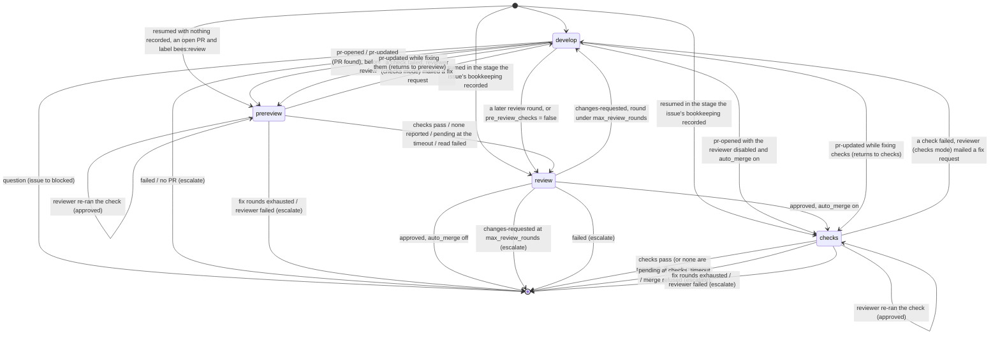

# Architecture

How `bees run` works, for the person running it: what one pass of the
scheduler does and in what order, how a developer worker carries an issue from
`bees:ready` to a merged pull request, what a session is and what it sees, how
the roles talk to each other, and what the state directory holds when
something looks wrong. For the label state machine see
[workflow.md](workflow.md), for each role [roles.md](roles.md), for every
`bees.toml` key [configuration.md](configuration.md) and for the commands
[cli.md](cli.md). The package layout and the test-suite are contributor
material and live in
[CONTRIBUTING.md](https://github.com/kpenfound/busybees/blob/main/CONTRIBUTING.md).

## The scheduler loop

`bees run` starts by creating the state directory, pruning stale worktree
metadata in the clone, and creating any workflow label the repository is
missing: one `gh label list`, then one `gh label create` per name it does not
find, matched case-insensitively. A label that exists is left exactly as it
is, recoloured or not, and a failure here only warns. It then logs `scheduler
started` with the build it runs (the role prompts are compiled into that
build; see *Prompts* under [Running a session](#running-a-session)) and ticks
until it is told to stop.

**Ticks.** A tick comes every `scheduler.poll_interval` (default 5m), and
sooner whenever a local event wakes the loop (*Waking up*, below). Each tick
is either a **full pass** or a **local pass**. A full pass runs when the tick
is at or past the next scheduled GitHub poll, and schedules the one after it:
`poll_interval` later, or `off_hours_poll_interval` later when
`scheduler.work_hours` is set and the moment falls outside the window (see
[Work hours](configuration.md#work-hours)). When the window opens before that
interval would elapse, the next poll is scheduled for the opening, so the work
day starts on time. Without `work_hours` every scheduled tick is a full pass,
and the local passes are the ones a wake asks for. When the poll fails with a
rate-limit error (the message names a rate limit, abuse detection, an
overloaded service or a usage limit), the next poll waits
`scheduler.rate_limit_backoff` (default 15m) if that is longer than the
interval in force.

**Stopping.** Ctrl-C, and `q` in the live view, is the cool-down: polling and
dispatch stop, and the work in flight finishes: every running session, and
every issue a developer worker holds, on through the stages it has left. A
second interrupt stops the running sessions too. Both are described under
*Stopping* in [Running a session](#running-a-session).

A full pass is:

1. **Poll.** `gh issue list` and `gh pr list` with the filter's query (label,
   assignee, milestone): two calls. Every open issue is bucketed by its state
   label (`triage`, `ready`, `in-progress`, `blocked`, `review`, `approved`,
   `needs-human`, or none), each bucket sorted oldest first. An issue carrying
   `bees:feedback` or `bees:feature` is set aside for the product manager
   instead, so it never gets a state label. The queue counts (the buckets,
   plus `feedback`, `features`, `proposals` and `open_prs`) go into
   `status.json`. A ready issue that declares a blocker still open is listed
   there as waiting on it and is not dispatched (see
   [Dependencies](workflow.md#dependencies)).
2. **Comments on an in-flight issue.** For every issue in `in-progress`,
   `review`, `approved` or `blocked` whose `updatedAt` moved past the issue's
   `issue_human_seen_at` clock, the comments written since that clock are
   fetched (one call) and what people wrote goes out as one message from
   `human` (`issue == N`) to the role that can act on it: the developer for
   `in-progress` and `approved`; the developer and a copy to the reviewer for
   `review`, so the round in flight sees it; and for `blocked`, whoever asked
   the question, read off the worker's bookkeeping: a recorded branch or pull
   request means a developer session asked, and reconcile then moves the issue
   back to `ready`; nothing recorded means triage asked, so the project
   manager gets it. A comment is a bee's, and dropped, when its last line is a
   `<!-- bees:<role> -->` marker or its author is the login `[github]` gives
   the factory. With `[github]` unset, bees and people share one account and
   the marker is the only signal; only the last line counts, so a person
   quoting the bee they answer still gets through. The first pass that sees an
   issue in one of those four states with no clock records the poll time and
   delivers nothing: a zero clock must not mean "replay every comment this
   issue ever received". An issue in `triage` or `ready` has its clock
   refreshed on every pass and never delivers, because the session that acts
   on it next renders the whole comment history in its prompt. That refresh is
   what makes an answer to a blocking triage question arrive: the issue was
   observed in triage before it could be blocked, so it has a clock by the
   time it is blocked. What the mail adds over the comment history in a prompt
   is that the comment is fresh, that it is a person's, that it reaches the
   reviewer, that it unblocks a blocked issue, and that it wakes the loop. See
   [Commenting on the issue](workflow.md#commenting-on-the-issue).
3. **Feedback on a pull request.** For every open pull request whose closing
   issue is visible, when its `updatedAt` is later than the issue's
   `human_seen_at` clock (or the pull request's creation time), its reviews,
   inline review comments and conversation comments are fetched with `gh api
   --paginate` (three calls). Bee comments and empty approvals are dropped by
   the rule above. The rest go to the developer as one message from `human`
   (`issue == N`, `pr == M`) whose body carries each item's id and the `gh`
   command to reply to it, and the clock advances to the newest item. An
   `approved` issue that received feedback goes back to `ready` and its pull
   request loses `bees:approved`, so a developer worker picks it up in step 7,
   unless a worker still owns the issue (the checks stage), whose labels are
   left to that worker. Issue comments are delivered before pull request
   feedback on purpose: an approved issue that gets both leaves the in-flight
   buckets here, after step 2 has read them. The two clocks are separate so
   neither stream suppresses the other.
4. **Merge state.** `gh pr list` already reports `mergeable`,
   `mergeStateStatus` and the head commit, so this costs no call. For an issue
   in `review` or `approved`, a `CONFLICTING` pull request (with
   `scheduler.pr_fix_conflicts`) or a `BEHIND` one (with
   `scheduler.pr_keep_updated`) gets the developer one message from
   `orchestrator` (`issue == N`, `pr == M`) asking it to merge the default
   branch, resolve, test, push and report `pr-updated`. The head commit is
   recorded as `conflict_notified_sha`, so one head is mailed about once; a
   push changes the head and, if it still conflicts, is notified again. An
   approved issue goes back to `ready` as in step 3. An `UNKNOWN` or empty
   merge state means GitHub has not computed it yet, and the pull request is
   left alone for this poll. See
   [Conflicts with the default branch](workflow.md#conflicts-with-the-default-branch).
5. **Reconcile.** Label transitions driven by local state, in this order:
   - an issue with no state label and neither `bees:feature` nor
     `bees:feedback` is a person handing the factory an idea, not a spec:
     when the product manager is enabled it gets `bees:feedback` (and the
     base label, when the filter does not require it) and joins the product
     manager's list in the same pass. A person who wants it built without
     that hop labels it `bees:triage` or `bees:ready` themselves;
   - a `bees:blocked` issue with unread developer mail about it becomes
     `bees:ready`; one with unread project manager mail about it becomes
     `bees:triage`. Mail from a person counts as an answer too;
   - a `bees:ready` issue with no size label gets `bees:size/m`, the default
     size (see [Sizing](workflow.md#sizing));
   - a `bees:ready` issue sized above `roles.developer.max_size` (default `l`,
     so normally a `bees:size/xl` one) goes back to `bees:triage` without a
     comment, for the project manager to split;
   - every feature is checked for `bees:proposal`, and the pass that sees a
     person remove it records the approval: a label edit leaves no comment,
     and nothing else would bring the feature back to the product manager.

   Sizing runs after unblocking so that an issue which becomes ready in a pass
   is sized in the same pass. Every edit is also written back to the cached
   poll that local passes classify from; without that they would see the old
   labels and repeat the edit.
6. **Pauses.** Two conditions stop steps 7 and 8 from starting anything;
   workers already running finish their loop either way. Each pause is logged
   once when it starts and once when it lifts, and shown by `bees status` and
   in the live view's header. A cancelled loop context gates the same two
   steps, so a pass still finishing when the factory was asked to stop starts
   nothing the cool-down promised not to.
   - **Daily cost budget.** With `scheduler.max_cost_per_day` set, the ledger
     is summed over the last 24 hours before anything is dispatched. Dispatch
     pauses when the sum reaches the budget and resumes only once it has
     fallen under `max_cost_per_day_resume_percent` of it (default 100, which
     is the plain "under budget" test), so the factory backs off instead of
     oscillating on the edge. The sum is recomputed from the ledger on every
     pass; a restart loses only the hysteresis. The other two budgets are
     enforced elsewhere: `max_cost_per_issue` between a developer worker's
     stages, `max_cost_per_session` after a session ends. See
     [Cost budgets](configuration.md#cost-budgets).
   - **Claude session limit.** Recorded from a finished session rather than
     computed here: a session whose last `rate_limit_event` was blocking, or
     that failed without reporting an outcome and whose result text names a
     session or usage limit, pauses dispatch until the reset time the event
     carried (`rate_limit_backoff` when it carried none or the time is already
     past, and never more than 8 hours). The limit is per account, so it holds
     every role. A session that reported no outcome returns to its worker at
     once, spending no retry; one that did its work and reported is read
     normally. The pause is in memory only: after a restart the first session
     that hits the limit re-establishes it. See
     [The claude session limit](configuration.md#the-claude-session-limit).
7. **Dispatch developers.** The candidates, in order: issues in `in-progress`
   and `review` that no worker owns (resumed after a restart, never
   reordered); an `approved` issue whose worker was killed in the
   post-approval checks stage or in the developer round those checks sent
   back, told apart from a pull request waiting for a person by the stage
   recorded in the state directory and an open pull request on the branch;
   `ready` issues that already have an open pull request on their branch (sent
   back by feedback or a conflict; finished before new work, oldest first);
   then the rest of `ready`: `bees:priority` first, then
   `scheduler.dispatch_order` (smallest size first by default), ties by age.
   Priority reorders the queue and lifts no cap. A ready issue whose declared
   blockers are still open is skipped without taking a slot. A `bees:size/l`
   issue that is new work waits while `scheduler.max_large_in_flight` of them
   are owned; the check runs before a slot is taken, so a held issue does not
   keep a free developer idle. Each remaining candidate takes a slot from a
   pool of `max_developers` (default 1); when none is free the pass stops
   dispatching. A goroutine runs the worker
   ([The developer worker](#the-developer-worker)) and returns the slot when
   done, and the worker records the issue's size, which is what the cap counts
   and what `bees status` shows. A worker that fails with an error, rather
   than escalating its issue, backs that issue off for five poll intervals.
   See
   [Size decides what gets built next](workflow.md#size-decides-what-gets-built-next).
   Then the requested reviews: every pull request in the poll carrying
   `bees:review-requested` that no session is already reviewing gets a
   reviewer session in a slot from the same pool, so a review a person asked
   for never starves a ready issue. With `scheduler.review_assigned_prs` a
   pull request whose head branch does not start with
   `project.branch_prefix`, one the factory did not write, is dispatched the
   same way without the label, unless it is a draft or a review has already
   looked at this head. The label is removed before the session
   starts, which claims the request: one label is one pass whatever the
   session does, a failure or a killed scheduler included, and the head
   commit is recorded in `issues/<pr>.json` before the session for the same
   reason. Only a full pass dispatches one, because a local pass classifies
   the cached pull request list, which still carries a label removed on
   GitHub. The session is
   a detached checkout of the head branch, or of the default branch when the
   remote does not have it, and is recorded like a worker under the pull
   request's number. A failed session backs the pull request off for five poll
   intervals; there is no issue to escalate.
8. **Dispatch singletons.** The project manager, product manager and QA each
   run in a goroutine of their own, at most one session per role at a time, in
   a detached worktree of the default branch. When a session ends the role is
   not started again for one poll interval; when it fails, five. What starts
   each:
   - the **project manager**: triage issues (it takes the first
     `scheduler.triage_batch_size`, default 5, each fetched in full with its
     parent feature) or unread mail;
   - the **product manager**: unread mail; never having run;
     `scheduler.product_manager_interval` (default 1h) elapsed; a proposal a
     person approved since its last run; a feature whose every recorded
     sub-issue has closed; or a fresh feedback or feature issue: one updated
     since the last run, whose comments are fetched (one `gh issue view` each)
     and on which a person had the last word by the bee-comment rule of step 2
     (a tie in the same second is broken by the comments' order, so a person
     answering right after a bee still counts). A fresh issue carrying
     `bees:question` has that label removed on the spot. A proposal
     (`bees:proposal`), and an issue in
     [planning mode](workflow.md#planning-with-the-product-manager), counts as
     fresh only once a person has *commented*: the creation does not count,
     because nobody has commented on a proposal a bee has just written and it
     would otherwise be fresh forever. `bees:planned` wakes nothing; the issue
     waits for the interval;
   - **QA**: unread mail; never having run (the first run looks back seven
     days); or `scheduler.qa_interval` (default 30m) elapsed since it last ran
     or last looked, and something merged since its last run. The merged-PR
     query runs at most once per interval, recorded as `last_check` in
     `<state_dir>/qa.json`.

   The **product manager** is shown: the fresh feedback issues; the fresh
   features, with proposals in a section of their own; the issues in planning
   mode, and the planned ones that still need acting on, each in a section of
   its own (a planned feature drops off once it has sub-issues, a planned
   feedback issue once it is closed; a feature whose sub-issue lookup failed
   waits for the next run rather than being presented as not yet broken down,
   and one still carrying `bees:proposal` stays a proposal); every open
   feature with its sub-issue progress (one `gh api repos/../issues/N` per
   feature); every open work item with the feature it belongs to (one GraphQL
   query per work item, because the progress summary carries counts, not
   numbers); and the features whose work is done. That last list costs no
   GitHub call: every product manager run records each feature's open
   sub-issue numbers in `<state_dir>/issues/<n>.json`, and a later pass
   notices that every recorded number is absent from the poll. Such a feature
   is presented once and marked; a recorded set that changes clears the mark,
   so a feature that gains a sub-issue is presented again when that one
   closes. A run whose parent lookups did not all answer records nothing,
   since a partial answer would look like children that closed, and a feature
   no run has recorded children for waits for the interval.

   **Planning mode.** The planning section of the prompt lists no breakdown
   step and the planned section says the scope is settled; the enforced half
   is that `bees issue create` and `issue_link` refuse a `bees:planning` issue
   as a parent, as they refuse a proposal, so a planning issue grows no
   sub-issues whoever asks. Neither planning label is ever written by the
   factory.

   **Sub-issues and milestones.** Work items are native GitHub sub-issues of
   their feature. Roles create issues through the `issue_create` tool (or
   `bees issue create`), which labels for the filter and for kind and state,
   resolves the milestone as the explicit one, else the parent or related
   issue's, else `filter.milestone`, creates the issue, and attaches it to its
   parent as a sub-issue. The factory never creates, edits or closes
   milestones; people do, and the bees inherit. See
   [Features, sub-issues and milestones](workflow.md#features-sub-issues-and-milestones).

**Local passes.** A tick that is not due for a poll, and every wake, runs a
local pass: it classifies the issue and pull request lists cached from the
last successful poll again (reconcile's write-back and the refresh at the end
of every session keep that cache in step), then runs steps 5 and 6, dispatches
developers (never a requested review) and starts only the singletons that have
unread mail. It skips the poll, steps 2 to 4 and the product manager's and
QA's other has-work checks, all of which read GitHub; the label writes
reconcile and dispatch make still happen, because what a local pass protects
is the polling budget, not every API call. Until the first successful poll
there is nothing cached and a local pass does nothing.

The one read a local pass makes is a confirmation. Its snapshot can be stale
(an issue a worker has since finished, one a developer parked in
`bees:blocked`, one a person closed or relabelled), so before spending a
session on a candidate the pass fetches that one issue (`gh issue view`) and
drops it unless it is still open and in `bees:ready`, `bees:in-progress` or
`bees:review`, or in `bees:approved` for the interrupted checks stage of step
7. The fresh copy replaces the cached one, so the next local pass does not ask
again. That is one call immediately before a whole session, not one per pass.
The mailbox is not GitHub: the developer and reviewer loop, the checks stages
and mail-driven label transitions run at `poll_interval`, and sooner when a
wake asks, however the window is configured.

**Waking up.** Waiting out the poll interval for something that happened
locally is downtime, so the loop also listens on a wake channel and runs a
local pass for every signal. Three things signal it: a session finishing, a
developer worker returning its slot to the pool (a worker runs several
sessions before its slot comes free), and the two kinds of message the
scheduler sends itself (the merge-state notice of step 4 and the feedback of
steps 2 and 3). A wake is never a full pass, so the polling cadence stays
exactly what `poll_interval` and the window say. The channel holds one signal:
a burst of finished sessions costs one pass rather than one each, and a full
pass drops a pending wake because it does strictly more.

Mail written by another process (`bees mail send`, or the MCP server attached
to a session) cannot signal an in-process channel, and the mailbox is
deliberately not watched for changes. It does not need to be: the session that
wrote the mail signals when it finishes, and the local pass that follows
re-reads the mailbox from disk. Mail a person sends by hand while nothing is
running waits for the next tick.

A session's writes on GitHub cross the same boundary. The MCP server cannot
reach the cached issue lists either, so every tool that creates an issue or
changes one records its number in `<session>/touched-issues.txt`, and the
scheduler reads that list back when the session ends: one `gh issue view` per
issue on it, written into the cache before the wake is signalled. The local
pass that follows classifies from what the session did, so an issue the
project manager moved to `bees:ready` goes to a developer and a sub-issue it
filed counts as triage work, without waiting for the poll after the session. A
session that changed no issue records nothing and costs nothing, and an issue
that has since been closed, or that the filter does not match, is dropped
rather than cached: the cache holds what a poll would return. Pull requests
are not read back, because the developer and reviewer loop runs inside one
worker and finds its own pull request.

**API budget.** Every poll costs two `gh` calls. Everything else is gated on
what those lists report, so an idle factory stays at two calls per poll (and,
with `work_hours`, at two per `off_hours_poll_interval` outside the window).
Comments on an in-flight issue cost one call per issue whose `updatedAt`
moved; pull request feedback three per pull request whose `updatedAt` moved;
the product manager's freshness check one `issue view` per feedback or feature
issue updated since its last run; QA's merged-PR query at most once per
`qa_interval`; the checks stages poll `gh pr checks` every
`roles.reviewer.checks_poll_interval` (default 2m), not every poll; the
visibility backstop makes two list calls after each session; the refresh after
each session one `issue view` per issue that session created or relabelled;
and worker stage transitions make a handful of `issue view`, `pr view` and
`issue edit` calls.
Sessions call `gh` on their own on top of this, which busybees does not meter.
See [API budget](configuration.md#api-budget).

**Once mode.** `bees tick` and `bees run --once` perform a single pass and
then wait for everything it started. `--roles` restricts dispatch to the named
roles; a role with `enabled = false` in `bees.toml` is skipped regardless.

**`status.json`** is rewritten after every pass and whenever a worker or
singleton starts or stops; `bees status` reads it, the mailbox and the notes
files, and asks GitHub nothing. Two of its queue counts carry their detail:
`needs_human` names each escalated issue and why, from the reason the
escalation recorded, and `approved` names each pull request waiting for a
person to merge, oldest first. Both are built from the snapshot the counts
came from plus one state-directory read per escalated issue, so neither costs
a GitHub call. `degraded` lists the operations that are failing
([Degraded operations](#degraded-operations)).

**The event stream** is the live half of the same picture, for a view running
in the same process. A subscriber gets a buffered channel of events: a session
started (with the model it runs on, whether that is the role's fallback, and
its directory, which is where its `transcript.jsonl` is and the one thing a
view cannot work out from the name), a session ended (with its outcome, turns,
cost and duration), a developer worker moved to another stage, a full pass
finished. Events are published beside `status.json`, never instead of it: the
event says something happened, `status.json` says what the factory looks like.
The poll event is published after the write, so a view that re-reads the file
when one arrives sees the pass that event is about, never the one before it.
No scheduler decision depends on whether anyone is subscribed, and publishing
never blocks: an event a subscriber has no room for is dropped, so a view that
stops reading loses events instead of slowing a pass down.

The [live view](cli.md#the-live-view) is the subscriber. Its Now and Recent
panels are built from the session and stage events; Needs human, Approved PRs
and Queues are `status.json`, re-read when an event says it changed. Two
things come from a session's own `transcript.jsonl`, in the directory the
started event named, because no event carries them: the transcript the session
view shows, and the turn count the Now panel shows for a session still running
(claude reports `num_turns` in the final event of its stream and nothing
before it). Beyond stopping the factory, its `k` key is the one thing it asks
the scheduler to do: stop one running session by the name the stream
published, through the same path `bees kill` uses, and escalate the issue it
was working on. The mark that leaves behind is what keeps the session's own
worker from retrying it or escalating the issue a second time. The view's one
write is the message a person types in the session view: an ordinary mailbox
entry from `human`, addressed to the role on screen and carrying its issue and
pull request, which reaches the *next* session on that work item. A headless
`claude -p` works to the end of the prompt it was started with and ignores a
later turn written to its stdin.

## The developer worker

One worker owns one issue from claim to approval (or, with
`roles.reviewer.auto_merge`, to merge), or until the factory gives it up. It
is a small state machine with four stages:



- **Workspace.** `git fetch`, then one worktree for the issue on
  `<branch_prefix>issue-N`: created from `<project.remote>/<default_branch>`
  when the branch is new, checked out tracking the remote when it exists there
  (and fast-forwarded to it when a local branch was kept), or reused when it
  exists only locally. The same worktree serves the developer and reviewer
  sessions of that issue and is removed when the worker exits (unless
  `keep_workspaces`). Before each reviewer session it is fast-forwarded to the
  developer's latest push. Each workspace is a unique temporary directory
  under `workspace_root`, and the worktree inside it carries that same unique
  name: `git worktree add` derives its metadata id from the leaf name, and two
  concurrent adds sharing one would race for it.
- **Resume.** Before working each stage the worker records the stage it is in
  (`develop`, `prereview`, `review` or `checks`), the gate a developer round
  returns to, and whether the pre-review checks have been read, in
  `<state_dir>/issues/<n>.json`. A worker that finds a recorded stage comes
  back to it, so a `bees run` killed in the checks stage or in the middle of a
  check-fix round carries on there instead of paying for a review that has
  already happened: a workflow label says an issue is in review, never whether
  its review has run. The labels stay the human-facing truth all the same. A
  recorded stage they contradict is dropped with a log line and the worker
  starts where the labels say: one of the three review-loop stages on an issue
  with no open pull request, or on one a person put back to `bees:ready`, and
  a stage name this build does not run. `develop` fits any label, so the loop
  state recorded with it is dropped on the same test: an issue whose labels
  have left the review loop starts a fresh round, whatever the last worker was
  doing. One develop record is exempt: the round the post-approval checks send
  back is recorded before the develop stage can relabel the issue
  `bees:in-progress`, so it sits under `bees:approved` legitimately and keeps
  the gate it returns to. The record also names the pull request it was
  written for, and one written for another pull request, or before the number
  was known, is dropped the same way: a person can close a pull request and
  open another on the same branch while nothing is running, and neither the
  labels nor the branch tell the two apart. With nothing recorded, the worker
  looks for an open pull request on the branch: when one exists and the issue
  is labelled `bees:review` it starts in prereview (in review, with
  `pre_review_checks = false` or the reviewer disabled), otherwise in develop.
  That is how work survives a restart of `bees run`.
- **An interrupted session.** The recorded stage says where the worker was,
  not what happened to the session that was running when the scheduler died:
  it left a transcript no `result.json` closed, and a branch that may carry
  commits, uncommitted edits or a pull request nobody reported. So the
  scheduler also records the session it is about to run in the issue's
  bookkeeping (`session`: role, name, directory, start time) and clears it
  when the session ends, however it ends; a record that outlives its session
  is the signal. The worker that takes the issue over reads it and asks the
  directory what happened: a pid file naming a live process means the session
  is still running under another scheduler, and nothing is reported; a
  `result.json` means it finished after all, and the stale record is cleared;
  anything else means it was interrupted. The first session of the role that
  was interrupted is then told, at the top of its task prompt, how far the
  previous one got (assistant messages counted in the transcript, an
  approximation of the turn count the missing result event would have
  carried), where the transcript is, and whether it was stopped on purpose
  (`bees kill`, the live view's `k` key and a hard stop write an `interrupted`
  marker into the directories they stop). A developer is told the branch may
  already carry the session's work; a reviewer that its round reported no
  verdict, and starts over. Another role's session is told nothing, and the
  report never outlives the worker that found it. `bees status` marks such a
  worker `resumed`. The record is not consumed by the worker that reads it,
  only overwritten by the next session as it starts, so a worker that returns
  before starting a session leaves it for the next one.
- **Bookkeeping.** `<state_dir>/issues/<n>.json` records the review round,
  pull request number, branch, `check_fix_rounds` and the three resume fields,
  plus the running session, the two human-comment clocks,
  `conflict_notified_sha`, the cost totals, the proposal observation, a
  feature's open children and, once the factory has given the issue up,
  `escalation` and `escalated_at`. The file has two writers. The worker holds
  one copy for the whole life of the issue and writes back only the first
  group of fields; the polling path writes each of the others through a method
  that reads the file, changes its own field and writes it back. Saving the
  worker's copy wholesale would put back what the worker loaded when it
  started: feedback already delivered would be delivered again, a head already
  mailed about again, an approval forgotten, a finished feature reported twice
  or not at all. The round increments on every `changes-requested` and is
  compared with `scheduler.max_review_rounds`; feedback from people does not
  count against it. `check_fix_rounds` increments each time the reviewer is
  asked to diagnose failing checks, is shared between the prereview and checks
  stages, and is compared with `roles.reviewer.max_check_fix_rounds` (default
  2); check-fix rounds do not count against `max_review_rounds` either.
- **The reviewer's review stages** (`roles.reviewer.stages`) are sections of
  one reviewer session's prompt, not worker stages like the ones above: a
  staged review is still one session. The prompt carries the configured stages
  in order, each with its own focus and its own verdict, and the reviewer is
  told to run every one rather than stop at the first that blocks. The list is
  validated at load. `product-fit` is the one stage with a source of truth
  outside the diff and the issue: it needs the work item's parent feature, so
  the worker makes that GraphQL lookup only when the stage is configured (off
  by default; one call per review round when on). A work item with no parent
  renders the stage without one, and so does one whose lookup fails: the
  failure is reported as the `work-item-parent` degraded operation rather than
  costing the review, because a silent nothing would reach the verdict as
  "this work item belongs to no feature". See
  [Review stages](roles.md#review-stages-rolesreviewerstages).
- **Prereview stage** (`pre_review_checks`, on by default, independent of
  `auto_merge`). Between the developer and the first review the worker waits
  for the pull request's checks with a deadline of
  `pre_review_checks_timeout`, so the reviewer starts from a green pull
  request. Passed, nothing reported, or still pending at the timeout: the
  review runs, with the checks in the reviewer's prompt, where the pending and
  the no-checks case say that nothing was verified. A read that errors is
  advisory too: the review runs without a checks section, and the failure is
  recorded as the `pre-review-checks` degraded operation so a reviewer quietly
  losing its checks section is visible. Failed: the same checks-mode reviewer
  and developer fix round the checks stage uses, and the developer's next
  `pr-updated` returns here. The read belongs to the first review: once it has
  happened, a later `pr-updated` goes straight to review, so an ordinary
  changes-requested round pays neither the read nor the wait and cannot spend
  a check-fix round. The checks section is handed to the review it was read
  for and cleared afterwards, so a later round is not told that a head the
  developer has since replaced is green. Whether the read happened is
  remembered (`pre_review_done`), so a restarted worker does not pay for it
  twice; what it read is not, so a review that resumes runs without a checks
  section, exactly like the second round of a loop nothing interrupted. `bees
  status` reports the stage as `pre-review checks`. See
  [Pre-review checks](roles.md#pre-review-checks-pre_review_checks-on-by-default).
- **Checks stage** (`auto_merge`). An approval only labels the pull request
  and the issue `bees:approved`, and requests a review from `scheduler.notify`
  when it is set; merging happens here. The worker sleeps `checks_wait`
  (default 1m), then polls every `checks_poll_interval` (default 2m) until the
  checks pass or fail, or `checks_timeout` (default 30m) elapses. Which
  **gate** is in force is decided on the first observation that reports
  anything and never changes afterwards: `required` when branch protection
  requires checks (`gh pr checks --required`; the second call is then never
  made), otherwise `reported`, every check the pull request reports (`gh pr
  checks` without `--required`), because a repository with no branch
  protection would otherwise merge with nothing green. Two consecutive empty
  observations mean `none`: no CI at all, which merges but is logged as an
  ungated merge, never as "checks passed". The gate is shown in the worker's
  stage (`checks (required)`, `checks (reported)`, `checks (none)`) so `bees
  status` says what a long wait is waiting for, and `bees doctor` warns once
  when `auto_merge` is on and the default branch requires no check. busybees
  never reads or writes branch protection to change it; that is a person's
  setting. Passed: `gh pr merge` with `merge_method` and `--delete-branch`; a
  refusal escalates. Failed: a reviewer session in checks mode
  (`BEES_REVIEW_MODE=checks`, given the failed checks), whose
  `changes-requested` sends the developer a fix request and sets `checks` as
  the gate the next `pr-updated` returns to, and whose `approved` means it
  re-ran the check itself, so the wait starts again. Pending at the timeout
  escalates. With the reviewer role disabled, a developer's `pr-opened` counts
  as approved, and with `auto_merge` the worker goes straight from develop to
  checks. See [Checks mode](roles.md#checks-mode-a-failing-check) and
  [Merging](workflow.md#merging).
- **Verification.** An outcome that implies a side effect is checked:
  `pr-opened` and `pr-updated` must correspond to an open pull request on the
  branch (looked up by the reported number, else by branch), `question` must
  have produced mail to the project manager during the session, and
  `changes-requested` mail to the developer. A claim without its side effect
  is escalated rather than trusted.
- **Cost.** Between stages the worker compares what the issue has cost, every
  session included, with `scheduler.max_cost_per_issue`, and escalates when it
  is over. A running session is never interrupted on cost.
- **Escalation** sets `bees:needs-human`, posts a comment (mentioning
  `scheduler.notify` when it is set) and records the reason in the issue's
  bookkeeping, which is how `bees status` and the live view say what the
  factory is stuck on without asking GitHub. That comment is the only GitHub
  comment the orchestrator itself writes. Roles comment on GitHub to people (a
  developer replying on its pull request, the product manager on a feedback or
  feature issue), always ending with the `<!-- bees:<role> -->` marker. See
  [Escalation](workflow.md#escalation-beesneeds-human).

Singleton roles share one path: a detached worktree on the default branch, one
session, delivered mail marked read, `last_run` recorded in
`<state_dir>/<role>.json`.

## Degraded operations

Most things the scheduler does are best-effort: a failed label edit,
assignment or mail update warns and the pass carries on. A warning nobody
reads is silence, though, so each of those sites reports under a short, stable
operation name (`poll`, `assign`, `label`, `reconcile`, `human-feedback`,
`check-prs`, `list-created`, `ledger`, `write-status`,
`project-prompts/<role>`, and so on). The record logs what the site logged
plus `op=<name>`, and keeps a per-operation streak of consecutive failures; a
success clears the streak. `status.json` carries the streaks as `degraded`, so
a broken operation is visible in `bees status` and the live view instead of
only in the log. A mutation whose caller reports the failure itself still
records its own streak: making an item visible is three independent calls
(label, assign, milestone) joined into one warning naming the item, and each
of the three keeps a streak of its own.

At three consecutive failures the streak emits one record at error level to
the summary stream a person watching the run sees, and only one: the streak is
marked so it is not repeated on every pass. Nothing else changes: no retry, no
backoff, no GitHub comment and no mail, because there is no issue to comment
on for a factory-wide operation and no role can fix a broken credential or a
missing label. Purely informational warnings (a declared dependency cycle,
worktree housekeeping, the rate-limit backoff, a session retry) are
deliberately not operations: they are already visible elsewhere, or are facts
rather than failures. See [Degraded operations](cli.md#degraded-operations)
for what `bees status` prints.

## Running a session

A session is one `claude -p`, executed inside the worktree:

```
claude -p \
  --output-format stream-json --verbose \
  --dangerously-skip-permissions \
  --append-system-prompt-file <session>/system-prompt.md \
  --model <model> --max-turns <n> --name bees-<session name> \
  [--fallback-model <fallback>] [--effort <level>] \
  --add-dir <state_dir> \
  [--allowedTools ...] [--disallowedTools ...] \
  --mcp-config <session>/mcp.json --strict-mcp-config \
  [--plugin-dir <skill plugin dir> ...]
```

The task prompt is written to stdin. Each line of stream-json is appended to
`<session>/transcript.jsonl`; the final `result` event supplies the result
text, `is_error`, subtype, turn count, cost and claude session id. stderr is
saved to `stderr.log` when non-empty, and `result.json` summarises the run. A
session that ended without a `result` event (a signalled process, most often)
has no known cost: `bees status`, the live view and the summary line say so
rather than printing zero, and its turns are counted from the transcript's
assistant messages instead.

- **Outcome.** The session ends by calling the `done` tool (or running `bees
  done <status>`), which writes `<session>/outcome.json` through one shared
  validation: the status must be one the role may report, and `pr-opened` and
  `pr-updated` need a pull request number. The runner reads the file after
  claude exits; a missing one is reported as "no outcome" and the scheduler
  treats the session as `failed`. The process exits when the turn ends, so a
  session that ends its turn waiting on a background task's completion
  notification or a scheduled wakeup never receives one and never reports an
  outcome.
- **Retries.** Every session goes through the same retry loop. A failure is
  *infrastructure* (a timeout, an API error, exhausted turns, a rate limit,
  claude exiting with no result event) or *behavioural* (the session reported
  an outcome, `failed` included, or exited cleanly without reporting). Only
  infrastructure failures are retried, `scheduler.retries` times (default 1),
  waiting `scheduler.retry_delay` (default 10m) between attempts and running
  with the role's fallback model when `scheduler.retry_with_fallback` is set
  (on by default). Each attempt has its own session directory
  (`<name>-retry<n>`), and a retried developer session is told its previous
  attempt was interrupted so it continues from the branch. The account-wide
  claude session limit is neither kind and never reaches the classification: a
  session that died on it returns to its worker at once (see step 6 of the
  loop). A session that cost more than `scheduler.max_cost_per_session` is
  treated as failed. One such session is retried like an infrastructure
  failure, with the fallback model when that is configured; a second in a row
  for the same work item (or the same singleton role) is reported as `failed`,
  which escalates a work item and backs a singleton off. See
  [Retries first](workflow.md#retries-first).
- **Environment.** Every inherited `BEES_*` variable is dropped first, so a
  session started from inside another session cannot pick up a stale issue,
  pull request or branch. Then, in order: the role's configured `env` entries
  (`$VAR`-expanded) and `SHELL` when `shell` is set; `BEES_ROLE`,
  `BEES_SESSION_DIR`, `BEES_STATE_DIR`, `BEES_CONFIG`, `BEES_REPO`,
  `BEES_LABEL` and `BEES_BIN`, plus `BEES_NOTES_FILE`, `BEES_ISSUE`, `BEES_PR`
  and `BEES_BRANCH` when they apply and `BEES_REVIEW_MODE=checks` for the
  reviewer's checks-mode sessions; the directory holding the `bees` binary
  prepended to `PATH`, so `bees mail`, `bees issue` and `bees done` resolve
  inside the session; the factory's own
  [GitHub identity](configuration.md#github) when `[github]` configures one:
  `GH_TOKEN`, `GIT_AUTHOR_*` and `GIT_COMMITTER_*`, plus the variable a
  `"$VAR"` `github.token` names, holding the token bees resolved (a session
  loads `bees.toml` itself, and a reference that expands to nothing is a load
  error, so that one name survives the drop); and, unless `GIT_CONFIG_COUNT`
  is already set, the `GIT_CONFIG_*` entries below. The `BEES_*` variables are
  also written into the built-in MCP server's entry in `mcp.json` rather than
  left to inheritance; the token variable deliberately is not, because that
  file sits in the session directory on disk, and claude passes its own
  environment on to the servers it starts. See
  [Exported into every session](configuration.md#exported-into-every-session).
- **Prompts.** The system prompt is `system/common.md` plus
  `system/<role>.md`, the role's custom `prompt` from `bees.toml`, and then
  the project's own prompt files; the task prompt is `task/<role>.md`
  (`task/reviewer_checks.md` for a checks-mode reviewer). Both are rendered
  from one data structure (project, filter, labels, workspace, notes, inbox,
  issue, pull request, lists, round). The base prompts are compiled into the
  binary, so a running scheduler serves the prompts of the build it was
  started from: a prompt change merged to the default branch reaches no
  session until `bees` is rebuilt and `bees run` restarted. The scheduler
  records the build it runs, in its `scheduler started` log line and as
  `version` and `revision` in `status.json`, which is what `bees status` shows
  on its scheduler line, so the running prompts can be told from the
  repository's. `bees doctor`'s *scheduler build is current* check makes that
  comparison itself and warns when a running scheduler is behind `HEAD`.
- **Project prompt files.** `bees/prompts/common.md` and
  `bees/prompts/<role>.md` are read from the **worktree** the session runs in,
  so a branch's own instructions apply to the session working on that branch.
  They are read at session start rather than compiled in, so editing them
  takes effect on the next session with no rebuild and no restart. A missing
  directory is the normal case and is silent; a file that cannot be read, or
  is over 64 KiB, is skipped, never fatal, and recorded as the
  `project-prompts/<role>` degraded operation, one per role, so a file only
  one role reads is not cleared by the next session of another. `bees doctor`
  fails on the same files, and on one no role would read. See
  [Project prompt files](configuration.md#project-prompt-files).
- **Skills.** Each configured skill reference (`<url>[@ref][#subdir]`) is
  cloned under the cache directory (`BEES_CACHE_DIR`, else the user cache
  directory: `~/.cache/bees` on Linux, `~/Library/Caches/bees` on macOS) and
  becomes a `--plugin-dir`: the repository itself when it has
  `.claude-plugin/plugin.json`, otherwise a generated wrapper under
  `plugins/<name>/` in the cache whose `skills/` symlinks to the skill or
  skills collection. The project worktree is never modified. Sessions start
  concurrently and share one cache, so preparation is serialised and a wrapper
  that already points at the right target is left alone. Clones are refreshed
  according to `global.skills_refresh`; `bees skills` inspects the cache. See
  [Skills](configuration.md#skills).
- **MCP.** `mcp.json` is written for every session and always passed with
  `--strict-mcp-config`, so a session sees exactly two things: the servers of
  the resolved role (`$VAR` in `env` and `headers` expanded from the bees
  process environment) and the built-in `bees` server, `<bees binary> mcp
  serve` over stdio with the session's `BEES_*` variables in its `env`. That
  server serves the factory's own operations as tools backed by the same code
  the CLI uses, so a session calls a schema instead of composing a command
  line: `mail_send`, `mail_list`, `issue_create`, `issue_link`, `issue_view`,
  `pr_view`, `comment` and `done` go to every role; `issue_edit_body` to the
  two managers, `issue_set_state` to the project manager, `issue_question`
  to the product manager and `submit_review` to the reviewer. The schemas
  depend on `BEES_ROLE`: `done`'s `status`
  enum is the role's valid outcomes. The name `bees` is reserved in
  `bees.toml`. See [bees mcp serve](cli.md#bees-mcp-serve-sessions) and
  [MCP servers](configuration.md#mcp-servers).
- **Timeout.** The role's `timeout` (default 45m) bounds the command; claude
  runs in its own process group, and on expiry the whole group is killed so
  MCP servers die with it. The result is marked timed out.
- **Stopping.** Sessions do not run under the loop's context: `bees run`
  derives a second one for them, so cancelling the loop (an interrupt, or the
  live view's stop key) stops polling and dispatch and lets every running
  session finish, each still bounded by its role's `timeout`. A developer
  worker runs under that context too, so an issue one already holds is carried
  through the stages it has left rather than dropped between two of them: the
  loop ends where it always ends, at an approval, an escalation,
  `max_review_rounds` or `max_cost_per_issue`. The gate that stops a *new*
  issue being taken, and every singleton, is the loop's context. That is the
  cool-down. The hard stop, the second interrupt or the second press in the
  view, cancels the sessions' context instead: each process group is killed
  exactly as a timeout kills it, but no result file is written and the
  running-session record in the issue's bookkeeping is kept, so the directory
  reads as an interrupted session and the next `bees run` resumes the issue
  and tells its next session what was stopped, through the same crash-recovery
  path a killed scheduler goes through, with a marker saying the stop was
  deliberate.

Unless `GIT_CONFIG_COUNT` is already set, the runner also exports git
configuration through `GIT_CONFIG_KEY_n` / `GIT_CONFIG_VALUE_n`, with
`GIT_CONFIG_COUNT` derived from the entries it built:
`push.autoSetupRemote=true` and `push.default=current`, so a session can run a
plain `git push` on a branch the workspace created with `git worktree add
--no-track -b`; and, when `[github]` carries a token, an empty
`credential.helper` followed by `credential.helper=!gh auth git-credential`,
so that an https push authenticates as the factory. The empty value comes
first because git asks helpers in configuration order and takes the first
answer, and `GIT_CONFIG_*` is read last: without it the machine owner's own
helper would answer and the push would be theirs. busybees never edits the
clone's git configuration.

## The mailbox

A message is one JSON file at `<state_dir>/mail/<to-role>/<id>.json`:

```json
{
  "id": "20260829T151201-9f3a2b1c",
  "from": "reviewer",
  "to": "developer",
  "subject": "Review round 1",
  "body": "...",
  "issue": 12,
  "pr": 34,
  "created_at": "2026-08-29T15:12:01Z",
  "read_at": null,
  "in_reply_to": ""
}
```

Messages are addressed to a **role**, not a session. Delivery rules:

- A developer session for issue N with pull request M receives the unread
  developer mail where `issue == N` or `pr == M`.
- A reviewer session receives its own earlier feedback for the pull request
  (`from: reviewer, to: developer, pr == M`) as "previous rounds", plus the
  unread reviewer mail where `issue == N` or `pr == M`, in review mode and in
  checks mode alike, read afresh before each of those sessions.
- A singleton session receives all unread mail addressed to its role.
- Mail is marked read (`read_at` set) after the session that received it
  finishes, so a session that crashed sees it again.
- Reconcile uses *unread* mail to relabel blocked issues; the verification of
  a session's claim to have sent mail uses creation time.
- Feedback on a pull request, and a person's comments on an in-flight issue,
  enter the mailbox as messages from `human` (see the scheduler loop). People
  can also send mail by hand with `bees mail send --from human`, or by typing
  one in the live view's session view, which writes the same thing. The
  scheduler's own requests, to bring a pull request up to date with the
  default branch, come from `orchestrator`.

**Visibility backstop.** After every session the scheduler lists the issues
and pull requests created since the session started (`gh issue list` and `gh
pr list` with `created:>=<start>`, `--state all`, two calls), whatever their
labels and whoever opened them. Anything carrying the base label, or any
`<label>:*` label, but missing part of the filter is repaired the way the
developer worker repairs a pull request it opened: the base label, the
configured `filter.assignee` and, for pull requests only, the configured
`filter.milestone`. The search carries no author qualifier because the items
it exists for, a pull request a session opened with its own `gh pr create` and
an item a person opened by hand, are not reliably the account bees acts as, so
the label gate decides. Both halves of that gate are needed: a pull request a
session just opened carries only the base label, and earns its first
`<label>:*` label at approval. Items with no factory label at all are left
alone, and one that cannot be repaired is logged and skipped rather than
stopping the others.

A milestone is set on pull requests and never on issues: a milestone on an
issue is a person's decision, and an issue the factory creates inherits one
through `bees issue create`, while a milestone on a pull request is pure
filter bookkeeping.

Writes are atomic (a temporary file, then a rename), ids embed a timestamp so
a listing sorts oldest first, and `bees mail` works from any directory because
sessions get `BEES_STATE_DIR`.

## State directory

```
<state_dir>/                     default .bees/ next to bees.toml
  README.md
  mail/<role>/*.json             the mailbox
  notes/<role>.md                role memory (`bees notes show|edit|reset|add`)
  notes/archive/<role>-<ts>.md   notes replaced by `bees notes reset`
  sessions/<ts>-<name>-<rand>/   system-prompt.md, prompt.md, mcp.json, transcript.jsonl,
                                 stderr.log, outcome.json, result.json, pid,
                                 touched-issues.txt (the issues the session changed on
                                 GitHub, one per line, read back into the cached poll
                                 when it ends), interrupted (written by `bees kill`,
                                 the live view's k key and a hard stop)
  issues/<n>.json                {number, round, pr, branch, check_fix_rounds, worker_stage,
                                 after_develop, pre_review_done, session, human_seen_at,
                                 issue_human_seen_at, conflict_notified_sha, cost, sessions,
                                 proposal, proposal_approved_at, open_children,
                                 complete_reported_at, escalation, escalated_at, updated_at}
  <role>.json                    per-role bookkeeping, one file per role that has run:
                                 {last_run, last_check, sessions, last_consolidated}
  status.json                    live scheduler status for `bees status` (queues, workers,
                                 singletons, pauses, degraded operations, last_poll, last_error)
  ledger.jsonl                   append-only, one JSON line per finished session
                                 {time, role, session, issue, pr, turns, cost_usd,
                                 duration_ms, outcome, error_subtype, timed_out}
  bees.log                       every record of the last scheduler runs as JSON, rotated
                                 at 10 MiB into bees.log.1 and bees.log.2
```

`ledger.jsonl` is the factory's accounting: one line for every session that
finishes, whatever it reported, and `bees cost` sums it. Lines are written
with a single append so concurrent workers cannot interleave, and a line that
does not parse is skipped on read rather than failing it.

`<role>.json` carries what the scheduler remembers about a role between runs:
when the singleton roles last ran (`last_run`) and last looked for work
(`last_check`), how many sessions of any kind the role has run (`sessions`)
and the count at which it was last asked to consolidate its notes
(`last_consolidated`). Developer workers share `developer.json`, so every
update to it is a read-modify-write under the scheduler's lock.

`bees.log` is written only by the commands that run sessions (`run`, `tick`,
`exec`) and always holds every record at debug level, whatever the console
flags say. `bees issue` and `bees mail` run inside sessions, concurrently with
the scheduler, so they never open it.

`bees init` makes sure the directory is ignored by git: when `git
check-ignore` does not already ignore it (and it lives inside the clone),
`/.bees/` is appended to the repository's `.gitignore`, which is a change to
commit. `bees.toml` itself is meant to be committed. Worktrees live under
`$TMPDIR/bees/` (or `scheduler.workspace_root`) and are removed after each
worker or singleton run; the skills cache lives outside the state directory
(see *Skills* under [Running a session](#running-a-session)).

## Crash recovery (`bees kill`)

The runner writes the session's pid to `<session dir>/pid` right after
starting `claude` and removes it when the session ends. When bees dies, those
files, and the `--name bees-<session>` argument every session is started with,
let `bees kill` find the orphans: it merges the pid files with a `ps` scan
restricted to processes whose executable is `claude` (directly or through an
interpreter), cross-checking pid files against the scan so a reused pid is
discarded rather than killed. Both sources are scoped to one factory: a
scanned process counts only when its command line also references this state
directory's `sessions/` (every session's argv carries
`--append-system-prompt-file <sessions dir>/<session>/system-prompt.md`,
matched as a path prefix and also in its symlink-resolved form). Sessions of
another project's factory are never reported, so `bees kill` run with one
project's config cannot strand another project's issues.

Every session `bees kill` stops through a pid file is marked: it writes
`<session dir>/interrupted` naming the kill, so the next session for that
issue is told the session was stopped rather than left to guess that the
machine crashed (see *An interrupted session* under
[The developer worker](#the-developer-worker)). A process found only in the
process table names no directory and is killed unmarked.

The kill sends SIGTERM to the process group (sessions are started in a group
of their own, so MCP servers and shells belong to it), waits `--grace`
(default 5s), then SIGKILL. The command then removes every worktree of the
main clone that lives under the workspace root, prunes worktree metadata,
deletes leftover workspace directories and resets the worker list in
`status.json`. It refuses to run while the scheduler recorded in `status.json`
is alive unless `--scheduler` is given. See
[bees kill](cli.md#bees-kill---dry-run---scheduler---grace-5s).
