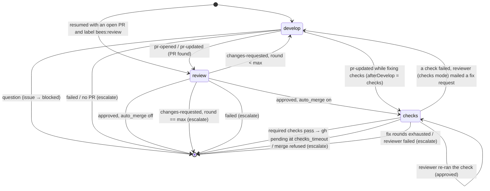

# Architecture

Internals for people working on busybees itself. For the user-facing view see
[workflow.md](workflow.md), [roles.md](roles.md), [configuration.md](configuration.md)
and [cli.md](cli.md).

## Package layout

```
cmd/bees/            CLI (cobra): init, run, tick, exec, status, mail, issue, done, mcp, config, prompts, labels
internal/config/     bees.toml schema, defaults, validation, global/role merging, label names, init template
internal/github/     thin wrapper around the gh CLI (issues, PRs, labels, milestones (read), sub-issues, required checks, merge, comment, PR activity)
internal/issues/     creates issues the factory way: filter labels/assignee, kind + state labels, sub-issue of --parent, inherited milestone
internal/mail/       the local mailbox: JSON messages under <state_dir>/mail/<role>/
internal/workspace/  temporary git worktrees created from the main clone
internal/skills/     clones skill repos by git URL and exposes them as claude plugin dirs
internal/session/    runs one headless `claude -p` session and collects its result and outcome
internal/prompts/    embedded base prompts (system/*.md, task/*.md) and their renderer
internal/mcpserver/  the built-in MCP server (`bees mcp serve`): mail, issue and outcome tools, filtered by role
internal/state/      state directory: notes, per-issue bookkeeping, singleton run times, status.json
internal/scheduler/  the orchestrator: poll, human feedback, PR merge state, reconcile, developer worker pool, singleton roles
internal/procs/      find and stop bees sessions after a crash (`bees kill`)
internal/testutil/   test helpers (local bare git remote + clone)
```

Dependency direction is strictly downwards: `cmd/bees` → `scheduler` →
everything else; `scheduler` is the only package that knows about all the
others. `github` and `session` execute external programs (`gh`, `claude`) and
both expose an override point (`Client.Exec`, `Runner.ClaudeBin`) so tests
never need the real ones.

## The scheduler loop

`scheduler.Run` initialises the state directory, prunes stale worktrees, then
ticks every `scheduler.poll_interval` (default 5m) until the context is
cancelled. Ctrl-C stops polling and waits for running sessions to finish.

Each tick (`tick`) is either a **full pass** or a **local pass**. A full pass
runs when the tick is at or past the next scheduled GitHub poll, and schedules
the next one `Scheduler.PollIntervalAt(now)` later — `poll_interval`, or
`off_hours_poll_interval` when `scheduler.work_hours` is configured and now
falls outside the window (see [Work hours](configuration.md#work-hours)).
Without `work_hours` that is always `poll_interval`, so every tick is a full
pass. If the poll fails with a rate-limit error (`isRateLimited`: the message
contains "rate limit", "secondary rate" or "abuse detection") the next poll is
pushed out by `scheduler.rate_limit_backoff` (default 15m) instead, whatever
the window says.

A full pass is:

1. **poll** – `gh issue list` and `gh pr list` with the filter's query (label,
   assignee, milestone). Issues are bucketed by state label (`triage`, `ready`,
   `in-progress`, `blocked`, `review`, `approved`, `needs-human`, or `""` for
   none) and sorted oldest first. Issues carrying `bees:feedback` or
   `bees:feature` are set aside in `snapshot.feedback` / `snapshot.features`
   instead of being bucketed, so they never get a state label — they belong
   to the product manager. Queue sizes (including `feedback` and `features`)
   go into `status.json`.
2. **human feedback** (`humans.go`) – for every open PR whose closing issue is
   visible, if `pr.updatedAt` is later than the issue's `human_seen_at` (or
   the PR's creation time), fetch its reviews, inline review comments and
   conversation comments with `gh api --paginate` (`github.Client.PRActivity`).
   Items containing `github.BeesMarker` (`<!-- bees:`) — comments written by
   bees, which share the human's `gh` account — and empty approvals are
   dropped. The rest are mailed to the developer as one message from `human`
   (`issue == N`, `pr == M`) whose body carries each item's id and the `gh`
   command to reply to it; `human_seen_at` is advanced to the newest item.
   If the issue was `approved`, `reopenApproved` relabels it `ready` and
   removes `bees:approved` from the PR, so a developer worker picks it up on
   step 4 (an issue a worker still owns — the checks stage — is left alone).
   **PR merge state** (`conflicts.go`, `checkPRs`) runs right after, over
   the same PRs: `gh pr list` already returns `mergeable`, `mergeStateStatus`
   and `headRefOid`, so this costs nothing. For an issue in `review` or
   `approved`, a `CONFLICTING` PR (with `scheduler.pr_fix_conflicts`) or a
   `BEHIND` one (with `scheduler.pr_keep_updated`) gets the developer one
   message from `orchestrator` (`issue == N`, `pr == M`) asking it to merge
   the default branch, resolve, test, push and report `pr-updated`; the head
   SHA is recorded as `conflict_notified_sha` so the same head is never
   mailed about twice. An approved issue goes through `reopenApproved` as
   above. `UNKNOWN`/empty merge state is "not computed yet" and skipped.
3. **reconcile** – label transitions driven by local state, in this order:
   - an issue with no state label gets `bees:triage` (and the `bees` label if
     the filter did not require it);
   - a `bees:blocked` issue with unread developer mail about it becomes
     `bees:ready`; with unread project-manager mail it becomes `bees:triage`;
   - a `bees:ready` issue with no size label gets `bees:size/m`, the default
     size (see [Sizing](workflow.md#sizing));
   - a `bees:ready` issue sized above `roles.developer.max_size` (default `l`,
     so normally a `bees:size/xl` one) goes back to `bees:triage` without a
     comment, for the project manager to split.

   The sizing runs after the unblocking so that an issue that becomes ready in
   a pass is sized in the same pass. Every edit is also written back to the
   cached poll (`cacheIssue`), which is what the local passes below classify
   from: without it they would see the old labels and repeat the edit.
4. **dispatch developers** – candidates are unowned `in-progress` and `review`
   issues (resume after a restart, never reordered), then `ready` issues that
   already have an open PR on their branch (`snapshot.prByBranch`; sent back
   by human feedback or a conflict — finished before new work, oldest first),
   followed by the remaining `ready` issues sorted by
   `scheduler.dispatch_order` (`sortReady`: smallest size first by default,
   ties by age). A `bees:size/l` candidate that is new work is skipped while
   `scheduler.max_large_in_flight` of them are already owned — the check runs
   *before* a slot is taken, so a held issue does not keep a worker idle. For
   the rest, a slot is taken from a buffered channel sized `max_developers`;
   when none is free the pass stops dispatching. A goroutine runs `workIssue`
   and returns the slot when done; the worker records the issue's size, which
   is what the cap counts and what `bees status` shows.
5. **dispatch singletons** – project manager (has triage issues or unread
   mail), product manager (unread mail, first run, or interval elapsed), QA
   (first run, or interval elapsed and something merged since — checked at
   most once per `qa_interval`). Each runs in
   its own goroutine, guarded by a `running` flag so at most one session per
   role exists.

   The product manager's "has work" test also looks at `snapshot.feedback`
   and `snapshot.features`: `freshIssues` fetches comments (`gh issue view`)
   only for issues whose `updatedAt` is later than the product manager's last
   run, and keeps those where `Issue.AwaitingBee()` is true — the latest
   human activity (creation or a comment without the `<!-- bees:` marker) is
   newer than the latest bee comment. A fresh issue that carries
   `bees:question` has that label removed on the spot (a person answered).
   Any fresh issue triggers a run outside `product_manager_interval`.
   `runProductManager` passes fresh feedback issues as `Data.Feedback`, fresh
   feature issues as `Data.FreshFeatures`, every open feature issue as
   `Data.Features` with its sub-issue progress in `Data.Progress` (one REST
   `gh api repos/../issues/N` per open feature, reading `sub_issues_summary`),
   and only work items (neither feature nor feedback) as `Data.Issues`.
   `runProjectManager` looks up each triage item's parent feature with one
   GraphQL query (`ParentIssue`) into `Data.Parents`; the developer worker
   does the same for its issue into `Data.Parent`.

   **Sub-issues and milestones.** Work items are native GitHub sub-issues of
   their feature. Roles create issues through the `issue_create` tool
   (`internal/issues`): it labels for the filter and kind/state, resolves the
   milestone as explicit → parent/related issue's milestone (`GetIssueDetails`)
   → `filter.milestone`, creates with `gh issue create`, and for a `parent`
   attaches the child with `POST repos/../issues/<parent>/sub_issues`
   (`AddSubIssue`, which needs the child's database id from
   `GetIssueDetails`). The factory never creates, edits or closes milestones;
   people do, and the bees inherit.

**Local passes.** A tick that is not due for a GitHub poll runs `localPass`
instead: it re-runs `classify` over the issue and PR lists cached from the last
successful poll (`classify` never mutates them, so the cache survives
`reconcile` appending to `snapshot.byState`), then does steps 3 and 4 and
dispatches only the singletons that have unread mail. It deliberately skips
the poll itself, the human-feedback fetch (step 2) and the product-manager and
QA "has work" checks, all of which read GitHub; label *writes* made by
`reconcile` and dispatch still happen, because what a local pass protects is
the polling budget, not every API call. Until the first successful poll there
is nothing cached and a local pass does nothing.

The one read a local pass does make is a confirmation. Its snapshot can be
stale — an issue a worker has since finished, one a developer parked in
`bees:blocked`, one a human closed or relabelled all still carry their old
state label in the cache — so before spending a session on a candidate,
`dispatchDevelopers` fetches that single issue (`gh issue view`) and drops it
unless it is still open and in `bees:ready`, `bees:in-progress` or
`bees:review`. The fresh copy replaces the cached one, so the next local pass
does not ask again. That is one call immediately before a whole session, not
per pass. The mailbox is not GitHub: the
developer ↔ reviewer loop, the checks stage and mail-driven label transitions
run at `poll_interval` however the window is configured.

**Backoff.** A singleton is never dispatched again sooner than one poll
interval after it finishes, and a failing singleton or developer issue waits
five poll intervals. This stops a broken session from burning tokens in a tight
loop.

**API budget.** Every poll costs exactly two `gh` calls (`issue list`,
`pr list`); everything else is gated on what those lists report so an idle
factory stays at two calls per poll (and, with `scheduler.work_hours` set, at
two calls per `off_hours_poll_interval` outside working hours). Human PR feedback is fetched (3 calls)
only for PRs whose `updatedAt` moved past `human_seen_at`; product-manager
feedback/feature comments (1 `issue view` each) only for issues whose
`updatedAt` is newer than the PM's last run; QA's merged-PR query runs at most
once per `qa_interval`, recorded as `last_check` in `<state_dir>/qa.json` so
an elapsed interval with nothing merged does not re-query on every poll; the
checks stage polls `gh pr checks` every `roles.reviewer.checks_poll_interval`
(default 2m), not every poll; the label backstop makes two list calls after
each session; and worker stage transitions make a handful of `issue view` /
`pr view` / `issue edit` calls. Sessions call `gh` on their own on top of
this, which busybees does not meter.

**Once mode.** `Once = true` (`bees tick`, `bees run --once`) performs a single
pass and then waits for everything it started. `OnlyRoles` (`--roles`)
restricts dispatch to the named roles; a role with `enabled = false` in
`bees.toml` is skipped regardless.

`status.json` is rewritten after every pass and whenever a worker or
singleton starts or stops; `bees status` just reads it.

## The developer worker

`workIssue` owns one issue from claim to approval — or, with
`roles.reviewer.auto_merge`, to merge — (or escalation) and runs a
small state machine with two stages:



- **Workspace.** `git fetch`, then one worktree for the issue on
  `<branch_prefix>issue-N`: created from `<project.remote>/<default_branch>` if new,
  checked out tracking the remote if it exists there, or reused if it exists
  only locally. The same worktree serves both developer and reviewer sessions
  for that issue and is removed when the worker exits (unless
  `keep_workspaces`). Before each reviewer session the worktree is
  fast-forwarded to the developer's latest push.
- **Resume.** On start the worker looks for an open PR whose head is the
  branch. If one exists and the issue is labelled `bees:review` it starts in
  the review stage; otherwise in develop. This is how work survives a restart
  of `bees run`.
- **Rounds.** `<state_dir>/issues/<n>.json` records the review round, PR
  number, branch, `check_fix_rounds`, `human_seen_at` and
  `conflict_notified_sha`. The round is
  incremented on every `changes-requested` and compared with
  `scheduler.max_review_rounds`; human feedback rounds do not count against
  the limit. `check_fix_rounds` is incremented each time the reviewer is asked
  to diagnose failing checks and compared with
  `roles.reviewer.max_check_fix_rounds`.
- **Checks stage** (`auto_merge`). `approve` only labels the PR and issue
  `bees:approved`; merging happens in the `checks` stage. `awaitChecks` sleeps
  `checks_wait`, then calls `github.RequiredChecks` (`gh pr checks --required
  --json …`; gh's non-zero exits for pending/failing checks and its "no
  required checks" / "no checks reported" messages are handled, an empty list
  counts as passed) every `checks_poll_interval` until `Summarize` returns
  passed or failed, or `checks_timeout` elapses. Passed → `MergePR` with `merge_method`
  and `--delete-branch` (a refusal escalates). Failed → a reviewer session
  with `task: "reviewer_checks"` and `BEES_REVIEW_MODE=checks`, given
  `github.Failed(checks)`. Its `changes-requested` sets `afterDevelop =
  "checks"` so the next developer `pr-updated` returns to the checks stage
  instead of review; `approved` re-polls. If the reviewer role is disabled
  the developer's PR goes straight from develop to checks.
- **Verification.** Outcomes that imply a side effect are checked: `pr-opened`
  must correspond to an open PR on the branch (looked up by the reported
  number, else by branch), `question` must have produced mail to the project
  manager during the session, and `changes-requested` mail to the developer.
  A claim without the side effect is escalated rather than trusted.
- **Escalation** (`escalate`) sets `bees:needs-human` and posts a comment;
  it is the only GitHub comment the orchestrator itself writes. Roles comment on
  GitHub to people (developer PR replies, product-manager replies and questions
  on feedback/feature issues), always with the `<!-- bees:<role> -->` marker.

Singleton roles share `runSingleton`: detached worktree on the default branch,
one session, mark delivered mail read, record `LastRun` in
`<state_dir>/<role>.json`.

## Running a session

`session.Runner.Run` executes, inside the worktree:

```
claude -p \
  --output-format stream-json --verbose \
  --dangerously-skip-permissions \
  --append-system-prompt-file <session>/system-prompt.md \
  --model <model> [--fallback-model <fallback>] [--effort <level>] \
  --max-turns <n> --name bees-<session name> \
  --add-dir <state_dir> \
  [--allowedTools ...] [--disallowedTools ...] \
  --mcp-config <session>/mcp.json --strict-mcp-config \
  [--plugin-dir <skill plugin dir> ...]
```

The task prompt is written to stdin. Each line of stream-json is appended to
`<session>/transcript.jsonl`; the final `result` event supplies the result
text, `is_error`, subtype, turn count, cost and claude session id. stderr is
saved to `stderr.log` when non-empty, and `result.json` summarises the run.

- **Outcome.** The session ends by calling the `done` tool (or running
  `bees done <status>`), which writes `<session>/outcome.json` through
  `session.Report` — the shared validation for both paths. The runner reads the
  file after claude exits; a missing one is reported as `HasOutcome = false` and
  the scheduler treats it as `failed`.
- **Retries.** `runSession` is the single-attempt primitive; every worker calls
  it through `runSessionWithRetry`. `classifyFailure` (in
  `internal/scheduler/sessions.go`) splits failures into *infrastructure* — a
  timeout, an API error, exhausted turns, a rate limit, `claude` exiting with
  no result event — and *behavioural*: the session reported an outcome
  (including `failed`), or exited cleanly without reporting. Only
  infrastructure failures are retried, `scheduler.retries` times, waiting
  `scheduler.retry_delay` between attempts and running with the role's
  fallback model when `scheduler.retry_with_fallback` is set. Each attempt has
  its own session directory (`<name>-retry<n>`), and a retried developer
  session is told its previous attempt was interrupted so it continues from
  the branch. See [Escalation](workflow.md#escalation-beesneeds-human).
- **Environment.** The configured `env` entries first (`$VAR`-expanded) and
  `SHELL` when `shell` is set; then `BEES_ROLE`, `BEES_SESSION_DIR`,
  `BEES_STATE_DIR`, `BEES_CONFIG`, `BEES_REPO`, `BEES_LABEL`, `BEES_BIN`, plus
  `BEES_NOTES_FILE`, `BEES_ISSUE`, `BEES_PR`, `BEES_BRANCH` when they apply and
  `BEES_REVIEW_MODE=checks` for the reviewer's checks-mode sessions; and, unless
  `GIT_CONFIG_COUNT` is already set, `GIT_CONFIG_*` entries for
  `push.autoSetupRemote=true` / `push.default=current`. The directory holding
  the `bees` binary is prepended to `PATH` so `bees mail`, `bees issue` and
  `bees done` resolve inside the session. The `BEES_*` variables are also passed
  explicitly to the built-in MCP server rather than left to inheritance.
- **Prompts.** `prompts.System` renders `system/common.md` + `system/<role>.md`
  and appends the role's custom text from `bees.toml`; `prompts.Task` renders
  `task/<role>.md`. Both take a single `prompts.Data` struct (project, filter,
  labels, workspace, notes, inbox, issue, PR, lists, round).
- **Skills.** `skills.Manager.Prepare` clones each URL (`<url>[@ref][#subdir]`)
  under `~/.cache/bees/repos/` and returns a plugin directory: the repo itself
  if it has `.claude-plugin/plugin.json`, otherwise a generated wrapper under
  `~/.cache/bees/plugins/<name>/` whose `skills/` symlinks to the skill or
  skills collection. Each becomes a `--plugin-dir`, so the project worktree is
  never modified. Sessions start concurrently and share one manager, so
  `Prepare` serialises its work behind a mutex and leaves a wrapper that
  already points at the right target alone.
- **MCP.** `mcp.json` is written for every session and always passed with
  `--strict-mcp-config`, so a session sees exactly two things: the servers from
  the resolved role (`$VAR` in `env` and `headers` expanded from the bees process
  environment) and the built-in `bees` server — `<bees binary> mcp serve` over
  stdio, with the session's `BEES_*` variables in its `env`. It serves the
  factory's own operations (`mail_send`, `mail_list`, `issue_create`,
  `issue_link`, `done`) as tools backed by the same `internal/mail`,
  `internal/issues` and `session.Report` code the CLI uses, so a session calls a
  schema instead of composing a command line. The tool schemas depend on
  `BEES_ROLE`: `done`'s `status` enum is the role's valid outcomes. The name
  `bees` is reserved in `bees.toml`. See `internal/mcpserver` and
  [cli.md](cli.md#bees-mcp-serve-sessions).
- **Timeout.** The role's `timeout` bounds the command context; claude runs in
  its own process group and on expiry the whole group is `SIGKILL`ed so MCP
  servers die with it. The result is marked `TimedOut`.

Unless `GIT_CONFIG_COUNT` is already set, the runner also exports
`GIT_CONFIG_COUNT=2` with `push.autoSetupRemote=true` and `push.default=current`,
so a session can run a plain `git push` on a branch the workspace created with
`git worktree add --no-track -b …` without busybees ever editing the clone's git
configuration.

## The mailbox

A message is one JSON file at `<state_dir>/mail/<to-role>/<id>.json`:

```json
{
  "id": "20260829T151201-9f3a2b1c",
  "from": "reviewer",
  "to": "developer",
  "subject": "Review round 1",
  "body": "...",
  "issue": 12,
  "pr": 34,
  "created_at": "2026-08-29T15:12:01Z",
  "read_at": null,
  "in_reply_to": ""
}
```

Messages are addressed to a **role**, not a session. Delivery rules:

- A developer session for issue N with PR M receives unread developer mail
  where `issue == N` or `pr == M`.
- A reviewer session receives its own earlier feedback for the PR
  (`from: reviewer, to: developer, pr == M`) as "previous rounds".
- Singleton sessions receive all unread mail addressed to their role.
- Mail is marked read (`read_at` set) after the session that received it
  finishes, so a crashed session sees it again.
- Reconcile uses *unread* mail to relabel blocked issues; the scheduler's
  `sentSince` check uses creation time to verify a session really sent what it
  claimed.
- Human PR feedback enters the mailbox as messages from `human` (see the
  scheduler loop); people can also send mail by hand with
  `bees mail send --from human`. The scheduler's own requests — bring a PR
  up to date with the default branch — come from `orchestrator`.

**Label backstop.** After every session (`runSession` in `sessions.go`) the
scheduler calls `adoptCreated`: `github.Client.ListCreatedSince` lists issues
and PRs matching `author:@me created:>=<session start>` regardless of labels,
and anything carrying a `<label>:*` label but missing the base label (or the
configured `filter.assignee`) is labelled/assigned so it stays visible. Items
with no factory label at all are left alone.

Writes are atomic (temp file + rename), IDs embed a timestamp so listing sorts
oldest first, and `bees mail` works from any directory because sessions get
`BEES_STATE_DIR`.

## State directory

```
<state_dir>/                     default .bees/ next to bees.toml
  README.md
  mail/<role>/*.json             mailbox
  notes/<role>.md                role memory
  sessions/<ts>-<name>-<rand>/   system-prompt.md, prompt.md, mcp.json, transcript.jsonl,
                                 stderr.log, outcome.json, result.json
  issues/<n>.json                {number, round, pr, branch, check_fix_rounds, human_seen_at,
                                 conflict_notified_sha, updated_at}
  product_manager.json           {last_run}
  qa.json                        {last_run, last_check}
  status.json                    live scheduler status for `bees status` (queues, workers, singletons, last_poll, last_error)
  ledger.jsonl                   append-only, one JSON line per finished session
                                 {time, role, session, issue, pr, turns, cost_usd,
                                 duration_ms, outcome, error_subtype, timed_out}
  bees.log                       every record of the last scheduler runs as JSON, rotated
                                 at 10 MiB into bees.log.1 and bees.log.2
```

`ledger.jsonl` is the factory's accounting: `runSession` appends one line for every
session that finishes, whatever it reported, and `bees cost` sums it. Lines are
written with a single `O_APPEND` write so concurrent workers cannot interleave, and
a line that does not parse is skipped on read rather than failing it.

`bees.log` is written only by the commands that run sessions (`run`, `tick`,
`exec`) and always contains every record at debug level, whatever the console
flags say. `bees issue` and `bees mail` run inside sessions, concurrently with
the scheduler, so they never open it.

`bees init` makes sure the directory is ignored by git: if `git check-ignore`
does not already ignore it (and it lives inside the clone), `/.bees/` is
appended to the repository's `.gitignore` — commit that change. `bees.toml`
itself is meant to be committed. Worktrees live under `$TMPDIR/bees/` (or
`scheduler.workspace_root`) and are removed after each worker or singleton
run; the skills cache lives under `~/.cache/bees/` (`BEES_CACHE_DIR`), whose clones
are refreshed on use according to `global.skills_refresh` and can be inspected with
`bees skills`.

## Testing

Nothing in the test-suite talks to GitHub or runs Claude Code.

- **Fake gh.** `github.Client.Exec` is a function field; the scheduler tests
  replace it with an in-memory implementation that understands the `gh`
  invocations the wrapper makes — `issue list` (including `--state all
  --search` for the label backstop), `issue view/edit/comment` (labels and
  `--add-assignee`), `pr list/view/merge/checks` (a queue of scripted check
  results; merge arguments are recorded), `api .../milestones`, `api
  repos/…/issues/N` (REST details: id, milestone, sub-issue summary), `api
  graphql` (parent lookup) and `api …/pulls/N/reviews|comments` and
  `issues/N/comments` (human PR activity) — and records label history,
  comments and merges for assertions.
- **Fake claude.** The scheduler test binary doubles as `claude`: `TestMain`
  checks `FAKE_CLAUDE=1` (not `BEES_FAKE_CLAUDE`: the runner strips every
  inherited `BEES_*`, so a flag in that namespace would never reach the fake)
  and, when set, runs a scripted role
  (`developer` commits and pushes then reports `pr-opened`; `reviewer` mails
  feedback once then approves; singletons report `done`), writes
  `outcome.json` and prints a stream-json `result` line. `Runner.ClaudeBin` is
  set to `os.Args[0]`. The session tests use small shell scripts the same way.
- **Real git.** `testutil.SetupRepos` creates a bare "origin" and a clone with
  one commit; workspace and scheduler tests create real worktrees and push to
  it, then assert the branch history and that no worktrees are left behind.
- **Skills.** `skills.Manager.Git` is replaced with a copy of a fixture
  directory so every supported repository layout is exercised offline.

Run locally:

```
go test ./...
```

Or through Dagger, which is the CI entrypoint. The workspace (`dagger.toml`)
installs the official `github.com/dagger/go` module, providing the checks
`go:lint-all`, `go:test-all` and `go:generate-all`:

```
DAGGER_X_RELEASE=v1.0.0-beta.11 dagger check
DAGGER_X_RELEASE=v1.0.0-beta.11 dagger check -l        # list checks
DAGGER_X_RELEASE=v1.0.0-beta.11 dagger check go:test-all
```

The `DAGGER_X_RELEASE` variable pins the Dagger release used for this
repository; set it in your shell.

## Crash recovery (`bees kill`)

The runner writes the session's pid to `<session dir>/pid` right after starting
`claude` and removes it when the session ends. If bees dies, those files (and the
`--name bees-<session>` argument every session is started with) let `bees kill`
find the orphans: `procs.Find` merges the pid files with a `ps` scan restricted to
processes whose executable is `claude` (directly or via an interpreter), cross-checking
pid files against the scan so a reused pid is discarded rather than killed.
Both sources are scoped to one factory: a scanned process counts only when its command
line also references this state directory's `sessions/` (every session's argv carries
`--append-system-prompt-file <sessions dir>/<session>/system-prompt.md`, matched as a
path prefix and also in its `filepath.EvalSymlinks` form). Sessions of another project's
factory are never reported, so `bees kill` run with one project's config cannot strand
another project's issues.
`procs.Kill` sends SIGTERM to the process group (sessions are started with
`Setpgid`, so MCP servers and shells belong to it), waits `--grace`, then SIGKILL.
The command then removes every worktree of the main clone that lives under the
workspace root, prunes worktree metadata, deletes leftover workspace directories and
resets `status.json`. It refuses to run while the scheduler recorded in `status.json`
is alive unless `--scheduler` is given.
