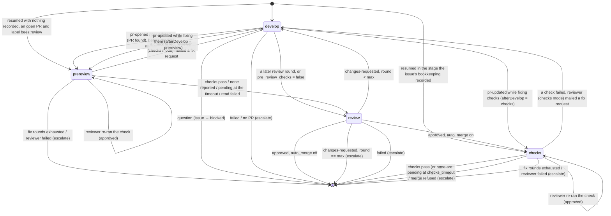

# Architecture

Internals for people working on busybees itself. For the user-facing view see
[workflow.md](workflow.md), [roles.md](roles.md), [configuration.md](configuration.md)
and [cli.md](cli.md).

## Package layout

```
cmd/bees/            CLI (cobra): init, run, tick, exec, status, mail, issue, done, mcp, config, prompts, labels
internal/config/     bees.toml schema, defaults, validation, global/role merging, label names, init template
internal/github/     thin wrapper around the gh CLI (issues, PRs, labels, milestones (read), sub-issues, checks (required and reported), merge, comment, PR activity)
internal/issues/     creates issues the factory way: filter labels/assignee, kind + state labels, sub-issue of --parent, inherited milestone
internal/mail/       the local mailbox: JSON messages under <state_dir>/mail/<role>/
internal/workspace/  temporary git worktrees created from the main clone
internal/skills/     clones skill repos by git URL and exposes them as claude plugin dirs
internal/session/    runs one headless `claude -p` session and collects its result and outcome
internal/prompts/    embedded base prompts (system/*.md, task/*.md) and their renderer
internal/mcpserver/  the built-in MCP server (`bees mcp serve`): mail, issue and outcome tools, filtered by role
internal/state/      state directory: notes, per-issue bookkeeping, singleton run times, status.json
internal/scheduler/  the orchestrator: poll, human feedback, PR merge state, reconcile, developer worker pool, singleton roles, event stream
internal/procs/      find and stop bees sessions after a crash (`bees kill`)
internal/testutil/   test helpers (local bare git remote + clone)
```

Dependency direction is strictly downwards: `cmd/bees` → `scheduler` →
everything else; `scheduler` is the only package that knows about all the
others. `github` and `session` execute external programs (`gh`, `claude`) and
both expose an override point (`Client.Exec`, `Runner.ClaudeBin`) so tests
never need the real ones.

## The scheduler loop

`scheduler.Run` initialises the state directory, prunes stale worktrees,
creates the workflow labels the repository is missing (`ensureLabels`: one
`gh label list`, then `gh label create` for each name it does not find, matched
case-insensitively — existing labels are left alone, and a failure only warns),
then ticks every `scheduler.poll_interval` (default 5m) — or sooner, when a
local event wakes it (below) — until the context is cancelled. Ctrl-C stops
polling and waits for running sessions to finish.

Each tick (`tick`) is either a **full pass** or a **local pass**. A full pass
runs when the tick is at or past the next scheduled GitHub poll, and schedules
the next one `Scheduler.PollIntervalAt(now)` later — `poll_interval`, or
`off_hours_poll_interval` when `scheduler.work_hours` is configured and now
falls outside the window (see [Work hours](configuration.md#work-hours)).
Without `work_hours` that is always `poll_interval`, so every *scheduled*
tick is a full pass and the local passes in between are the ones a wake asks
for. If the poll fails with a rate-limit error (`isRateLimited`: the message
contains "rate limit", "secondary rate" or "abuse detection") the next poll is
pushed out by `scheduler.rate_limit_backoff` (default 15m) instead, whatever
the window says.

A full pass is:

1. **poll** – `gh issue list` and `gh pr list` with the filter's query (label,
   assignee, milestone). Issues are bucketed by state label (`triage`, `ready`,
   `in-progress`, `blocked`, `review`, `approved`, `needs-human`, or `""` for
   none) and sorted oldest first. Issues carrying `bees:feedback` or
   `bees:feature` are set aside in `snapshot.feedback` / `snapshot.features`
   instead of being bucketed, so they never get a state label — they belong
   to the product manager. Queue sizes (including `feedback` and `features`)
   go into `status.json`.
2. **human feedback** (`humans.go`) – for every open PR whose closing issue is
   visible, if `pr.updatedAt` is later than the issue's `human_seen_at` (or
   the PR's creation time), fetch its reviews, inline review comments and
   conversation comments with `gh api --paginate` (`github.Client.PRActivity`).
   Comments bees wrote, and empty approvals, are dropped. A comment is a
   bee's if its last line is a `<!-- bees:<role> -->` marker, or if its
   author is the login `[github]` gives the factory (`github.IsBee`); with
   `[github]` unset — bees then share the human's `gh` account — the marker
   is the only signal. Only the last line counts (`github.BeeRole`), so a
   person quoting the bee they answer still reaches the developer. The rest
   are mailed to the developer as one message from `human` (`issue == N`,
   `pr == M`) whose body carries each item's id and the `gh` command to reply
   to it; `human_seen_at` is advanced to the newest item.
   If the issue was `approved`, `reopenApproved` relabels it `ready` and
   removes `bees:approved` from the PR, so a developer worker picks it up on
   step 5 (an issue a worker still owns — the checks stage — is left alone).
   **PR merge state** (`conflicts.go`, `checkPRs`) runs right after, over
   the same PRs: `gh pr list` already returns `mergeable`, `mergeStateStatus`
   and `headRefOid`, so this costs nothing. For an issue in `review` or
   `approved`, a `CONFLICTING` PR (with `scheduler.pr_fix_conflicts`) or a
   `BEHIND` one (with `scheduler.pr_keep_updated`) gets the developer one
   message from `orchestrator` (`issue == N`, `pr == M`) asking it to merge
   the default branch, resolve, test, push and report `pr-updated`; the head
   SHA is recorded as `conflict_notified_sha` so the same head is never
   mailed about twice. An approved issue goes through `reopenApproved` as
   above. `UNKNOWN`/empty merge state is "not computed yet" and skipped.
3. **reconcile** – label transitions driven by local state, in this order:
   - an issue with no state label and neither `bees:feature` nor
     `bees:feedback` is a person handing the factory an idea, not a spec: it
     gets `bees:feedback` (and the `bees` label if the filter did not
     require it) and is appended to `snapshot.feedback`, so it reaches the
     **product manager** in the same pass and never enters triage. A person
     who wants it built without that hop labels it `bees:triage` or
     `bees:ready` themselves;
   - a `bees:blocked` issue with unread developer mail about it becomes
     `bees:ready`; with unread project-manager mail it becomes `bees:triage`;
   - a `bees:ready` issue with no size label gets `bees:size/m`, the default
     size (see [Sizing](workflow.md#sizing));
   - a `bees:ready` issue sized above `roles.developer.max_size` (default `l`,
     so normally a `bees:size/xl` one) goes back to `bees:triage` without a
     comment, for the project manager to split.

   The sizing runs after the unblocking so that an issue that becomes ready in
   a pass is sized in the same pass. Every edit is also written back to the
   cached poll (`cacheIssue`), which is what the local passes below classify
   from: without it they would see the old labels and repeat the edit.
4. **pauses** (`budgets.go`, `limits.go`) – two things can stop steps 5 and 6
   from starting anything new; workers already running finish their loop
   either way, and each pause is logged once when it starts and once when it
   lifts, and reported by `bees status`.
   - **cost budget** – with `scheduler.max_cost_per_day` set, the ledger is
     summed over the last 24 hours before anything is dispatched. The other
     two budgets are enforced elsewhere: `max_cost_per_issue` between a
     developer worker's stages, and `max_cost_per_session` after a session
     ends. See [Cost budgets](configuration.md#cost-budgets).
   - **claude session limit** – recorded from a finished session rather than
     computed here (`recordSessionLimit`, called from `runSessionWithRetry`):
     a session whose last `rate_limit_event` was blocking, or which failed
     without reporting an outcome and whose result text names a session or
     usage limit, pauses dispatch until the reset time the event carried
     (`rate_limit_backoff` when there was none, capped at 8h). A session that
     reported no outcome also returns at once, without spending a retry; one
     that did its work and reported is still read normally. The limit is per
     account, so it holds every role. See
     [The claude session limit](configuration.md#the-claude-session-limit).
5. **dispatch developers** – candidates are unowned `in-progress` and `review`
   issues (resume after a restart, never reordered), along with an `approved`
   issue whose worker was killed in the post-approval checks stage
   (`resumableChecks`: an open PR and a `worker_stage` of `checks` recorded in
   the state directory — `approve()` labels the issue before that wait, so it
   is work in flight; every other approved issue is waiting for a person to
   merge it). Then `ready` issues that already have an open PR on their branch
   (`snapshot.prByBranch`; sent back by human feedback or a conflict —
   finished before new work, oldest first), followed by the remaining `ready`
   issues sorted by `sortReady`: issues a person marked `bees:priority` first,
   then `scheduler.dispatch_order` (smallest size first by default), ties by
   age. Priority is a separate axis from size and reorders the queue only — it
   lifts no cap. A `bees:size/l` candidate that is new work is skipped while
   `scheduler.max_large_in_flight` of them are already owned — the check runs
   *before* a slot is taken, so a held issue does not keep a worker idle. For
   the rest, a slot is taken from a buffered channel sized `max_developers`;
   when none is free the pass stops dispatching. A goroutine runs `workIssue`
   and returns the slot when done; the worker records the issue's size, which
   is what the cap counts and what `bees status` shows.
6. **dispatch singletons** – project manager (has triage issues or unread
   mail), product manager (unread mail, first run, interval elapsed, or a
   feature whose work is done), QA
   (unread mail, first run, or interval elapsed and something merged since —
   checked at most once per `qa_interval`). Each runs in its own goroutine,
   guarded by a `running` flag so at most one session per role exists.

   The product manager's "has work" test also looks at `snapshot.feedback`
   and `snapshot.features`: `freshIssues` fetches comments (`gh issue view`)
   only for issues whose `updatedAt` is later than the product manager's last
   run, and keeps those where `Client.AwaitingBee` is true — the human side
   (creation, or a comment that is not a bee's by either of the two rules
   above: no `<!-- bees:<role> -->` marker on its last line, and not authored
   by the factory's own login) had the last word. A person quoting the bee
   they are answering is still a person: the marker only counts where a bee
   puts it, at the end, and the login is theirs, not the factory's.
   `gh` reports comment times at second resolution, so a tie is broken by the
   comments' order in the list rather than by comparing timestamps: a person
   commenting in the same second as a bee is still awaiting a bee. A fresh
   issue that carries `bees:question` has that label removed on the spot (a
   person answered). Any fresh issue triggers a run outside
   `product_manager_interval`. A
   [proposal](workflow.md#feature-issues) only does so once a person has
   commented on it (`Client.AwaitingBeeComment`, which is `AwaitingBee`
   without the creation seeded in): nobody has commented on one a bee wrote,
   so it is fresh forever, and counting that would wake the product manager
   on every poll for a decision only a person can make. A person's question
   still gets an answer on the next poll, and the proposal goes quiet again
   on the one after that. Approval leaves no comment either, so `reconcile`
   also watches `bees:proposal` on every feature and records
   `ProposalApprovedAt` when a person removes it — a label edit leaves no
   comment, so nothing else would notice — and a feature approved since the
   last run wakes the product manager and reaches it whatever `AwaitingBee`
   says. An issue a person put in
   [planning mode](workflow.md#planning-with-the-product-manager)
   (`bees:planning`) is the same shape for the same reason: only a comment on
   it counts, because the run it would start can do nothing but reply to what
   the person wrote. `bees:planned` wakes nothing at all — the issue waits for
   the run `product_manager_interval` brings round.

   The last condition is a **feature whose work is done**
   (`completedFeatures`), and it makes no GitHub call: every
   `runProductManager` records each feature's open sub-issue numbers in
   `<state_dir>/issues/<n>.json` (`IssueState.OpenChildren`, inverted from the
   `Parents` map it already builds — `sub_issues_summary` carries counts, not
   numbers), and the check asks whether every recorded number is absent from
   `snapshot.open`. Such a feature reaches the run as `Data.CompletedFeatures`,
   a task section of its own, and is marked `CompleteReportedAt` so it is
   reported once; a recorded set that changes clears the mark, so a feature
   that gains a sub-issue can be reported again when that one closes. A run
   whose `ParentIssue` queries did not all answer records nothing — a partial
   answer would look like children that closed — so a failed query costs the
   `Parent` column and that run's recording, nothing else. A run whose product
   manager session never started does not spend the report either. A feature
   the scheduler has never recorded children for does not fire and waits for
   the interval.
   `runProductManager` passes fresh feedback issues as `Data.Feedback`, the
   features whose every recorded sub-issue has closed as
   `Data.CompletedFeatures`, fresh
   feature issues as `Data.FreshFeatures` (proposals partitioned out into
   `Data.Proposals`, which the task prompt presents in a section of its own),
   the issues carrying `bees:planning` as `Data.Planning` and the ones
   carrying `bees:planned` as `Data.Planned` (both partitioned out of the
   fresh lists into sections of their own),
   every open feature issue as
   `Data.Features` with its sub-issue progress in `Data.Progress` (one REST
   `gh api repos/../issues/N` per open feature, reading `sub_issues_summary`),
   and only work items (neither feature nor feedback) as `Data.Issues`, each
   with the feature it is a sub-issue of in `Data.Parents` — the summary
   carries counts only, so the parent is a lookup of its own.
   `runProjectManager` fills the same map for its triage items, and the
   developer worker for its one issue into `Data.Parent`; all three use one
   `ParentIssue` GraphQL query per issue.

   **Planning mode.** The `Data.Planning` section lists no breakdown step and
   the `Data.Planned` one says the scope is settled, which is the readable
   half of the rule; the enforced half is that `internal/issues` refuses a
   `bees:planning` issue as a `parent` and `issue_link` refuses it as a
   parent, exactly as both already do a proposal, so a planning issue grows no
   sub-issues whoever asks. A planned *feature* is in `Data.Planned` only
   while `sub_issues_summary` reports no sub-issues — that is the "has it been
   broken down already?" answer, and the sub-issues the breakdown creates are
   what take it off the list, so no later run does it twice. A planned
   *feedback* issue leaves the list by being closed, which takes it out of the
   poll. The summary is that answer only when it can be *read*: a feature whose
   `feature-progress` lookup failed leaves no entry at all, and a missing entry
   is not evidence of no sub-issues, so such a feature waits for the next run
   rather than being presented again. An issue still carrying `bees:proposal`
   is not agreed either, whatever else a person put on it — the proposal label
   is what says they have not approved it — so it stays in the proposals
   section. Neither planning label is ever written by the factory.

   **Sub-issues and milestones.** Work items are native GitHub sub-issues of
   their feature. Roles create issues through the `issue_create` tool
   (`internal/issues`): it labels for the filter and kind/state, resolves the
   milestone as explicit → parent/related issue's milestone (`GetIssueDetails`)
   → `filter.milestone`, creates with `gh issue create`, and for a `parent`
   attaches the child with `POST repos/../issues/<parent>/sub_issues`
   (`AddSubIssue`, which needs the child's database id from
   `GetIssueDetails`). The factory never creates, edits or closes milestones;
   people do, and the bees inherit.

**Local passes.** A tick that is not due for a GitHub poll — and every wake —
runs `localPass` instead: it re-runs `classify` over the issue and PR lists
cached from the last successful poll (`classify` never mutates them, so the
cache survives `reconcile` appending to `snapshot.byState`), then does steps 3
and 4 and dispatches only the singletons that have unread mail. It deliberately
skips the poll itself, the human-feedback fetch (step 2) and the
product-manager and QA "has work" checks, all of which read GitHub; label
*writes* made by `reconcile` and dispatch still happen, because what a local
pass protects is the polling budget, not every API call. Until the first
successful poll there is nothing cached and a local pass does nothing.

The one read a local pass does make is a confirmation. Its snapshot can be
stale — an issue a worker has since finished, one a developer parked in
`bees:blocked`, one a human closed or relabelled all still carry their old
state label in the cache — so before spending a session on a candidate,
`dispatchDevelopers` fetches that single issue (`gh issue view`) and drops it
unless it is still open and in `bees:ready`, `bees:in-progress` or
`bees:review` — or in `bees:approved`, for the interrupted checks stage above,
which is the one approved issue the same pass admitted. The fresh copy
replaces the cached one, so the next local pass does not ask again. That is
one call immediately before a whole session, not per pass. The mailbox is not
GitHub: the developer ↔ reviewer loop, the checks stage and mail-driven label
transitions run at `poll_interval` — sooner when a wake asks for it — however
the window is configured.

**Waking up.** Waiting out the poll interval for something that happened
locally is pure downtime, so `Run` selects on a `wake` channel beside the poll
timer and runs a local pass for every signal. Three things signal it: a session
finishing (`runSession`), a developer worker returning its slot to the pool
(the two are separate events — a worker runs several sessions before its slot
comes free), and the two messages the scheduler sends itself (the conflict
notice in `checkPRs` and the human feedback `deliverHumanFeedback` forwards). A
wake is never a full pass: no extra GitHub call, and the polling cadence is
exactly what `poll_interval` and the window say. The channel holds one signal,
so a burst of finished sessions costs one pass rather than one each, and a full
pass drops whatever is pending because it does strictly more.

Mail written by another process — `bees mail send`, or the MCP server attached
to a session — cannot signal an in-process channel, and the mailbox is
deliberately not watched for changes. It does not need to be: the session that
wrote the mail signals when it finishes, and the local pass that follows
re-reads the mailbox from disk. Mail a person sends by hand while nothing is
running waits for the next tick.

**Backoff.** A singleton is never dispatched again sooner than one poll
interval after it finishes, and a failing singleton or developer issue waits
five poll intervals. This stops a broken session from burning tokens in a tight
loop.

**API budget.** Every poll costs exactly two `gh` calls (`issue list`,
`pr list`); everything else is gated on what those lists report so an idle
factory stays at two calls per poll (and, with `scheduler.work_hours` set, at
two calls per `off_hours_poll_interval` outside working hours). Human PR feedback is fetched (3 calls)
only for PRs whose `updatedAt` moved past `human_seen_at`; product-manager
feedback/feature comments (1 `issue view` each) only for issues whose
`updatedAt` is newer than the PM's last run; QA's merged-PR query runs at most
once per `qa_interval`, recorded as `last_check` in `<state_dir>/qa.json` so
an elapsed interval with nothing merged does not re-query on every poll; the
checks stage polls `gh pr checks` every `roles.reviewer.checks_poll_interval`
(default 2m), not every poll; the visibility backstop makes two list calls after
each session; and worker stage transitions make a handful of `issue view` /
`pr view` / `issue edit` calls. Sessions call `gh` on their own on top of
this, which busybees does not meter.

**Once mode.** `Once = true` (`bees tick`, `bees run --once`) performs a single
pass and then waits for everything it started. `OnlyRoles` (`--roles`)
restricts dispatch to the named roles; a role with `enabled = false` in
`bees.toml` is skipped regardless.

`status.json` is rewritten after every pass and whenever a worker or
singleton starts or stops; `bees status` just reads it.

**The event stream** (`events.go`) is the live half of the same picture, for
a view running in the same process — a terminal UI, a log tail.
`Scheduler.Subscribe` returns a buffered channel of `Event`s: a session
started, a session ended (with its outcome and cost), a developer worker
moved to another stage, a full pass finished. It is published *alongside*
`writeStatus`, never instead of it: the event says something happened,
`status.json` says what the factory now looks like. The poll event is
published *after* the write, so a view that re-reads `status.json` when one
arrives sees the pass that event is about, never the one before it.

It is a view mechanism and nothing more. No scheduler decision depends on
whether anyone is subscribed, and `publish` never blocks — an event a
subscriber has no room for is dropped, so a view that stops reading loses
events instead of slowing a pass down. Event timestamps come from the
scheduler's clock, like everything else it records.

## The developer worker

`workIssue` owns one issue from claim to approval — or, with
`roles.reviewer.auto_merge`, to merge — (or escalation) and runs a
small state machine with four stages:



- **Workspace.** `git fetch`, then one worktree for the issue on
  `<branch_prefix>issue-N`: created from `<project.remote>/<default_branch>` if new,
  checked out tracking the remote if it exists there, or reused if it exists
  only locally. The same worktree serves both developer and reviewer sessions
  for that issue and is removed when the worker exits (unless
  `keep_workspaces`). Before each reviewer session the worktree is
  fast-forwarded to the developer's latest push. Each workspace is a unique
  temp directory under `workspace_root` and the worktree inside it carries that
  same unique name: `git worktree add` derives the id under `.git/worktrees/`
  from the directory's leaf name, and concurrent adds sharing one would race
  for it.
- **Resume.** A worker records the stage it is in — `develop`, `prereview`,
  `review` or `checks` — and the loop state that goes with it in
  `<state_dir>/issues/<n>.json`, before working each stage. A worker that
  finds a recorded stage comes back to it, so a `bees run` killed in the
  checks stage or in the middle of a check-fix round carries on there instead
  of re-running a review that has already happened. A workflow label says an
  issue is in review, never whether its review has already run. Labels stay
  the human-facing truth all the same: a recorded stage they contradict — one
  of the three review-loop stages on an issue with no open pull request, or
  one a person has put back to `bees:ready` — is dropped with a log line, and
  the worker starts where the labels say. So does a stage name this version
  does not run, which is what a state file written by another one looks like.
  `develop` fits any label, so the loop state recorded with it — which gate
  the round goes back to, and whether the pre-review checks have been read —
  is dropped on the same test: an issue whose labels have left the review loop
  starts a fresh round, whatever the last worker was doing. The record also
  belongs to the pull request it was written for, and the recorded number is
  what says so: a person can close a pull request and open another on the same
  branch while nothing is running, and neither the labels nor the branch tell
  the two apart. A stage or loop state recorded for any other pull request —
  or for none, before the number was known — is dropped the same way, so the
  new pull request gets its own review. An issue with nothing recorded — a
  first run, or one last worked on before the stage was recorded — starts
  exactly where it always did: the worker looks for an open PR whose head is
  the branch, and if one exists and the issue is labelled `bees:review` it
  starts in the prereview stage (review, with `pre_review_checks = false` or
  the reviewer disabled); otherwise in develop. This is how work survives a
  restart of `bees run`.
- **An interrupted session.** Resuming the stage says where the worker was;
  it says nothing about the session that was running when the scheduler died.
  That session left a transcript no `result.json` ever closed, and a branch
  that may carry commits, uncommitted edits or even a pull request nobody
  reported. So the scheduler records the session it is about to run in the
  issue's bookkeeping (`session`: role, name, directory, start time) and
  clears it when the session ends, whatever it ended with; a record that
  outlives its session is the signal. The worker that takes the issue over
  reads it and asks `session.CheckInterrupted` what the directory now says:
  a pid file naming a live process means the session is *still running* —
  another scheduler owns it, and nothing is reported, because a session that
  has not written its result yet is simply a session in progress — a
  `result.json` means it finished after all and the stale record is cleared,
  and anything else means it was interrupted. The first session of the role
  that was interrupted is then told, at the top of its task prompt: how far
  the session got (assistant messages counted in the transcript, an
  approximation of the turn count the missing `result` event would have
  carried), where the transcript is, and whether it was stopped on purpose
  (`bees kill` writes an `interrupted` marker into the directory it stops).
  What to do about it is per role: a developer is told the branch may
  already carry the session's work, a reviewer that its round reported no
  verdict and starts over. Another role's session is told nothing — it could
  act on none of it — and the report never outlives the worker that found
  it. `bees status` marks such a worker `resumed`. The record itself is not
  consumed by the worker that reads it: it is the only thing that remembers
  the interruption, so a worker that returns before it starts a session
  leaves it for the next one. The next session for the issue overwrites it
  as it starts and clears it as it ends, and `SetIssueSession` is its only
  writer, so a worker holding older bookkeeping cannot write a consumed
  record back.
- **Rounds.** `<state_dir>/issues/<n>.json` records the review round, PR
  number, branch, `check_fix_rounds`, `worker_stage`, `after_develop`,
  `pre_review_done`, `session`, `human_seen_at` and `conflict_notified_sha`,
  plus the cost totals, the proposal observation and a feature's open
  children. Only the round, PR number, branch, `check_fix_rounds` and the
  three worker-stage fields belong to the developer worker, and
  `state.Store.SaveIssue` is what writes them. Every other field has an owner
  method on `state.Store` — `AddIssueCost`, `SetIssueSession`,
  `SetHumanSeenAt`, `SetConflictNotifiedSHA`, `SetProposal` and
  `SetOpenChildren` — each reading the file, changing its own fields and
  writing it back, and `SaveIssue` carries them over from the file rather than
  taking them from its argument. The split matters because a worker holds one
  copy of the file for the whole life of an issue while the polling path keeps
  writing to the same file: saving that copy wholesale would put back what the
  worker loaded when it started, and the polling path's bookkeeping is exactly
  the kind that must not be undone — feedback already delivered would be
  delivered again, a head already mailed about mailed about again, an approval
  forgotten, a finished feature reported twice or not at all. The round is
  incremented on every `changes-requested` and compared with
  `scheduler.max_review_rounds`; human feedback rounds do not count against the
  limit. `check_fix_rounds` is incremented each time the reviewer is asked to
  diagnose failing checks — the prereview and checks stages share the counter —
  and compared with `roles.reviewer.max_check_fix_rounds`. Check fix rounds do
  not count against `max_review_rounds`.
- **The reviewer's review stages** (`roles.reviewer.stages`) — sections of one
  reviewer session's prompt, not worker stages like the ones above and below:
  a staged review is still one session. The prompt carries the configured
  stages in order, each a section of its own with its own focus and its own
  verdict, and the reviewer is told to run every one of them rather than stop
  at the first that blocks. The list is validated at load, so the
  worker never has to reject a stage name. `product-fit` is the one stage with
  a source of truth outside the diff and the issue: it needs the work item's
  parent feature, so the worker makes the `ParentIssue` GraphQL query only when
  that stage is configured — off by default, and one call per review round
  when it is on. A work item with no parent renders the stage without one, and
  so does one whose lookup fails: the failure is reported as the
  `work-item-parent` degraded operation rather than costing the review,
  because a silent nil would reach the verdict as "this work item belongs to
  no feature".
- **Prereview stage** (`pre_review_checks`, on by default, independent of
  `auto_merge`). Between the developer and the first review the worker calls
  `awaitChecks` with a deadline of `pre_review_checks_timeout`, so the reviewer
  starts from a green pull request. Passed, or nothing reported, or still
  pending at the timeout → the review runs, with `Checks`/`ChecksStatus` in the
  reviewer's prompt; the pending and the no-checks case tell it nothing was
  verified and to say so in its outcome note. A read that errors is advisory
  too: warn and review without a checks section (unlike the checks stage, where
  the read is a merge gate), recorded as the `pre-review-checks` degraded
  operation so a reviewer quietly losing its checks section is visible. Failed →
  `fixFailedChecks`, the same checks-mode reviewer and developer fix round the
  checks stage uses, and the developer's next `pr-updated` returns here
  (`afterDevelop = "prereview"`); every path out into `review` resets
  `afterDevelop` to `"review"` and sets `prereviewDone`. The read belongs to the
  first review, so once `prereviewDone` is set the developer's next `pr-updated`
  goes straight to `review`: an ordinary changes-requested round pays neither
  the extra read nor the wait, and cannot spend a check fix round. (The two
  questions are separate, which is why `prereviewDone` exists: `afterDevelop` is
  a stage name consumed as a stage name, and the changes-requested path leaves
  it on `"review"`.) The checks section is handed to the review it was read for
  and cleared afterwards, so a later round is not told a head the developer has
  since replaced is green. Whether the read has happened is remembered
  (`pre_review_done`), so a restarted worker does not pay for it twice; what it
  read is deliberately not remembered, so a review that resumes runs without a
  checks section, exactly like the second round of a loop nothing interrupted. A
  worker with nothing recorded reads again, and so does one whose labels say the
  pull request it recorded the read for is no longer under review — or whose
  record names another pull request, or none at all. `bees status` reports the
  stage as `pre-review checks`; unlike the checks stage it does not append the
  gate, because its own name is the useful one.
- **Checks stage** (`auto_merge`). `approve` only labels the PR and issue
  `bees:approved`; merging happens in the `checks` stage. `awaitChecks` sleeps
  `checks_wait`, then polls every `checks_poll_interval` until `Summarize`
  returns passed or failed, or the timeout it was given elapses
  (`checks_timeout` here, `pre_review_checks_timeout` in the prereview stage).
  Each poll calls
  `github.RequiredChecks` (`gh pr checks --required --json …`; gh's non-zero
  exits for pending/failing checks and its "no required checks" / "no checks
  reported" messages are handled, an empty list is `ChecksNone`, not
  `ChecksPassed`). Which **gate** is in force is decided on the first
  observation that reports anything and never changes afterwards: `required`
  when the branch requires checks (then the second gh call is never made and
  the behaviour is what it always was), otherwise `reported` — every check the
  pull request reports, read with `github.Checks` (`gh pr checks` without
  `--required`), because a repository with no branch protection would
  otherwise merge with nothing green. Two consecutive empty observations mean
  `none`: no CI at all, which merges but is logged as an ungated merge, never
  as "checks passed". The gate is shown in the worker stage (`checks
  (required)`, `checks (reported)`, `checks (none)`) so `bees status` says
  what a long wait is waiting for, and `bees doctor` warns once when
  `auto_merge` is on and the default branch requires no check. bees never
  reads or writes branch protection to change it — that is a person's
  setting. Passed → `MergePR` with `merge_method`
  and `--delete-branch` (a refusal escalates). Failed → `fixFailedChecks`, a
  reviewer session with `task: "reviewer_checks"` and `BEES_REVIEW_MODE=checks`,
  given `github.Failed(checks)` — the helper the prereview stage calls too. Its
  `changes-requested` sets `afterDevelop = "checks"` so the next developer
  `pr-updated` returns to the checks stage instead of review; `approved`
  re-polls. If the reviewer role is disabled
  the developer's PR goes straight from develop to checks.
- **Verification.** Outcomes that imply a side effect are checked: `pr-opened`
  must correspond to an open PR on the branch (looked up by the reported
  number, else by branch), `question` must have produced mail to the project
  manager during the session, and `changes-requested` mail to the developer.
  A claim without the side effect is escalated rather than trusted.
- **Escalation** (`escalate`) sets `bees:needs-human` and posts a comment;
  it is the only GitHub comment the orchestrator itself writes. Roles comment on
  GitHub to people (developer PR replies, product-manager replies and questions
  on feedback/feature issues), always with the `<!-- bees:<role> -->` marker.

Singleton roles share `runSingleton`: detached worktree on the default branch,
one session, mark delivered mail read, record `LastRun` in
`<state_dir>/<role>.json`.

## Degraded operations

Most things the scheduler does are best-effort: a failed label edit, assignment
or mail update warns and the pass carries on. A warning nobody reads is silence,
though, so each of those sites reports through `Scheduler.op` (`degraded.go`)
under a short, stable operation name (`poll`, `assign`, `label`, `reconcile`, …).
`op` logs the same record the site logged before plus `op=<name>`, and keeps a
per-operation streak of consecutive failures; a nil error clears the streak.
`writeStatus` copies the streaks into `Status.Degraded`, so a broken operation is
visible in `status.json` and `bees status` instead of only in the log.
`Scheduler.track` is the same bookkeeping without the logging, for a mutation whose
caller reports the failure itself: `ensureVisible` makes three independent calls
(label, assign, milestone) and joins them into the one warning naming the item, so
each of the three records its own streak and none of them logs a line of its own.

At `degradedEscalateAfter` (3) consecutive failures the streak emits one record at
error level marked `logging.SummaryKey`, so it reaches the summary stream a person
watching the run sees; the entry's `escalated` flag keeps it to one line per
streak. Nothing else changes: no retry, no backoff, no GitHub comment and no mail
— there is no issue to comment on for a factory-wide operation, and no role can
fix a broken credential or a missing label. Purely informational warnings
(a declared dependency cycle, worktree/workspace housekeeping, the rate-limit
backoff, a session retry) are deliberately *not* operations: they are already
visible elsewhere or are facts rather than failures.

## Running a session

`session.Runner.Run` executes, inside the worktree:

```
claude -p \
  --output-format stream-json --verbose \
  --dangerously-skip-permissions \
  --append-system-prompt-file <session>/system-prompt.md \
  --model <model> [--fallback-model <fallback>] [--effort <level>] \
  --max-turns <n> --name bees-<session name> \
  --add-dir <state_dir> \
  [--allowedTools ...] [--disallowedTools ...] \
  --mcp-config <session>/mcp.json --strict-mcp-config \
  [--plugin-dir <skill plugin dir> ...]
```

The task prompt is written to stdin. Each line of stream-json is appended to
`<session>/transcript.jsonl`; the final `result` event supplies the result
text, `is_error`, subtype, turn count, cost and claude session id. stderr is
saved to `stderr.log` when non-empty, and `result.json` summarises the run.

- **Outcome.** The session ends by calling the `done` tool (or running
  `bees done <status>`), which writes `<session>/outcome.json` through
  `session.Report` — the shared validation for both paths. The runner reads the
  file after claude exits; a missing one is reported as `HasOutcome = false` and
  the scheduler treats it as `failed`.
- **Retries.** `runSession` is the single-attempt primitive; every worker calls
  it through `runSessionWithRetry`. `classifyFailure` (in
  `internal/scheduler/sessions.go`) splits failures into *infrastructure* — a
  timeout, an API error, exhausted turns, a rate limit, `claude` exiting with
  no result event — and *behavioural*: the session reported an outcome
  (including `failed`), or exited cleanly without reporting. The
  account-wide claude session limit is neither and never reaches
  `classifyFailure`: `recordSessionLimit` returns `errSessionLimited` from
  `runSessionWithRetry` first (see step 4 above). Only
  infrastructure failures are retried, `scheduler.retries` times, waiting
  `scheduler.retry_delay` between attempts and running with the role's
  fallback model when `scheduler.retry_with_fallback` is set. Each attempt has
  its own session directory (`<name>-retry<n>`), and a retried developer
  session is told its previous attempt was interrupted so it continues from
  the branch. See [Escalation](workflow.md#escalation-beesneeds-human).
- **Environment.** The configured `env` entries first (`$VAR`-expanded) and
  `SHELL` when `shell` is set; then `BEES_ROLE`, `BEES_SESSION_DIR`,
  `BEES_STATE_DIR`, `BEES_CONFIG`, `BEES_REPO`, `BEES_LABEL`, `BEES_BIN`, plus
  `BEES_NOTES_FILE`, `BEES_ISSUE`, `BEES_PR`, `BEES_BRANCH` when they apply and
  `BEES_REVIEW_MODE=checks` for the reviewer's checks-mode sessions; then the
  factory's own [GitHub identity](configuration.md#github) when `[github]`
  configures one — `GH_TOKEN`, `GIT_AUTHOR_*` and `GIT_COMMITTER_*`; and, unless
  `GIT_CONFIG_COUNT` is already set, the `GIT_CONFIG_*` entries below. The
  directory holding the `bees` binary is prepended to `PATH` so `bees mail`,
  `bees issue` and `bees done` resolve inside the session. The `BEES_*`
  variables are also passed explicitly to the built-in MCP server rather than
  left to inheritance.
- **Prompts.** `prompts.System` renders `system/common.md` + `system/<role>.md`
  and appends the role's custom text from `bees.toml`; `prompts.Task` renders
  `task/<role>.md`. Both take a single `prompts.Data` struct (project, filter,
  labels, workspace, notes, inbox, issue, PR, lists, round).
- **Skills.** `skills.Manager.Prepare` clones each URL (`<url>[@ref][#subdir]`)
  under `~/.cache/bees/repos/` and returns a plugin directory: the repo itself
  if it has `.claude-plugin/plugin.json`, otherwise a generated wrapper under
  `~/.cache/bees/plugins/<name>/` whose `skills/` symlinks to the skill or
  skills collection. Each becomes a `--plugin-dir`, so the project worktree is
  never modified. Sessions start concurrently and share one manager, so
  `Prepare` serialises its work behind a mutex and leaves a wrapper that
  already points at the right target alone.
- **MCP.** `mcp.json` is written for every session and always passed with
  `--strict-mcp-config`, so a session sees exactly two things: the servers from
  the resolved role (`$VAR` in `env` and `headers` expanded from the bees process
  environment) and the built-in `bees` server — `<bees binary> mcp serve` over
  stdio, with the session's `BEES_*` variables in its `env`. It serves the
  factory's own operations as tools backed by the same `internal/mail`,
  `internal/issues`, `internal/github` and `session.Report` code the CLI uses,
  so a session calls a schema instead of composing a command line: `mail_send`,
  `mail_list`, `issue_create`, `issue_link`, `done`, `issue_view`, `pr_view` and
  `comment` go to every session; `issue_edit_body` to the two managers,
  `issue_set_state` to the project manager and `issue_question` to the product
  manager. The tool schemas depend on `BEES_ROLE`: `done`'s `status` enum is the
  role's valid outcomes. The name `bees` is reserved in `bees.toml`. See
  `internal/mcpserver` and [cli.md](cli.md#bees-mcp-serve-sessions).
- **Timeout.** The role's `timeout` bounds the command context; claude runs in
  its own process group and on expiry the whole group is `SIGKILL`ed so MCP
  servers die with it. The result is marked `TimedOut`.

Unless `GIT_CONFIG_COUNT` is already set, the runner also exports git
configuration through `GIT_CONFIG_KEY_n` / `GIT_CONFIG_VALUE_n`, with
`GIT_CONFIG_COUNT` derived from the entries it built rather than written out:
`push.autoSetupRemote=true` and `push.default=current`, so a session can run a
plain `git push` on a branch the workspace created with `git worktree add
--no-track -b …`; and, when `[github]` carries a token, an empty
`credential.helper` followed by `credential.helper=!gh auth git-credential`,
so that an https push authenticates as the factory. The empty value comes
first because git asks helpers in configuration order and takes the first
answer, and `GIT_CONFIG_*` is read last — without it the machine owner's own
helper would answer and the push would be theirs. busybees never edits the
clone's git configuration.

## The mailbox

A message is one JSON file at `<state_dir>/mail/<to-role>/<id>.json`:

```json
{
  "id": "20260829T151201-9f3a2b1c",
  "from": "reviewer",
  "to": "developer",
  "subject": "Review round 1",
  "body": "...",
  "issue": 12,
  "pr": 34,
  "created_at": "2026-08-29T15:12:01Z",
  "read_at": null,
  "in_reply_to": ""
}
```

Messages are addressed to a **role**, not a session. Delivery rules:

- A developer session for issue N with PR M receives unread developer mail
  where `issue == N` or `pr == M`.
- A reviewer session receives its own earlier feedback for the PR
  (`from: reviewer, to: developer, pr == M`) as "previous rounds", plus unread
  reviewer mail where `issue == N` or `pr == M` — in review mode and in
  checks mode alike, and read afresh before each of those sessions.
- Singleton sessions receive all unread mail addressed to their role.
- Mail is marked read (`read_at` set) after the session that received it
  finishes, so a crashed session sees it again.
- Reconcile uses *unread* mail to relabel blocked issues; the scheduler's
  `sentSince` check uses creation time to verify a session really sent what it
  claimed.
- Human PR feedback enters the mailbox as messages from `human` (see the
  scheduler loop); people can also send mail by hand with
  `bees mail send --from human`. The scheduler's own requests — bring a PR
  up to date with the default branch — come from `orchestrator`.

**Visibility backstop.** After every session (`runSession` in `sessions.go`)
the scheduler calls `adoptCreated`: `github.Client.ListCreatedSince` lists
issues and PRs matching `created:>=<session start>` regardless of labels and
regardless of who opened them, and anything carrying `<label>` or a
`<label>:*` label but missing part of the filter is repaired through the
same `ensureVisible` helper the developer worker uses on a PR it opened —
the base label, the configured `filter.assignee`, and, for pull requests
only, the configured `filter.milestone`. The search carries no `author:`
qualifier: the items the backstop exists for are a pull request a session
opened with its own `gh pr create` and an item a person opened by hand,
neither of which is reliably the account bees acts as, so the label gate is
what decides. Both halves of that gate are needed: a pull request a session
just opened carries only `<label>`, and earns its first `<label>:*` label at
approval. Items with no factory label at all are left alone, and one item
that cannot be repaired is logged and skipped rather than stopping the
others.

A milestone is set on pull requests and never on issues: a milestone on an
issue is a person's decision, and an issue the factory creates inherits one
through `bees issue create`, while a milestone on a PR is pure filter
bookkeeping.

Writes are atomic (temp file + rename), IDs embed a timestamp so listing sorts
oldest first, and `bees mail` works from any directory because sessions get
`BEES_STATE_DIR`.

## State directory

```
<state_dir>/                     default .bees/ next to bees.toml
  README.md
  mail/<role>/*.json             mailbox
  notes/<role>.md                role memory (`bees notes show|edit|reset|add`)
  notes/archive/<role>-<ts>.md   notes replaced by `bees notes reset`
  sessions/<ts>-<name>-<rand>/   system-prompt.md, prompt.md, mcp.json, transcript.jsonl,
                                 stderr.log, outcome.json, result.json, pid,
                                 interrupted (written by `bees kill`)
  issues/<n>.json                {number, round, pr, branch, check_fix_rounds, worker_stage,
                                 after_develop, pre_review_done, session, human_seen_at,
                                 conflict_notified_sha, updated_at}
  <role>.json                    per-role bookkeeping, one file per role that has run:
                                 {last_run, last_check, sessions, last_consolidated}
  status.json                    live scheduler status for `bees status` (queues, workers, singletons, last_poll, last_error)
  ledger.jsonl                   append-only, one JSON line per finished session
                                 {time, role, session, issue, pr, turns, cost_usd,
                                 duration_ms, outcome, error_subtype, timed_out}
  bees.log                       every record of the last scheduler runs as JSON, rotated
                                 at 10 MiB into bees.log.1 and bees.log.2
```

`ledger.jsonl` is the factory's accounting: `runSession` appends one line for every
session that finishes, whatever it reported, and `bees cost` sums it. Lines are
written with a single `O_APPEND` write so concurrent workers cannot interleave, and
a line that does not parse is skipped on read rather than failing it.

`<role>.json` carries what the scheduler remembers about a role between runs:
when the singleton roles last ran (`last_run`) and last looked for work
(`last_check`), how many sessions of any kind the role has run (`sessions`) and
the count at which it was last asked to consolidate its notes
(`last_consolidated`). Developer workers share `developer.json`, so every
update to it is a read-modify-write under the scheduler's lock.

`bees.log` is written only by the commands that run sessions (`run`, `tick`,
`exec`) and always contains every record at debug level, whatever the console
flags say. `bees issue` and `bees mail` run inside sessions, concurrently with
the scheduler, so they never open it.

`bees init` makes sure the directory is ignored by git: if `git check-ignore`
does not already ignore it (and it lives inside the clone), `/.bees/` is
appended to the repository's `.gitignore` — commit that change. `bees.toml`
itself is meant to be committed. Worktrees live under `$TMPDIR/bees/` (or
`scheduler.workspace_root`) and are removed after each worker or singleton
run; the skills cache lives under `~/.cache/bees/` (`BEES_CACHE_DIR`), whose clones
are refreshed on use according to `global.skills_refresh` and can be inspected with
`bees skills`.

## Testing

Nothing in the test-suite talks to GitHub or runs Claude Code.

- **Fake gh.** `github.Client.Exec` is a function field; the scheduler tests
  replace it with an in-memory implementation that understands the `gh`
  invocations the wrapper makes — `issue list` (including `--state all
  --search` for the visibility backstop), `issue view/edit/comment` (labels and
  `--add-assignee`), `pr list/view/merge/checks` (a queue of scripted check
  results; merge arguments are recorded), `api .../milestones`, `api
  repos/…/issues/N` (REST details: id, milestone, sub-issue summary), `api
  graphql` (parent lookup) and `api …/pulls/N/reviews|comments` and
  `issues/N/comments` (human PR activity) — and records label history,
  comments and merges for assertions.
- **Fake claude.** The scheduler test binary doubles as `claude`: `TestMain`
  checks `FAKE_CLAUDE=1` (not `BEES_FAKE_CLAUDE`: the runner strips every
  inherited `BEES_*`, so a flag in that namespace would never reach the fake)
  and, when set, runs a scripted role
  (`developer` commits and pushes then reports `pr-opened`; `reviewer` mails
  feedback once then approves; singletons report `done`), writes
  `outcome.json` and prints a stream-json `result` line. `Runner.ClaudeBin` is
  set to `os.Args[0]`. The session tests use small shell scripts the same way.
- **Real git.** `testutil.SetupRepos` creates a bare "origin" and a clone with
  one commit; workspace and scheduler tests create real worktrees and push to
  it, then assert the branch history and that no worktrees are left behind.
- **Skills.** `skills.Manager.Git` is replaced with a copy of a fixture
  directory so every supported repository layout is exercised offline.

Run locally:

```
go test ./...
```

Or through Dagger, which is the CI entrypoint. The workspace (`dagger.toml`)
installs the official `github.com/dagger/go` module, providing the checks
`go:lint-all`, `go:test-all` and `go:generate-all`:

```
DAGGER_X_RELEASE=v1.0.0-beta.11 dagger check
DAGGER_X_RELEASE=v1.0.0-beta.11 dagger check -l        # list checks
DAGGER_X_RELEASE=v1.0.0-beta.11 dagger check go:test-all
```

The `DAGGER_X_RELEASE` variable pins the Dagger release used for this
repository; set it in your shell.

## Crash recovery (`bees kill`)

The runner writes the session's pid to `<session dir>/pid` right after starting
`claude` and removes it when the session ends. If bees dies, those files (and the
`--name bees-<session>` argument every session is started with) let `bees kill`
find the orphans: `procs.Find` merges the pid files with a `ps` scan restricted to
processes whose executable is `claude` (directly or via an interpreter), cross-checking
pid files against the scan so a reused pid is discarded rather than killed.
Both sources are scoped to one factory: a scanned process counts only when its command
line also references this state directory's `sessions/` (every session's argv carries
`--append-system-prompt-file <sessions dir>/<session>/system-prompt.md`, matched as a
path prefix and also in its `filepath.EvalSymlinks` form). Sessions of another project's
factory are never reported, so `bees kill` run with one project's config cannot strand
another project's issues.
Every session `bees kill` stops through a pid file is marked: it writes
`<session dir>/interrupted` naming the kill, so the next session for that issue is
told the session was stopped rather than left to guess that the machine crashed
(see *An interrupted session* above; a process found only in the process table
names no directory and is killed unmarked).
`procs.Kill` sends SIGTERM to the process group (sessions are started with
`Setpgid`, so MCP servers and shells belong to it), waits `--grace`, then SIGKILL.
The command then removes every worktree of the main clone that lives under the
workspace root, prunes worktree metadata, deletes leftover workspace directories and
resets `status.json`. It refuses to run while the scheduler recorded in `status.json`
is alive unless `--scheduler` is given.
