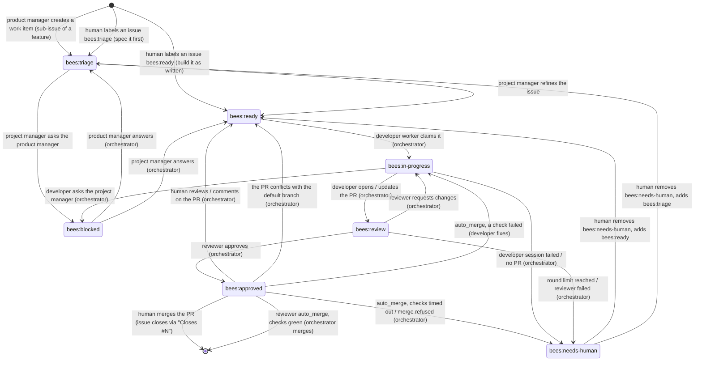
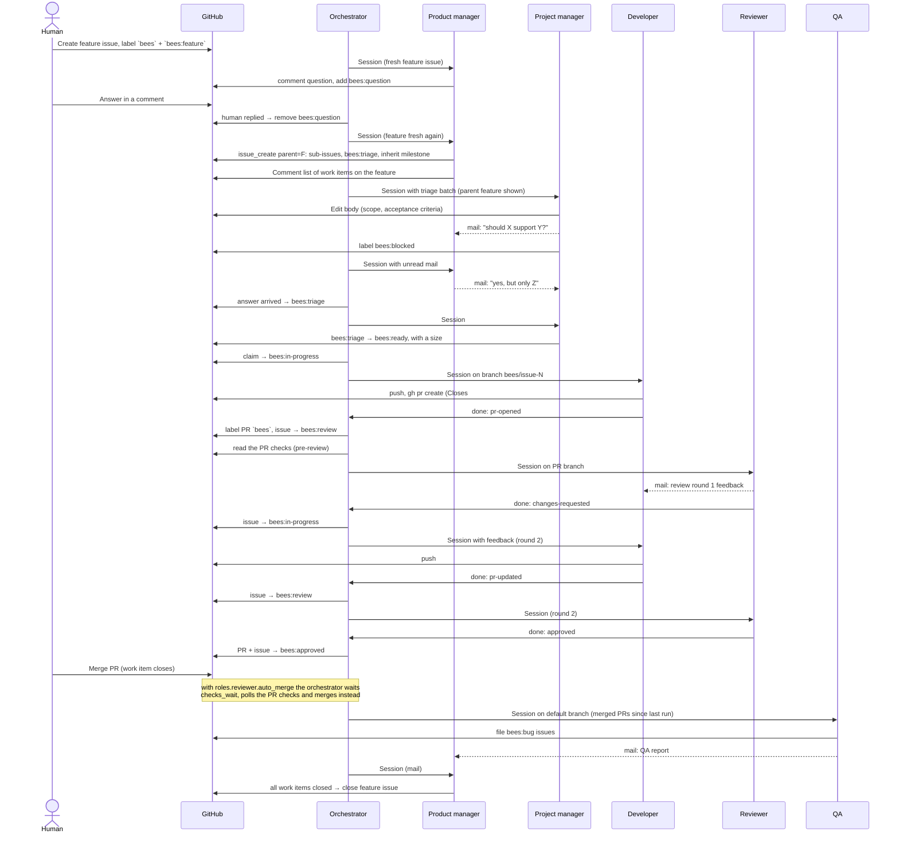

# The workflow

busybees is driven through GitHub. People create issues, label them, comment
and merge pull requests. The factory does everything in between. This page
follows an issue through it: what the factory can see, which label means
what, how work is sized and ordered, and what happens when the factory needs
you. What each role is, what it reads and how to configure it is on
[roles.md](roles.md).

## The flow at a glance

1. **You give the product manager input.** File an issue with `bees` and
   `bees:feedback` (an idea, product feedback, a bug report), file a feature
   issue with `bees` and `bees:feature`, or write to it by mail:
   `bees mail send --from human --to product_manager --subject "..." --body "..."`.
2. **The product manager owns feature issues.** It makes each one detailed
   enough, asks you on the issue when only a person can decide something
   (`bees:question`), and breaks the feature into work items: one issue per
   pull-request-sized piece, each a GitHub sub-issue of the feature.
3. **The project manager triages work items.** It refines each `bees:triage`
   issue, asks the product manager by mail when it needs a product decision,
   and moves the issue to `bees:ready` with a size.
4. **A developer and the reviewer ship it.** A developer worker implements
   the issue on a branch and opens a pull request. The reviewer reviews it.
   Once it is approved you merge it, or the reviewer's `auto_merge` does
   after the checks pass.
5. **QA tests the default branch** after merges, files bugs and reports to
   the product manager.

A concrete piece of work you already understand skips the product manager:
label it `bees` + `bees:triage` for the project manager, or `bees` +
`bees:ready` for a developer. See [Filing work](#filing-work).

## What the factory can see

The factory reads only the issues and pull requests that match the
`[filter]` block in `bees.toml`, and every configured criterion must match:

| Criterion | Key | Default | Meaning |
|---|---|---|---|
| Label | `filter.label` | `bees` | The item carries the label (skipped with `require_label = false`) |
| Assignee | `filter.assignee` | unset | The item is assigned to this login. `@me` is your own `gh` login, never the [`[github]`](configuration.md#github) account |
| Milestone | `filter.milestone` | unset | The item is in this milestone |

Everything outside the filter is invisible: the factory never reads, labels
or comments on it. Adding a criterion to a running factory hides everything
that does not already satisfy it. Set `assignee` in a repository full of
unassigned `bees` issues and every one of them disappears in one commit.
`bees doctor` reports that case with both counts:

```
34 open issues and 2 pull requests carry `bees`, 0 match your filter (label=bees AND assignee=kyle)
```

The label is also the prefix of every workflow label, so with
`label = "hive"` the states are `hive:triage`, `hive:ready` and so on.
`bees init` and `bees labels sync` create the whole set in the repository,
and `bees run` and `bees tick` create any that are missing when they start.
Existing labels keep their colour and description unless you run
`bees labels sync`.

Everything the factory creates gets the label, and the assignee when one is
configured, so it stays visible. The orchestrator backstops the roles: after
every session it lists the issues and pull requests created since the session
started, whoever opened them, and adds the label and assignee to anything
carrying `bees` or a `bees:*` label without them. On a pull request it adds
the configured milestone too. An issue never gets a milestone from a bee. That
is a person's decision, and an issue `bees issue create` makes inherits one
from the issue it relates to.

Two setups cover most repositories. Alone, keep the defaults and put `bees`
on an issue. In a shared repository where busybees handles your share of the
work:

```toml
[filter]
assignee = "@me"
require_label = false
```

## The label state machine

Every work item carries exactly one state label. The orchestrator moves most
of them. The project manager moves an issue out of `bees:triage`, to
`bees:ready` or `bees:blocked`, with its `issue_set_state` tool, which
refuses an issue in any other state. You can move any of them. One label
stacks on top of a state label instead of replacing it: `bees:needs-human`,
which you add to hold an issue where it is (see
[Holding an issue by hand](#holding-an-issue-by-hand)).

Feature issues (`bees:feature`) and feedback issues (`bees:feedback`) are not
in this diagram. They never carry a state label. They belong to the product
manager, and work items are what it makes from them. When the product manager
is enabled, an issue with the `bees` label alone becomes one of them: the
orchestrator labels it `bees:feedback` and the product manager decides what
it turns into. To have it built instead, label it `bees:triage` or
`bees:ready` yourself (see [Filing work](#filing-work)).



The two edges out of `needs_human` describe an issue the factory escalated:
it replaced the state label, so there is one to add back. An issue you held
by hand still carries its state label underneath, and removing
`bees:needs-human` is the whole of the undo.

| Label | Meaning | Who sets it |
|---|---|---|
| `bees:triage` | Needs the project manager to make it buildable | Product manager (new work items), orchestrator (after an answer, when a ready issue is sized above `roles.developer.max_size`, or on an unlabelled issue when only the project manager is enabled), you |
| `bees:ready` | Detailed enough for a developer | Project manager (with a size), orchestrator (after an answer, after your feedback on an approved pull request, when an approved pull request conflicts with the default branch, or on an unlabelled issue when both managers are disabled), you |
| `bees:in-progress` | A developer worker owns it and a branch exists | Orchestrator |
| `bees:blocked` | Waiting on an answer to a question | Project manager (asking the product manager), orchestrator (the developer asking the project manager) |
| `bees:review` | A pull request is open and in the review loop | Orchestrator |
| `bees:approved` | The reviewer approved. Waiting for you to merge, or for the checks with `auto_merge` | Orchestrator (on the pull request too) |
| `bees:needs-human` | The factory gave up on it, or you are holding it | Orchestrator, you |

Five labels sit outside the state machine. An issue carrying `bees:feature`
or `bees:feedback` never gets a state label and is never triaged:

| Label | Meaning | Who sets it |
|---|---|---|
| `bees:feature` | A feature issue. The product manager makes it detailed enough and breaks it into work items | Product manager, you |
| `bees:feedback` | The product manager's inbox: an idea, product feedback or a bug report from a person | You, orchestrator (an issue with no state label and neither `bees:feature` nor `bees:feedback`, when the product manager is enabled) |
| `bees:question` | The product manager is waiting for you to answer on a feature or feedback issue | Product manager. The orchestrator removes it when you reply |
| `bees:proposal` | A feature issue a bee wrote. It sits next to `bees:feature`, and you remove it to approve the feature | `bees issue create --feature`. Only you remove it |
| `bees:review-requested` | On a pull request, not an issue: one review pass from the reviewer, whoever opened the pull request. Not needed with `scheduler.review_assigned_prs` on. See [Asking for a review of any pull request](#asking-for-a-review-of-any-pull-request) | You. The orchestrator removes it as the review starts |

Three more sit next to a state label rather than replacing one.

`bees:planning` and `bees:planned` are how you agree something with the
product manager before anything is built. Both are yours alone: the product
manager never adds or removes either. See
[Planning with the product manager](#planning-with-the-product-manager).

| Label | Meaning | Who sets it |
|---|---|---|
| `bees:planning` | You and the product manager are still agreeing a feature or feedback issue. It discusses and breaks nothing down | You |
| `bees:planned` | Agreed. The product manager treats the scope as settled and breaks the issue down on its next run | You |

`bees:priority` says "build this next". An issue keeps its state label
alongside it, it survives every state change, and nothing in the factory
removes it. See [Priority](#priority-do-this-next).

`bees:bug` is a kind label on a work item: a bug filed by the developer, the
reviewer, QA or a person. It says what the issue is, not where it goes, and
the issue moves through the state machine like any other work item. Only
`bees:feature` and `bees:feedback` route an issue out of the state machine,
so `bees` + `bees:bug` with no state label is routed like any other
unlabelled issue (feedback for the product manager when it is enabled), and
`bees` + `bees:bug` + `bees:triage` is a work item for the project manager.
You never need to add a kind label.

## Sizing

Besides its state label, a work item carries at most one size label. The
reviewer is told the size and adjusts its scrutiny to it, `bees status`
breaks the ready queue down by size, and the size can pick the model a
developer session runs
([`roles.developer.model_by_size`](configuration.md#rolesdeveloper-only-commit-flags-max-size-and-per-size-models)).

| Size | Label | Rough meaning |
|---|---|---|
| xs | `bees:size/xs` | One file, obvious change, no design (typo, config, trivial bug) |
| s | `bees:size/s` | A few files, clear approach, existing tests cover it |
| m | `bees:size/m` | A coherent feature slice touching several packages, needs new tests |
| l | `bees:size/l` | Crosses subsystems or needs a design decision. Near the limit for one pull request |
| xl | `bees:size/xl` | Too big for one pull request. Split it instead |

Who sets it:

- The **project manager** sizes a work item when it moves it from
  `bees:triage` to `bees:ready`. Its `issue_set_state` tool requires a size
  and applies both labels in one edit. A refined scope that comes out as `xl`
  is split rather than labelled.
- The **product manager** may pre-size a work item it creates. That is a
  hint. The project manager confirms or changes it during triage.
- The **orchestrator** adds `bees:size/m` to any issue that reaches
  `bees:ready` without a size, which is usually one you fast-tracked past
  triage. Label the issue yourself when `m` is not what you meant.
- **You** can add or change a size label at any time, and nothing removes
  it. Moving an issue between states never clears its size.

### Size decides what gets built next

A free developer worker first picks up work already in flight. An issue in
`bees:in-progress` or `bees:review` is resumed, and so is a `bees:approved`
issue whose post-approval checks were interrupted. Then comes any
`bees:ready` issue that already has an open pull request, one sent back for
[your feedback](#giving-the-developer-feedback) or because it
[conflicts with the default branch](#conflicts-with-the-default-branch).
Only then does the worker take new work from `bees:ready`:
[`bees:priority`](#priority-do-this-next) issues first, then in the order
`scheduler.dispatch_order` asks for:

| `dispatch_order` | Order |
|---|---|
| `small-first` (default) | Smallest size first, oldest first within a size. Quick wins do not queue behind a big item |
| `oldest` | Oldest first, whatever the size |
| `large-first` | Largest size first, oldest first within a size |

An issue without a size ranks as `m`, which is the label the orchestrator
gives it anyway.

Two limits sit on top of that order:

- `scheduler.max_large_in_flight` (default `1`) caps how many `bees:size/l`
  issues developers work on at once. A `bees:size/l` issue over the cap is
  skipped and the free worker takes the next issue that fits. `0` removes the
  cap. The cap holds back new work only: a resumed issue is already in
  flight. Under `small-first` the cap can keep a `bees:size/l` issue waiting
  for as long as smaller ones keep arriving. Switch to `oldest` if that
  matters more than quick wins.
- `roles.developer.max_size` (default `l`) is the largest size a developer
  takes. A ready issue above it is never dispatched: the orchestrator moves
  it back to `bees:triage` without a comment, and the project manager splits
  it on its next run. With the default, every `bees:size/xl` issue goes back
  to be split.

### Priority: "do this next"

Add `bees:priority` to a `bees:ready` issue and the next free developer takes
it before the rest of the queue, whatever `scheduler.dispatch_order` says and
however old the other issues are. The whole dispatch order is:

1. issues being resumed (`bees:in-progress`, `bees:review`, an interrupted
   post-approval checks stage in `bees:approved`, and `bees:ready` issues
   with an open pull request), never reordered;
2. `bees:priority` issues;
3. `scheduler.dispatch_order` (size, or age under `oldest`);
4. age.

Priority is a separate axis from size: a `bees:size/xs` issue does not jump
a priority `bees:size/l` one under `small-first`. Between two priority issues
`dispatch_order` decides as usual.

Set it from the GitHub UI like any other label. It is yours: it survives
every state change, nothing in the factory removes it, and it stays on the
issue until you take it off. Two roles may put it on an issue, each under a
narrow rule. The project manager may add it to a work item that unblocks the
factory itself: the default branch does not build, every pull request's
checks are red for the same reason, or the orchestrator cannot run. Its
prompt rules out anything else, including reordering the queue by moving
`bees:ready` issues back to `bees:triage`. The product manager only carries
one: put it on a feedback issue and the work item the product manager makes
from that issue gets it too, so your lever survives the hop.

Priority reorders the queue. It does not lift the limits: a priority
`bees:size/l` issue still waits while `scheduler.max_large_in_flight` of them
are in flight, and a priority issue above `roles.developer.max_size` still
goes back to `bees:triage` to be split.

`bees status` counts the queued issues carrying the label on its `ready` row
and lists their numbers under `priority` in `--json`, so you can see the
lever took effect:

```
ready          4  (xs 1, s 2, m 1, 1 priority)
```

## Talking to the product manager

Not everything you want to say is a buildable issue. The product manager
turns product intent into work, and it listens on two kinds of issue.

### Feedback issues

For a feature idea ("we should support SSO"), product feedback ("onboarding
feels clunky"), or a bug report you would rather have weighed than fixed
verbatim, create an issue with the `bees` label and the `bees:feedback`
label. You can leave the second label off: when the product manager is
enabled, an issue with `bees`, no state label and neither `bees:feature` nor
`bees:feedback` gets `bees:feedback` from the orchestrator on the next poll
([Filing work](#filing-work)). Adding it yourself says what you meant. Either
way the issue goes to the product manager, not to triage:

- The orchestrator never adds a state label to it and the project manager
  never sees it. `bees status` counts it in the `feedback` queue.
- A fresh feedback issue wakes the product manager on the next poll instead
  of waiting for `scheduler.product_manager_interval`. Fresh means you
  created it, or commented on it, after the product manager's last reply. In
  [planning mode](#planning-with-the-product-manager) only a comment counts.
- The product manager reads it with all its comments, decides what to do,
  and does it: it creates or adjusts feature issues, files a work item, or
  declines. It never touches milestones.
- It replies on your feedback issue with a comment saying what it did and
  linking any issue it created. Like every comment a bee writes, that reply
  ends with an invisible `<!-- bees:product_manager -->` marker, which is how
  the orchestrator tells your comments from the product manager's.
- When the feedback is fully actioned it closes the issue. When it has a
  question for you it asks in a comment and labels the issue `bees:question`
  ([below](#questions-for-you-beesquestion)).

A small, well-formed ask is routed rather than weighed. When a feedback issue
is really a piece of work, the product manager creates the work item directly
(`related: <feedback issue>`, so it inherits the milestone), carries your
`bees:priority` over if you set one, replies with the number and closes the
feedback issue.

### Feature issues

A feature issue (`bees` + `bees:feature`) describes a user-visible outcome:
the problem, who it is for, what "done" looks like, constraints. The product
manager writes most of them, from feedback, QA reports and its own roadmap,
and you can file one directly. Feature issues never enter the state machine.
`bees status` counts them in its `features` queue.

A feature issue a bee wrote also carries `bees:proposal`: it is a proposal
until you approve it. The product manager writes it, refines it and asks
questions on it, but nothing is broken down from it, so the factory cannot
grow its own roadmap. The scheduler never presents a proposal for breakdown,
and `bees issue create --parent <proposal>` and `bees issue link` refuse it,
so a proposal grows no sub-issues whoever asks. Remove the `bees:proposal`
label to approve it: the scheduler notices the label is gone and brings the
feature back to the product manager, which breaks it down on its next run. A
feature issue you filed never carries the label and is broken down straight
away.

For each fresh feature issue the product manager:

1. makes sure it is detailed enough to be broken down, or asks you
   ([below](#questions-for-you-beesquestion));
2. breaks it into work items: one issue per pull-request-sized piece, created
   with its `issue_create` tool (`parent: <feature>`, `bug: true` for bugs).
   Each becomes a GitHub sub-issue of the feature, labelled `bees` +
   `bees:triage` (+ `bees:bug`), and inherits the feature's milestone. GitHub
   tracks the feature's progress from its sub-issues. Work items are ordered,
   with dependencies written as a `Blocked by #N` line
   ([Dependencies](#dependencies)). The project manager adds the
   implementation detail during triage. An existing issue is attached with
   `issue_link` (`parent: <feature>`, `child: <item>`), which makes the
   sub-issue relationship and, when the issue is in no milestone, puts it in
   the feature's. Both tools refuse a feature that is still a proposal, or one
   you have put in planning;
3. comments the list of work items on the feature issue, with the marker, so
   the feature is not presented to it again until something changes;
4. later, closes the feature issue once all its sub-issues are closed, or
   when it stops making sense, saying why. The orchestrator brings a feature
   whose last open sub-issue has closed back to the product manager on the
   next pass, in a section of its own. See
   [Features, sub-issues and milestones](#features-sub-issues-and-milestones).

You steer a feature by commenting on it. Your comment gives the human side
the last word and makes the issue fresh again.

### Planning with the product manager

A feature issue is one-shot: by the time it exists, you and the product
manager have never agreed on it. For anything non-trivial, plan it first.

Put `bees:planning` on a feature or feedback issue. While the label is there
the product manager only discusses it. Every comment you leave starts a run,
and it replies on the issue: the questions it needs answered, the options it
sees with a recommendation, or a draft of the feature description for you to
react to. It creates nothing, attaches nothing and asks nothing with
`bees:question`. The conversation is the channel. That is enforced, not only
prompted: the issue is presented in a section of its own that lists no
breakdown step, and `bees issue create --parent <planning issue>` and
`bees issue link` refuse it, so it grows no sub-issues whoever asks. An
untouched planning issue is not work. The product manager wakes for your
comment, not for the label.

End planning by swapping `bees:planning` for `bees:planned`. That label is
your agreement. On its next run the product manager treats the issue as
settled. It does not re-open the scope or ask for it to be confirmed again,
and adds `bees:question` only if something new comes up that the
conversation never covered. It writes what was agreed into the issue body as
a short `## Decisions` section, so the project manager and the developers
see it without reading the thread, records the outcome in its notes, and
then breaks the feature into work items, or actions and closes the feedback
issue.

It does that once: a feature is presented for breakdown only while it has no
sub-issues, so the ones the breakdown creates are what take it off the list.
Nothing about `bees:planned` wakes the product manager, so the run that picks
it up is the next one `scheduler.product_manager_interval` or a comment of
yours brings round. With the default interval that is at most an hour.

One exception: when the issue is a proposal the product manager wrote,
`bees:proposal` says you have not approved it, and it outranks
`bees:planned`. Take it off as well, or the issue stays a proposal waiting
for you.

Leave `bees:planned` on the issue or take it off. The factory neither reads
it again nor removes it.

### Questions for you: `bees:question`

When only a person can decide something on a feature or feedback issue, the
product manager posts the question as a comment, with the marker, adds the
`bees:question` label, and stops working on that issue. The label is for you:
it marks the issues waiting on a person. Answer in a comment. On the next
poll the orchestrator sees that a person had the last word, removes
`bees:question`, and the issue comes back to the product manager as fresh.

The ways of getting something into the factory, side by side:

| You want | Do this | Who handles it |
|---|---|---|
| An idea weighed, feedback heard, a bug considered | issue with `bees` + `bees:feedback` | Product manager |
| A non-trivial idea thought through with you before anything is specced | issue with `bees` + `bees:feedback` (or `bees:feature`) + `bees:planning` | Product manager, in [planning mode](#planning-with-the-product-manager) |
| A feature specified and broken into work items | issue with `bees` + `bees:feature` | Product manager |
| A concrete piece of work specified, then built | issue with `bees` + `bees:triage` (optionally `bees:bug`) | Project manager (triage), then a developer |
| A concrete piece of work built as written | issue with `bees` + `bees:ready` | A developer |
| A private note to a role, off GitHub | `bees mail send --from human --to product_manager --subject "..." --body "..."` | That role, on its next session |

## Filing work

Work items normally come from the product manager breaking a feature issue
down, but you can file one yourself. The labels you put on the issue decide
what happens next, and the default is deliberately cautious.

An issue with the `bees` label and nothing else is read as feedback, not as
a spec, when the product manager is enabled. On the next poll the
orchestrator labels it `bees:feedback` and it goes to the product manager,
which weighs it, decides what it becomes (a feature, a work item, or a
reasoned no) and replies on it (see [Feedback issues](#feedback-issues)).
Nothing is specced or built until someone has authorised the scope. That
mirrors the rule pointing the other way: a feature issue a bee writes is only
a `bees:proposal` until you approve it. Between the two, new scope enters the
factory only through a person or through the product manager. With
`require_label = false` the orchestrator adds `bees` in the same edit, so the
issue is fully tagged either way.

With the product manager disabled, nothing ever reads `bees:feedback`, so the
orchestrator routes the same unlabelled issue further down the pipeline
instead: to `bees:triage` when the project manager is enabled, or straight to
`bees:ready` when both managers are disabled. The first enabled role able to
take the issue wins; a factory running only developers builds an unlabelled
issue as it stands, with no spec and no refinement pass.

To have it built, give it a state label yourself. That is the intended fast
path, not a workaround: the feedback rule applies only to an issue that
carries no state label, so the one you set stands.

- **`bees:triage` means "this is work, spec it first".** The project manager
  picks it up. It reads the codebase and the parent feature issue if there
  is one, rewrites the body with scope, acceptance criteria and pointers to
  the relevant code while keeping your intent, splits it if it is too big,
  and moves it to `bees:ready` with a size. It never changes milestones. An
  invalid or duplicate issue it closes with a comment. An issue that is
  really a direction rather than a piece of work, one whose first deliverable
  is a decision about what to build, goes to the product manager by mail and
  waits in `bees:blocked` for the answer. The project manager does not invent
  acceptance criteria for it. It only ever edits work items. Feature and
  feedback issues are the product manager's.
- **`bees:ready` means "this is already detailed enough, build it as
  written".** It skips triage. The next free developer worker takes it in
  the [dispatch order](#size-decides-what-gets-built-next), and the
  orchestrator gives it the default size if you did not pick one.

Nothing else is added for you on that path, so put the `bees` label on the
issue yourself when the filter requires it. The same rule decides where a bug
report lands: `bees` + `bees:bug` on its own is routed like any other
unlabelled issue (feedback for the product manager when it is enabled), while
`bees` + `bees:bug` + `bees:triage` goes straight to the project manager.

Steering: anything a person writes, in an issue, in a pull request or in mail
to a role, is authoritative for every role and outranks their prompts.
Commenting on an issue is the way to change direction. While the factory is
working on it, your comment is delivered as mail (see
[Commenting on the issue](#commenting-on-the-issue)). Labels are yours to
move too: relabel to `bees:triage` to send an issue back for refinement, or
remove the `bees` label to take it out of the factory.

## Dependencies

A work item can declare what has to land first. Put a line anywhere in the
body:

```
Blocked by #37
```

`blocked by` and `depends on` are both recognised, case-insensitively, with
an optional colon and Markdown emphasis, and several numbers separated by
commas, spaces or `and` (`Depends on: #3, #4 and #5`). The phrase without a
number (`blocked by the missing tests`) declares nothing. The `issue_create`
tool's `blocked_by`, or `bees issue create --blocked-by 37`, writes the line
for you.

The scheduler reads the line on every poll and does not hand the issue to a
developer while any of its blockers is open. Open means present in the last
poll: an issue that is closed, or that the factory's filter does not see,
blocks nothing. Work items and feature issues both count as blockers.

The label does not change. The issue stays `bees:ready`, `bees status` says
why it is not moving, and it becomes dispatchable on the first poll after its
blocker closes:

```
ready          4  (xs 1, s 3, 2 waiting on deps)
```

Holding an issue back never costs a developer pool slot, so the rest of the
queue keeps moving. Issues already in `bees:in-progress` or `bees:review`,
and an interrupted post-approval checks stage in `bees:approved`, are
resumptions and are never held back.

When the declarations form a cycle (`#1` blocked by `#2` blocked by `#1`),
the scheduler ignores the dependencies of the issues in it, because nothing
would ever be built otherwise, and logs a warning once per issue.

The project manager sees the open blockers of every work item in its prompt
and is told to write the line rather than park a dependent item in triage.
The product manager uses `blocked_by` when it breaks a feature down.

## Development

When a developer worker claims a `bees:ready` issue it:

1. labels it `bees:in-progress`;
2. creates a temporary git worktree on the branch `bees/issue-N` (the prefix
   is `project.branch_prefix`), based on the default branch, reusing the
   branch when it already exists;
3. runs a developer session that implements the issue, merges the default
   branch into the branch, pushes, and opens a pull request whose body
   contains `Closes #N`;
4. labels the pull request `bees`, assigns it when an assignee is
   configured, and moves the issue to `bees:review`.

The developer never touches labels and never pushes to the default branch.
Where the issue leaves it a choice it makes one, implements it and records it
in the pull request for the reviewer to rule on. Bugs it notices outside the
issue's scope go into new `bees:bug` issues in triage rather than into the
pull request. It merges the default branch before every push, on every
round, and re-runs the tests afterwards: the default branch moves while an
issue is being worked, and a pull request that has fallen behind it costs a
review round. What the session is given and what it reports is on
[roles.md](roles.md#developer).

## Questions

Roles never talk to each other on GitHub. They use a local mailbox in the
state directory, which you can read with `bees mail list`. The visible
effect on GitHub is the `bees:blocked` label:

- A **developer** asks only when no reading of the issue is safe: the issue
  contradicts itself about something the repository cannot settle, or the
  wrong choice would throw the implementation away. A question costs more
  than a choice, because the work restarts in a later session with none of
  the first one's context. When it does ask, it sends one question to the
  project manager and stops. The orchestrator checks the message was sent
  during the session, labels the issue `bees:blocked` and frees the worker.
  A developer that reports a question without sending one is escalated
  instead. When the project manager answers, the orchestrator sees unread
  mail for the developer about that issue and relabels it `bees:ready`. The
  next developer session starts with the answer in its prompt.
- A **project manager** that needs a product decision during triage asks the
  product manager and labels the issue `bees:blocked` itself. When the
  product manager answers, the orchestrator relabels the issue `bees:triage`
  and the project manager continues.

Answers travel with the issue, so it does not matter which developer worker
ends up with it. To answer a question yourself, comment on the issue: while
it carries `bees:blocked` your comment is delivered to whoever asked, and the
orchestrator moves the label back to `bees:ready` or `bees:triage` for you
(see [Commenting on the issue](#commenting-on-the-issue)). Moving the label
yourself works too, and so does mail:

```
bees mail send --from human --to developer --issue 12 --subject "Re: which DB" --body "Use SQLite."
```

## Review

Each developer worker runs a strictly sequential loop for its issue:

```
developer → reviewer → developer → reviewer → … → approved
```

The reviewer checks out the pull request branch, reads the diff and the
issue, and works through the review stages
[`roles.reviewer.stages`](roles.md#review-stages-rolesreviewerstages)
configures, by default correctness, completeness against the acceptance
criteria, cleanliness and style, giving each its own verdict. It then either
approves, which needs every stage to pass, or sends the developer one
consolidated message through the mailbox, its points grouped by stage.
Verifying that the change builds and passes is CI's job: the reviewer judges
the change from the code and does not re-run the repository's test-suite. On
a developer's pull request it does not submit a GitHub review, comment on the
pull request, or push to the branch. On changes requested the orchestrator
moves the issue back to
`bees:in-progress` and runs the developer again with the feedback in its
prompt. The developer pushes and reports `pr-updated`.

`scheduler.max_review_rounds` (default `3`) caps the number of reviewer
passes. When the last round still requests changes the issue is escalated
([below](#escalation-beesneeds-human)). The reviewer is told when it is on
the final round.

When the reviewer approves, the orchestrator labels both the pull request
and the issue `bees:approved` and requests a review from everyone in
[`scheduler.notify`](configuration.md#notifying-a-person), so the pull
request shows up in their review queue. That request is best effort: GitHub
refuses one from the pull request's own author, which with a shared account
is usually the configured login. With the reviewer role
[disabled](roles.md#disabling-a-role), a pull request is approved as soon as
the developer opens it.

### Asking for a review of any pull request

The review loop above runs on the pull requests the factory's developers open.
To have the reviewer look at any other open pull request, your own or
anyone's, put `bees:review-requested` on it. The pull request needs the `bees`
label too, or it is outside the [filter](#what-the-factory-can-see) and the
factory never sees it; with `filter.assignee` set, assign it as well.

One label is one review pass. The next poll starts a reviewer session on the
pull request, in a read-only checkout of its head branch, and removes the
label as the session starts: it is gone whether the session approves, requests
changes or fails, and adding it again asks for another pass. A request that
arrives while a review of the same pull request is still running waits for the
poll after it. The session takes a developer slot, so
`scheduler.max_developers` bounds these reviews together with the developer
workers, and it starts only after every ready issue that can be dispatched has
been, so a request never starves the queue. A session that fails is logged,
and the pull request is not tried again for five poll intervals: there is no
issue to escalate.

A head branch the factory's remote does not have, a pull request from a fork
or a branch deleted since, does not stop the review: the session runs from a
checkout of the default branch and reads the change with `gh pr diff`.

With [`scheduler.review_assigned_prs`](configuration.md#scheduler) on, the
label is not needed: every open pull request the factory can see whose head
branch does not start with `project.branch_prefix` is reviewed on sight. The
prefix is what says the factory did not write it, so the pull requests its own
developers open keep going through the review loop above and are not reviewed
twice. With `filter.assignee` set, this is every such pull request assigned to
the factory; without it, every one carrying the `bees` label.

    [scheduler]
    review_assigned_prs = true

One head commit is one review pass. The head the reviewer looked at is
remembered, so a restart does not review it again, and a push earns another
pass. A draft is skipped until it is marked ready. The label keeps working
alongside it and keeps its own meaning: it asks for a pass whether or not the
head has already been reviewed.

The verdict is one GitHub review on the pull request, because there is no
developer to mail and no issue to label: `approve` when every review stage
passed, `request-changes` when any failed, each stage's verdict line and its
points in the body, ending with the `<!-- bees:reviewer -->` marker. There is
no issue, so the reviewer judges the change against the pull request's
description and the repository's conventions, not against acceptance
criteria. GitHub refuses an approval from a pull request's own author: when
the author is the login the factory acts as, the reviewer submits a `comment`
review in place of the approval and says so in it. With no `[github]` table
the factory acts as the account `gh` is signed in with, so a review of that
person's own pull request is a comment too. The review never comes back in
as feedback: the orchestrator reads reviews and comments only on a pull
request that closes a visible factory issue, and this one closes none. What
the reviewer reads and does in this mode is under
[Requested reviews](roles.md#requested-reviews-beesreview-requested).

### Before the review: the checks

The developer runs the repository's own lint and test commands before it
pushes, and the orchestrator reads the pull request's checks before the first
review ([`pre_review_checks`](roles.md#pre-review-checks-pre_review_checks-on-by-default),
on by default and independent of `auto_merge`). Between the developer
opening the pull request and the first reviewer session, the worker waits
`checks_wait`, then polls every `checks_poll_interval`, for at most
`pre_review_checks_timeout` (default 10 minutes):

- **Green.** The review starts, and the reviewer's prompt lists the checks so
  it knows CI passed and can concentrate on the change itself.
- **A check failed.** The reviewer gets a
  [checks-mode session](roles.md#checks-mode-a-failing-check) first, exactly
  as after approval, mails the developer the error, and the developer pushes
  a fix. Only then does the review happen. These rounds share
  `max_check_fix_rounds` with the post-approval stage and do not count
  against `max_review_rounds`. Exhausting them escalates.
- **Still pending** at the timeout, or **no check reported at all.** The
  review happens anyway, and the reviewer is told nothing was verified for
  it and to say so in its outcome note.
- **The read itself fails** (`gh` errors, a rate limit, an API outage). The
  read is advisory, so it is logged as a warning and the review happens
  anyway, without a checks section in the reviewer's prompt.

The read happens once per pull request. A later review round, the developer
answering the reviewer's feedback, goes straight to the reviewer with no
second read, no second wait and no checks section: the checks that were read
describe a head the developer has since replaced. A restarted `bees run` does
not read them again either. That the read happened is recorded in
`<state_dir>/issues/<n>.json` along with the stage the worker was in.

`bees status` shows the worker in the `pre-review checks` stage while it
waits. Set `pre_review_checks = false` to go straight from the developer to
the reviewer.

## Giving the developer feedback

You do not need the mailbox to steer a developer. Review the pull request on
GitHub as you would a colleague's. On every poll the orchestrator looks at
each open factory pull request whose `updatedAt` moved since it last checked
and collects the reviews, inline review comments and conversation comments
written since then. It drops the ones bees wrote and empty approvals. What is
left goes to the developer as one mail message from `human`, listing each
item with its author, file and line, comment id, link and the exact `gh`
command to reply to it. The timestamp of the last item delivered is recorded
as `human_seen_at` in `<state_dir>/issues/<n>.json`. Comments on the issue
itself have a clock of their own next to it, `issue_human_seen_at`, so
reading one stream never suppresses the other.

How the orchestrator tells a bee comment from yours. Two mechanisms, and
either one on its own makes a comment a bee's:

- **The marker.** Every comment a role posts ends with the invisible line
  `<!-- bees:<role> -->`. Only a comment's last line counts, so quoting a
  marker earlier in a reply does not make the reply a bee's. Bees emit it
  whatever else is configured, and while the factory shares your GitHub
  account, the default, it is the only signal there is.
- **The author.** When [`[github]`](configuration.md#github) gives the
  factory an account of its own, everything the factory does acts as that
  login, so any comment by it is the factory's whether or not it carries a
  marker. The orchestrator's escalation comment, for one, carries none.
  Sessions carry the same token in `GH_TOKEN`, so a comment a session posts
  with its own `gh` is made by that login too. This says nothing about
  anybody else's comment: yours is yours even when it quotes a marker.

The same two mechanisms decide whether a person had the last word on a
feedback or feature issue, which is what wakes the product manager.

What happens next depends on the issue's state:

- **`bees:approved`**, the usual case: the reviewer approved and the pull
  request is waiting on you. The orchestrator moves the issue back to
  `bees:ready` and removes `bees:approved` from the pull request. A developer
  worker picks it up, reads your feedback, pushes changes, and replies to
  each of your comments on GitHub. The reviewer re-reviews and the issue
  returns to `bees:approved`.
- **`bees:in-progress` / `bees:review`**: the worker is still running. The
  mail is delivered to the next developer session for that pull request.
- **`bees:blocked`**: mail for the developer counts as an answer, so the
  issue becomes `bees:ready` on the same poll.

### Commenting on the issue

The same steering works on the issue, which is where you are more likely to
write when there is no pull request yet, or when the direction is about the
work rather than the diff. On every poll the orchestrator also looks at each
issue in the four in-flight states `bees:in-progress`, `bees:review`,
`bees:approved` and `bees:blocked` whose `updatedAt` moved since it last
checked, and collects the issue's own comments written since then.
`bees:triage` is deliberately not on that list: the orchestrator records the
time on a triage issue but never mails a comment on one, because the project
manager reads the issue's whole comment history in its own prompt. Bee
comments are dropped by the same two mechanisms. What is left is sent as one
message from `human`, and who it reaches depends on the state:

- **`bees:in-progress`, `bees:approved`**: the developer.
- **`bees:review`**: the developer, and a copy to the reviewer, so the round
  in flight takes your direction into account rather than ruling on the pull
  request without it.
- **`bees:blocked`**: whoever is waiting for the answer. An issue blocked out
  of a developer session, one that already has a branch or a pull request,
  goes to the developer and becomes `bees:ready` on the same poll. One
  blocked out of triage goes to the project manager and becomes
  `bees:triage`.

The developer replies on the issue with its `comment` tool, and treats your
comment as it treats a comment on the pull request: a direction that
outranks the issue body and the reviewer.

Unlike feedback on the pull request, a comment on an issue in `bees:approved`
does not send it back to `bees:ready`. "Looks good, merge it" is as likely a
comment there as "change this", and the label is your cue to merge. The
message waits for the developer's next session on that issue: the auto-merge
checks stage, a comment on the pull request, or your own relabel. Comment on
the pull request instead if you want the work reopened.

Until the orchestrator has recorded a time for an issue it delivers nothing.
The first pass that sees the issue, in `bees:triage`, in `bees:ready` or in
one of the in-flight states, records the time instead, because a fresh state
directory, or the first poll after an upgrade, must not replay every comment
an issue has ever received. Delivery starts from what is written after that.
Nothing is lost: a developer session's prompt renders the issue's whole
comment history anyway, so an earlier comment is context it already reads.
What the mail adds is that the comment is fresh, that it is a person's, and
that it reaches a reviewer or unblocks a blocked issue.

`bees:triage` and `bees:ready` make the rest work. Neither is delivered from,
but the orchestrator records the time on an issue in either, on every poll it
is still there. An issue is always seen in triage before anything can block
it, so a question the project manager blocks on already has a clock, and your
answer reaches it on the next poll however quickly you write it. Recording
the time in `bees:ready` too keeps an issue that waited days for a developer
from handing its whole wait's worth of comments to the first session that
picks it up.

You can also mail a developer directly, with or without a pull request:

```
bees mail send --from human --to developer --issue 12 --body "Keep the CLI flag names as they are."
```

Roles treat what people write as authoritative. When your request conflicts
with the issue or the reviewer's feedback, the developer follows you and says
so in the pull request.

### Conflicts with the default branch

Every merge can leave the remaining open pull requests conflicting with the
default branch, and a conflicting pull request is one you cannot merge. On
every poll the orchestrator reads each open factory pull request's merge
state, which comes with the pull request list at no extra API cost, for
issues in `bees:review` or `bees:approved`:

- **Conflicting** (`scheduler.pr_fix_conflicts`, default `true`): the
  developer is mailed from `orchestrator` to merge the default branch into
  the branch, resolve the conflicts, run the tests, push and report
  `pr-updated`.
- **Behind** (`scheduler.pr_keep_updated`, default `false`): the same for a
  pull request that would merge cleanly but was not tested against the
  current default branch. Off by default because that is usually fine.

Both are backstops. The developer is told to merge the default branch itself
before every push, so a pull request is rarely conflicting or behind by the
time the reviewer sees it.

An issue in `bees:approved` goes back to `bees:ready` and `bees:approved` is
removed from the pull request, exactly as for your feedback. Because it
already has a pull request, a developer worker takes it ahead of any new
work item. An issue in `bees:review` keeps its worker: the mail reaches the
developer on its next round, or on the next poll once the reviewer approves.
The developer's push then goes through review again, so nothing is merged
untested. An issue in `bees:in-progress` is skipped. The developer is on it
already.

The developer is told once per head commit, recorded as
`conflict_notified_sha` in `<state_dir>/issues/<n>.json`. The same
conflicting head is never nagged about twice, but a push that still conflicts
is reported again. GitHub computes mergeability lazily, so a pull request
whose state is still unknown is left alone until the next poll.

## Merging

By default nobody in the factory merges. An approved pull request waits for
you, and merging it closes the issue through `Closes #N`.

The reviewer can be given the job instead. Set `auto_merge = true` under
`[roles.reviewer]`, with optional `merge_method`, `checks_wait`,
`checks_timeout` and `max_check_fix_rounds`, the keys the
[pre-review read](#before-the-review-the-checks) uses too (see
[configuration.md](configuration.md#rolesreviewer-only-checks-and-auto-merge)).
Once the reviewer approves, the developer worker enters a checks stage:

1. It waits `checks_wait` (default 1 minute), because some checks take a
   moment to report that they have started.
2. It polls the pull request's checks every `checks_poll_interval` (default
   2 minutes) until none is pending. The required checks
   (`gh pr checks --required`) are the gate whenever the branch has any. When
   it has none, a repository with no branch protection, every check the pull
   request reports (`gh pr checks`) is the gate instead: gating on the checks
   that exist beats gating on nothing. To take a check out of the gate, mark
   the ones that must block a merge as required in the branch protection
   rules of the default branch. bees never touches those rules.
3. All green, the orchestrator merges with
   `gh pr merge --<merge_method> --delete-branch`. The issue closes through
   `Closes #N` and QA sees the change on its next run. When nothing is
   reported at all, a repository with no CI, it merges too, after two
   consecutive empty polls, and logs that no check was reported rather than
   that the checks passed.
4. A check failed: the reviewer gets a follow-up session in
   [checks mode](roles.md#checks-mode-a-failing-check). It works out what
   failed without assuming any particular CI system, then mails the developer
   the main error message, its cause and how to reproduce it. The developer
   pushes a fix (`pr-updated`) and the worker goes straight back to polling
   the checks in the stage that found the failure, pre-review or
   post-approval. There is no second full review. When the reviewer decides
   the failure is unrelated (infrastructure, flakiness) it may re-run the
   check where the CI system allows and report `approved`, which means "wait
   for the checks again".
5. The fix loop runs at most `max_check_fix_rounds` times (default 2). After
   that, or when the checks are still pending at `checks_timeout` (default
   30 minutes), or when GitHub refuses the merge (typically branch protection
   that requires a human review), the issue is escalated to
   `bees:needs-human`.

With the reviewer role disabled and `auto_merge` on, a developer's pull
request skips review and goes straight to the checks stage.

## Escalation: `bees:needs-human`

### Retries first

Not every dead session is a bad decision. Before escalating, the orchestrator
classifies what went wrong:

- **Infrastructure.** The session timed out, ran out of turns, hit an API
  error or a rate limit, or `claude` exited without producing a result.
  These are retried up to `scheduler.retries` times (default `1`), after
  `scheduler.retry_delay` (default 10 minutes), and with the role's
  `fallback_model` as the primary model when `scheduler.retry_with_fallback`
  is on. Each attempt gets its own directory under `<state_dir>/sessions/`,
  the retry suffixed `-retry1`, and a retried developer session is told its
  previous attempt was interrupted, so it continues from whatever is on the
  branch instead of starting over. `bees status` shows the attempt number
  next to the round.
- **Behavioural.** The session ran and reported an outcome with the `done`
  tool, `failed` included, or ended cleanly without reporting at all.
  Running it again would repeat the same decision, so it escalates at once.

One failure is neither: the claude session limit. It belongs to the account,
not to the session, so the attempt is not repeated and the issue is not
escalated. The issue keeps its state label and the whole factory stops
dispatching until the limit resets. See
[The claude session limit](configuration.md#the-claude-session-limit).

Set `scheduler.retries = 0` to escalate every failure at once. Retries apply
to sessions only. Git, `gh` and worktree failures are not retried.

### When the factory gives up

Once retries are exhausted, or the failure was behavioural, the factory
hands the issue to a person:

- the developer session failed, or timed out and its retries were exhausted,
  or reported a pull request that does not exist;
- the developer said it asked a question but sent no mail, or the reviewer
  said it requested changes but sent no feedback;
- the reviewer session failed;
- `max_review_rounds` passed without approval;
- a worktree could not be created;
- with `roles.reviewer.auto_merge`: the checks still failed after
  `max_check_fix_rounds`, were still pending at `checks_timeout`, the
  reviewer could not diagnose them or said it had mailed the developer but
  had not, or GitHub refused the merge;
- the issue ran out of money: every session run for it has cost more than
  [`scheduler.max_cost_per_issue`](configuration.md#cost-budgets), or two
  sessions in a row cost more than `scheduler.max_cost_per_session`. The
  comment names the spend, so the choice is between raising the budget and
  finishing the work by hand. Both budgets are off by default;
- a person stopped the session working on it, with `k` in
  [the live view](cli.md#the-live-view). That one is not the factory giving
  up but a person taking the work back, and the comment says so.

A budget the factory hits does not always escalate: `scheduler.max_cost_per_day`
pauses dispatch instead. Nothing is labelled, no comment is written, and the
workers already running finish their loop. The scheduler starts nothing new
until the rolling 24-hour spend falls under the threshold
[`max_cost_per_day_resume_percent`](configuration.md#cost-budgets) sets,
which by default is the budget itself. `bees status` reports the pause.

The orchestrator sets `bees:needs-human` and posts a comment on the issue
explaining why. It records the same reason in
`<state_dir>/issues/<n>.json`, which is where `bees run`'s live view reads it
to say what the factory is stuck on without asking GitHub again. An issue you
label `bees:needs-human` by hand has no such record, and the view says so
rather than inventing one. The comment mentions everyone in
[`scheduler.notify`](configuration.md#notifying-a-person), since a comment
posted under your own account notifies nobody by itself. This is the only
comment the orchestrator itself writes. Roles do comment on GitHub, but only
to people: the developer replying to your feedback, the product manager
replying to feedback and feature issues or asking a `bees:question`, always
tagged `<!-- bees:<role> -->`. Everything between roles stays in the mailbox.
The reviewer's last feedback, if any, is there (`bees mail list --issue N`),
and the full transcripts are under `<state_dir>/sessions/`.

To hand the issue back, remove `bees:needs-human` and add `bees:ready` (to
retry development, reusing the branch and any pull request) or `bees:triage`
(to have the project manager rework it).

### Holding an issue by hand

`bees:needs-human` is not only the factory's escalation marker. It is also
how you stop the factory working on something. Add it to an issue from the
GitHub issue list, without removing the state label underneath, and the issue
is held where it is. Nothing dispatches it, it drops out of its own queue,
and the live view's Needs human panel lists it with no reason, since you did
not escalate it and there is none to show.

Remove the label and the issue goes straight back to whatever state label it
still carries, with nothing else to do. The factory never tidies the pair up,
so a held issue keeps its place in the workflow for as long as you leave the
label on.

While the hold is on, the issue is out of the states the orchestrator
delivers your comments from, so a comment you write on it reaches nobody
until you lift the hold. That is the point: nothing is working on it. Comment
first, then remove the label, and the session that picks the issue up reads
the whole conversation in its prompt.

## QA

QA is a singleton that runs against a detached checkout of the default
branch, so it only ever sees merged work. It runs when at least
`scheduler.qa_interval` (default 30m) has passed since its last run and
something matching the filter has been merged since then. That merged-PR
check itself happens at most once per `qa_interval`. Its first run happens
immediately and looks back seven days. Unread mail in the QA inbox triggers
an earlier run, whatever the interval: `qa_interval` is a floor on the runs
QA starts by itself, not on the ones a person or the product manager asks it
for.

In a session QA works out from the repository's documentation and its notes
how to install dependencies, run the test-suite and exercise the product,
verifies each merged pull request against its issue, explores around it, and
then:

- files a `bees:bug` issue in triage for every defect it reproduced itself,
  with reproduction steps, expected against actual behaviour, severity, and
  the command it ran with the output it got, after searching the existing
  issues, closed as well as open. It comments on an open duplicate instead of
  filing another, and opens a new bug linking to a closed one it has
  reproduced again. A clean batch is a good result: QA files nothing and says
  so;
- sends the product manager one report by mail: what was tested, what works,
  the bugs filed, and product-level observations, even when it found nothing.

QA looks for product defects, not for critique of how the code is written.
That is the reviewer's job, on the pull request. It never starts anything
that acts on the real world for it (a deploy, a job runner, a command that
spends money or writes to the live project the product manages) and uses a
sandbox or a dry-run flag instead.

QA stays in its lane. What it files directly is a bug report, or a small work
item within the existing design. Anything that asks for new scope goes to the
product manager by mail, and the product manager decides whether to drop it
or turn it into a [proposal](#feature-issues) for you to approve. QA never
opens feature issues itself. See [roles.md](roles.md#qa).

## Bugs

The developer, the reviewer and QA all file bugs. They always go in as
`bees` + `bees:bug` + `bees:triage`, in the milestone of the issue they were
found on, so they flow through the project manager like any other work item.
Developers and reviewers only file bugs they notice outside the scope of what
they are working on. They do not fix them in passing.

## Features, sub-issues and milestones

The product manager owns the roadmap of feature issues. It runs at least
every `scheduler.product_manager_interval` (default 1h), or sooner when it
has unread mail (questions from the project manager, reports from QA), when
a feature or feedback issue is fresh, when you approve a proposal, or when a
feature's work is done (below). A proposal, and an issue in
[planning](#planning-with-the-product-manager), count as fresh only once a
person has commented: until then nobody but a person can move either. It
writes feature issues that describe user-visible outcomes rather than
implementation, and breaks them into work items as described above, with two
exceptions: a feature issue it wrote itself starts as a
[proposal](#feature-issues) (`bees:proposal`) and is only broken down once
you remove that label, and an issue you put in planning (`bees:planning`) is
only discussed until you swap that label for `bees:planned`. Because work
items are GitHub sub-issues of their feature, progress is visible on the
feature issue itself, in GitHub's project views, and in the product manager's
prompt.

**A feature whose work is done comes back to the product manager.** The last
open sub-issue of a feature closing is an event nobody would otherwise
report: the work items are gone from the queues, and the feature would sit
open until the product manager next ran for another reason. Each product
manager run records which sub-issues of each feature are open. Every later
pass checks those numbers against the issues the poll still finds open, which
costs no GitHub call. When all of them have closed, the feature wakes the
product manager and is presented in a section of its own as one yes/no
decision: is the feature's original intent complete? If it is, the product
manager closes it. If it is not, it says on the issue what is still missing
and creates work items for exactly that, because a finished feature is not an
invitation to widen it. Only a person can be sure, so it is a decision rather
than an automatic close, and it is put once: a feature the product manager
deliberately leaves open is not raised again until it gains a sub-issue and
that one closes too. A feature whose sub-issues all closed before the
orchestrator ever recorded them is picked up on the next run for any other
reason instead.

**Milestones are managed by people, never by bees.** No role creates, edits
or closes a milestone. The product manager sees the open milestones read-only
and treats them as a priority signal. What the bees do is inherit: every
issue they create takes the milestone of the issue it relates to. A work item
gets its parent feature's milestone, a bug found while working on an issue
gets that issue's milestone (`related`), and a feature distilled from a
feedback issue gets the feedback issue's milestone, falling back to
`filter.milestone` when the factory is pinned to one. Attaching an existing
issue to a feature with `issue_link` inherits the same way, but only when
that issue is in no milestone: one it already has is a person's decision, and
a bee never overwrites or clears it. So if you put a feature into a
milestone, everything that grows out of it lands there too.

You shape the roadmap by creating or editing milestones and moving issues
between them, editing the product manager's notes file
(`<state_dir>/notes/product_manager.md`), filing feature or feedback issues,
or answering the product manager's questions.

## One issue, end to end


