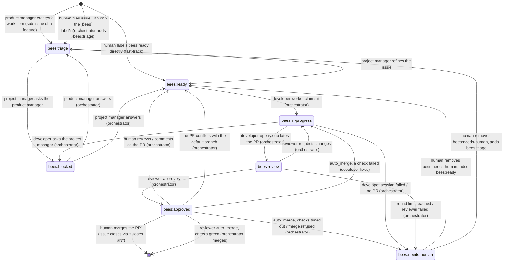

# The workflow

busybees is driven entirely through GitHub. Humans create issues, label them,
comment, and merge pull requests; the factory does everything in between.
This page describes what that looks like from the human side.

## The flow at a glance

1. **A person gives the product manager input.** File an issue with `bees` +
   `bees:feedback` (an idea, product feedback, a bug report), file a feature
   issue directly with `bees` + `bees:feature`, or send mail
   (`bees mail send --from human --to product_manager ...`). A concrete bug you
   already understand can skip the product manager: `bees` + `bees:bug` goes
   straight to triage.
2. **The product manager owns feature issues.** It makes each `bees:feature`
   issue detailed enough, asks *you* on the issue when only a person can decide
   something (label `bees:question`), and breaks the feature into work items —
   one issue per pull-request-sized piece, created with the `issue_create`
   tool (`parent: <feature>`) so each is a native GitHub
   **sub-issue** of the feature. GitHub shows the feature's progress; the
   product manager closes the feature once all its sub-issues are closed.
3. **The project manager triages work items.** It refines each `bees:triage`
   issue (reading the parent feature for context), asks the product manager by
   mail if it needs a product decision, and moves it to `bees:ready`.
4. **Developers and reviewers ship work items.** A developer worker implements
   the issue on a branch and opens a PR; the reviewer reviews; when approved a
   human merges (or the reviewer's `auto_merge` does, once its checks are
   green).
5. **QA tests the default branch** after merges, files bugs (`bees:bug` +
   `bees:triage`) and reports to the product manager, which feeds the next round.

Feature and feedback issues belong to the product manager and sit outside the
label state machine below; work items are the issues that move through it.

## What the factory can see

The factory only looks at issues and pull requests that match the `[filter]`
block in `bees.toml`. All configured criteria must match:

| Criterion | Key | Default | Meaning |
|---|---|---|---|
| Label | `filter.label` | `bees` | Item carries the label (when `require_label = true`) |
| Assignee | `filter.assignee` | unset | Item is assigned to this GitHub login (`@me` = the `gh` user) |
| Milestone | `filter.milestone` | unset | Item belongs to this milestone |

The criteria are ANDed, so adding one to a factory that is already running hides
everything that does not already satisfy it - uncommenting `assignee` in an
established repository makes every issue nobody ever assigned invisible in one
commit. `bees doctor` reports that case with both counts ("34 open issues and 2
pull requests carry `bees`, 0 match your filter").

Everything outside the filter is invisible: the factory will never read, label
or comment on it. The label is also the base name for the workflow labels
below, so with `label = "hive"` the states become `hive:triage`, `hive:ready`
and so on. Everything the factory creates itself gets the label (and the
assignee, if one is configured) so it stays visible. The role prompts require
it, and the orchestrator backstops it: after every session it lists the
issues and PRs the account created since the session started and adds the
base label (and assignee) to anything carrying `bees` or a `bees:*` label
that lacks them — plus, on pull requests, the configured milestone. Both
halves matter: a pull request a session just opened carries only `bees`, and
it earns its first `bees:*` label at approval. Issues never get a
milestone from a bee; that is a person's decision, and an issue `bees issue
create` makes inherits one from the issue it relates to.

The typical solo setup is "label only": put `bees` on an issue and the factory
picks it up. In a shared repository where one person wants busybees to handle
their share of the work, set `assignee = "@me"` and optionally
`require_label = false` so everything assigned to you is fair game.

## The label state machine

Each visible issue carries exactly one **state label**. The orchestrator moves
most of them; the project manager moves a few, through the `issue_set_state`
tool, which is the only move it is offered and which refuses an issue that is
not in `bees:triage`; humans can move any of them.

Feature issues (`bees:feature`) and feedback issues (`bees:feedback`) are
**not** in this diagram: they never carry a state label. They are the product
manager's, and work items are what the product manager produces from them.



| Label | Meaning | Who sets it |
|---|---|---|
| `bees:triage` | Needs the project manager to make it buildable | Product manager (new work items), orchestrator (unlabelled issues), humans |
| `bees:ready` | Detailed enough for a developer | Project manager (`issue_set_state`, with a size), orchestrator (after an answer, human PR feedback on an approved issue, or an approved PR that conflicts with the default branch), humans |
| `bees:in-progress` | A developer worker owns it and a branch exists | Orchestrator |
| `bees:blocked` | Waiting on an answer to a question | Project manager (`issue_set_state`, asking the PM), orchestrator (developer asking) |
| `bees:review` | A pull request is open and in the review loop | Orchestrator |
| `bees:approved` | Reviewer approved; waiting for a human to merge (or, with `roles.reviewer.auto_merge`, for the checks) | Orchestrator (also put on the PR) |
| `bees:needs-human` | The factory gave up on it | Orchestrator |

Four more labels sit **outside** the state machine; issues carrying them
never get a state label and are never triaged (`bees:priority` below is a
fifth: it sits *next to* a state label rather than replacing one):

| Label | Meaning | Who sets it |
|---|---|---|
| `bees:feature` | A feature issue: owned by the product manager, which makes it detailed enough and breaks it into work items | Product manager, humans |
| `bees:feedback` | The product manager's inbox: an idea, product feedback or a bug report from a person | Humans |
| `bees:question` | The product manager is waiting for a person to answer on a feature or feedback issue | Product manager (`issue_question`; removed by the orchestrator when the person replies) |
| `bees:proposal` | A feature issue a bee wrote rather than a person; it sits next to `bees:feature`, and a person removes the label to approve it | `bees issue create --feature` (removed by a person) |

`bees:priority` says "build this next". It is not a state label: an issue keeps
exactly one of `bees:triage`/`bees:ready`/… alongside it, and it survives every
state change. Nothing in the factory removes it; the project manager is the one
role that may add it, to a work item that unblocks the factory itself. See
[Priority](#priority-do-this-next).

`bees:bug` is a **kind label** on a work item (a bug filed by the developer,
reviewer, QA or a human) and travels through the state machine like any other
work item. Humans do not need to add a kind label.

See [Talking to the product manager](#talking-to-the-product-manager) for how
feature and feedback issues are handled.

`bees init` (or `bees labels sync`) creates all of these in the repository.
`bees run` and `bees tick` also create, at start, any label the
factory needs and the repository does not have — so a repository set up by an
older version does not silently fail every label edit that uses a label added
since. Existing labels keep their colour and description; only `bees labels
sync` overwrites those.

## Sizing

Besides its state label, a work item carries at most one **size label**. Size
is what the factory knows about how big a piece of work is: the reviewer is
told the size and adjusts how much scrutiny it applies, `bees status`
breaks the ready queue down by size (`ready  4  (xs 1, s 2, m 1)`), and the size
can pick the model the developer session runs
(`roles.developer.model_by_size`, see
[configuration.md](configuration.md#rolesdeveloper-only-commit-flags-max-size-and-per-size-models)).

| Size | Label | Rough meaning |
|---|---|---|
| xs | `bees:size/xs` | One file, obvious change, no design (typo, config, trivial bug) |
| s | `bees:size/s` | A few files, clear approach, existing tests cover it |
| m | `bees:size/m` | A coherent feature slice touching several packages, needs new tests |
| l | `bees:size/l` | Crosses subsystems or needs a design decision; near the limit for one PR |
| xl | `bees:size/xl` | Too big for one pull request — it should be split instead |

Who sets it:

- The **project manager** sets the size when it moves a work item from
  `bees:triage` to `bees:ready`: `issue_set_state` requires one and applies
  both labels in a single edit. If the refined scope comes out as `xl` it
  splits the issue instead of labelling it.
- The **product manager** may pre-size a work item it creates
  (`issue_create` with `labels: ["bees:size/s"]`). It is a hint; the project
  manager confirms or changes it during triage.
- The **orchestrator** adds `bees:size/m` to any issue that reaches
  `bees:ready` without a size — typically one you fast-tracked past triage.
  Label the issue yourself if `m` is not what you meant.
- **You** can add or change a size label at any time; nothing removes it. Size
  labels are orthogonal to the state machine, so moving an issue between
  states never clears its size.

### Size decides what gets built next

When a developer worker is free, the orchestrator first checks whether an
open pull request needs attention: anything already `bees:in-progress` or
`bees:review` is resumed (a worker picking its issue back up after a restart
is never held back), then any `bees:ready` issue that already has an open pull
request — one sent back for [your feedback](#giving-the-developer-feedback) or
because it [conflicts with the default branch](#conflicts-with-the-default-branch)
— oldest first. Only then does it take new work from `bees:ready`:
[`bees:priority`](#priority-do-this-next) issues first, then in the
order `scheduler.dispatch_order` asks for:

| `dispatch_order` | Order |
|---|---|
| `small-first` (default) | Smallest size first, oldest first within a size. Quick wins do not queue behind a big item. |
| `oldest` | Oldest first, whatever the size. |
| `large-first` | Largest size first, oldest first within a size. |

An issue without a size ranks as `m`, which is the label the orchestrator gives
it anyway.

Two limits sit on top of that order:

- `scheduler.max_large_in_flight` (default `1`) caps how many `bees:size/l`
  issues developers work on at once. A `bees:size/l` issue over the cap is
  skipped — the free worker takes the next issue that fits instead of idling.
  `0` removes the cap. The cap only holds back new work: a resumed issue, with
  or without a pull request, is already in flight. Note that `small-first` and the cap together can keep a
  `bees:size/l` issue waiting for as long as smaller ones keep arriving; switch
  to `oldest` if that matters more than quick wins.
- `roles.developer.max_size` (default `l`) is the largest size a developer
  takes. A ready issue above it is **never dispatched**: the orchestrator moves
  it back to `bees:triage` (no comment — the label is the signal) and the
  project manager splits it on its next run. With the default that means every
  `bees:size/xl` issue goes back to be split.

### Priority: "do this next"

Add `bees:priority` to a `bees:ready` issue and the next free developer takes
it before the rest of the queue, whatever `scheduler.dispatch_order` says and
however old the other issues are. That makes the whole dispatch order:

1. issues being resumed (`bees:in-progress`, `bees:review`, and `bees:ready`
   issues with an open pull request) — never reordered;
2. `bees:priority` issues;
3. `scheduler.dispatch_order` (size, or age under `oldest`);
4. age.

Priority is a **separate axis from size**: a `bees:size/xs` issue does not jump
a priority `bees:size/l` one under `small-first`. Between two priority issues
`dispatch_order` decides as usual.

Set it from the GitHub UI like any other label. It is yours: it survives every
state change, nothing in the factory removes it, and it stays on the issue
until you take it off. One role may add it — the project manager, to a work
item that unblocks the factory itself: the default branch does not build,
every pull request's checks are red for the same reason, or the orchestrator
cannot run. Its prompt rules out anything else, including reordering the queue
by moving `bees:ready` issues back to `bees:triage`.

Priority reorders the queue; it does not lift the limits. A priority
`bees:size/l` issue still waits while `scheduler.max_large_in_flight` of them
are in flight, and a priority issue above `roles.developer.max_size` still goes
back to `bees:triage` to be split.

`bees status` counts the queued issues carrying the label on its `ready` row
(`ready  4  (xs 1, s 2, m 1, 1 priority)`) and lists their numbers under
`priority` in `--json`, so you can see the lever took effect.

## Talking to the product manager

Not everything you want to say is a buildable issue. The product manager is
the role that turns product intent into work, and it listens on two kinds of
issue.

### Feedback issues

For a high-level feature idea ("we should support SSO"), product feedback
("onboarding feels clunky"), or a bug report you would rather have *weighed*
than fixed verbatim, **create an issue with the `bees` label and the
`bees:feedback` label.** That issue goes to the product manager, not to
triage:

- The orchestrator never adds a state label to it and the project manager
  never sees it. `bees status` counts these issues in its `feedback` queue.
- A *fresh* feedback issue wakes the product manager on the next poll instead
  of waiting for `product_manager_interval`. Fresh means you created it, or
  commented on it, after the product manager's last reply.
- The product manager reads it (with all its comments), decides what to do,
  and does it: creates or adjusts feature issues, files a bug work item, or
  declines. (It never touches milestones — those are yours.)
- It then **replies on your feedback issue** with a comment saying what it did
  and linking any issues it created. Like every comment a bee writes, that
  reply ends with an invisible `<!-- bees:product_manager -->` marker; the
  orchestrator uses it to tell your comments from the product manager's.
- If the feedback is fully actioned, it **closes** the issue. If it has a
  question for you, it asks in a comment and labels the issue `bees:question`
  (below).

### Feature issues

A feature issue (`bees` + `bees:feature`) describes a user-visible outcome:
the problem, who it is for, what "done" looks like, constraints. The product
manager writes most of them (from feedback, QA reports and its own roadmap),
but you can file one directly and it is treated the same way. Feature issues
never enter the state machine; `bees status` counts them in its `features`
queue.

A feature issue a **bee** wrote also carries `bees:proposal`: it is a
*proposal* until you approve it. The product manager writes it, refines it and
asks questions on it, but nothing is broken down from it — so the factory
cannot grow its own roadmap. The scheduler never presents a proposal for
breakdown, and `bees issue create --parent <proposal>` and `bees issue link`
refuse outright, so a proposal grows no sub-issues whoever asks. **Remove the
`bees:proposal` label to approve it**: the scheduler notices the label is gone
and brings the feature back to the product manager, which breaks it down on its
next run. A feature issue you filed never carries the label, and is broken down
straight away.

For each *fresh* feature issue (created, or commented on by a person,
since the product manager's last marker comment on it) the product manager:

1. makes sure it is detailed enough to be broken down — or asks you (below);
2. breaks it into **work items**: one issue per pull-request-sized piece,
   created with the `issue_create` tool (`parent: <feature>`, `bug: true` for
   bugs). Each becomes a native GitHub **sub-issue** of the
   feature, labelled `bees` + `bees:triage` (+ `bees:bug`), and inherits the
   feature's milestone. GitHub tracks the feature's progress from its
   sub-issues, and the product manager's prompt shows it as a
   `completed/total` column. Work items are ordered with dependencies noted
   ("after #N"); the project manager adds implementation detail during triage.
   An existing issue can be attached with `issue_link` (`parent: <feature>`, `child: <item>`),
   which makes the sub-issue relationship and, when the issue is in no
   milestone, puts it in the feature's.
   Both refuse a feature that is still a proposal;
3. comments the list of work items on the feature issue (with the marker), so
   it is not presented to the product manager again until something changes;
4. later, closes the feature issue once all its sub-issues are closed, or
   when it no longer makes sense (saying why).

You steer a feature by commenting on it: a human comment newer than the
product manager's last reply makes the issue fresh again.

### Questions for you: `bees:question`

When only a person can decide something — on a feature issue or a feedback
issue — the product manager posts the question as a comment (with the marker),
adds the `bees:question` label, and stops working on that issue. The label is
purely for you: it marks issues waiting on a human. Answer in a comment; on
the next poll the orchestrator sees a human comment newer than the product
manager's last marker comment, removes `bees:question`, and the issue comes
back to the product manager as fresh.

Contrast with the other ways of getting something into the factory:

| You want | Do this | Who handles it |
|---|---|---|
| An idea weighed, feedback heard, a bug considered | issue with `bees` + `bees:feedback` | Product manager |
| A feature specified and broken into work items | issue with `bees` + `bees:feature` | Product manager |
| A concrete piece of work built | issue with `bees` (optionally `bees:bug`), or `bees:ready` to fast-track | Project manager (triage), then a developer |
| A private note to a role, off GitHub | `bees mail send --from human --to product_manager --subject "..." --body "..."` | That role, on its next session |

## Filing work

Work items normally come from the product manager breaking a feature issue
down, but you can file one yourself: **create an issue and add the `bees`
label.** That is all. On the next poll the orchestrator sees an issue with no
state label, adds `bees:triage`, and the project manager picks it up: it reads
the codebase and the parent feature issue if there is one (shown in its
prompt), rewrites the body with scope, acceptance criteria and pointers to
relevant code (keeping your intent, with `issue_edit_body`), splits it if it is
too big (with `issue_create` with `ready: true` and `parent: <feature>`, or
`related: <original>` when there is no parent feature), and moves it to
`bees:ready` with a size. It never changes milestones. If the issue is invalid or a duplicate the project
manager closes it with a comment. If it is really a *direction* rather than a
piece of work — an idea whose first deliverable is a decision about what to
build — the project manager does not invent acceptance criteria for it: it
goes to the product manager and waits in `bees:blocked` until they answer.
The project manager only ever edits work
items; feature and feedback issues are the product manager's.

If the filter does not require the label (`require_label = false`) the
orchestrator also adds the `bees` label at this point, so the issue is fully
tagged either way.

**Fast-track:** if your issue is already detailed enough, label it
`bees:ready` yourself and it skips triage. The next free developer worker takes
the oldest `bees:ready` issue first.

**Steering:** anything a human writes — in an issue, in a pull request, or in
mail to a role — is treated as authoritative by every role and outranks their
prompts, so commenting on an issue is the way to change direction. Labels are
also yours to move: relabel to `bees:triage` to send an issue back for
refinement, or remove the `bees` label to take it out of the factory entirely.

## Dependencies

A work item can declare what has to land first. Put a line anywhere in the
body:

```
Blocked by #37
```

`blocked by` and `depends on` are both recognised, case-insensitively, with an
optional colon and Markdown emphasis, and several numbers separated by commas,
spaces or `and` (`Depends on: #3, #4 and #5`). The phrase without a number
(`blocked by the missing tests`) declares nothing. The `issue_create` tool's
`blocked_by` (or `bees issue create --blocked-by 37`) writes the line for you.

The scheduler reads the line on every poll and will not hand the issue to a
developer while any of its blockers is **open** — meaning *present in the last
poll*: an issue that is closed, or that the factory's filter does not see,
blocks nothing. Both work items and feature issues count.

The label does not change: the issue stays `bees:ready`, `bees status` explains
why it is not moving, and it becomes dispatchable on the first poll after its
blocker closes. Holding an issue back never costs a developer pool slot, so the
rest of the queue keeps moving; issues that are already `bees:in-progress` or
`bees:review` are resumptions and are never held back.

If the declarations form a cycle (`#1` blocked by `#2` blocked by `#1`), the
scheduler ignores the dependencies of the issues in it — otherwise nothing
would ever be built — and logs a warning once per issue.

The project manager sees the open blockers of every work item in its prompt and
is told to write the line rather than park a dependent item in triage. The
product manager uses `blocked_by` when it breaks a feature down.

## Development

When a developer worker claims a `bees:ready` issue it:

1. labels it `bees:in-progress`;
2. creates a temporary git worktree on the branch `bees/issue-N` (prefix
   configurable), based on the default branch, reusing the branch if it
   already exists;
3. runs a developer session that implements the issue, merges the default
   branch into it, pushes, and opens a pull request whose body contains
   `Closes #N`;
4. labels the PR `bees` (and assigns it, if an assignee is configured) and
   moves the issue to `bees:review`.

The developer never touches labels itself and never pushes to the default
branch. Bugs the developer notices outside the issue's scope are filed as new
`bees:bug` issues in triage rather than fixed. It is told to merge the default
branch before every push, on every round, and to re-run the tests afterwards:
the default branch moves while an issue is being worked, and a pull request
that has fallen behind it costs a whole review round.

## Questions

Roles never talk to each other on GitHub. They use a local mailbox in the
state directory (`bees mail`), which humans can read with `bees mail list`.
The visible effect on GitHub is the `bees:blocked` label:

- A **developer** asks only when no reading of the issue is safe. Where the
  issue merely leaves a choice it makes the choice, implements it and writes it
  into the pull request for the reviewer to rule on; a question costs more,
  because the work restarts in a later session with none of the first one's
  context. When it does ask, it sends one question to the project manager and
  stops. The orchestrator checks the message was really sent during the session
  — if it was not, the issue is escalated to a human — then labels the issue
  `bees:blocked` and frees the worker. When the project manager answers, the
  orchestrator sees unread mail for the developer about that issue and relabels
  it `bees:ready`; the next developer session starts with the answer in its
  prompt.
- A **project manager** that needs a product decision during triage asks the
  product manager and labels the issue `bees:blocked` itself. When the product
  manager answers, the orchestrator relabels the issue `bees:triage` and the
  project manager continues.

Answers are delivered with the issue, so it does not matter which developer
worker ends up with it. If you want to answer a question yourself, do it in
the issue (roles treat human comments as authoritative) and move the label back
to `bees:ready` or `bees:triage`, or send mail:

```
bees mail send --from human --to developer --issue 12 --subject "Re: which DB" --body "Use SQLite."
```

## Review

Each developer worker runs a strictly sequential loop for its issue:

```
developer → reviewer → developer → reviewer → … → approved
```

The reviewer checks out the PR branch, reads the diff and the issue, runs the
tests, and either approves or sends one consolidated feedback message to the
developer through the mailbox. It does not submit a GitHub review and does not
push to the branch. On "changes requested" the orchestrator moves the issue
back to `bees:in-progress`, runs the developer again with the feedback in its
prompt, and the developer pushes and reports `pr-updated`.

`scheduler.max_review_rounds` (default 3) caps the number of reviewer passes.
If the last round still requests changes the issue is escalated (below). The
reviewer is told when it is on the final round.

When the reviewer approves, the orchestrator labels both the PR and the issue
`bees:approved` and requests a review from everyone in
[`scheduler.notify`](configuration.md#notifying-a-person), so the pull request
shows up in their review queue. That request is best effort: GitHub refuses one
from the pull request's own author, which with a shared account is usually the
configured login. If the reviewer role is disabled (`[roles.reviewer] enabled =
false`) a PR is treated as approved as soon as the developer opens it.

### Before the review: the checks

The developer runs the repository's own lint and test commands before it pushes,
and the orchestrator reads the pull request's **checks before the first review**
(`[roles.reviewer] pre_review_checks`, on by default — independent of
`auto_merge`). Between the developer opening the pull request and the first
reviewer session, the worker waits `checks_wait` and then polls every
`checks_poll_interval`, at most `pre_review_checks_timeout` (default 10 minutes):

- **Green**: the review starts, and the reviewer's prompt lists the checks so it
  knows CI is green and can concentrate on the change itself.
- **A check failed**: the reviewer gets a checks-mode session first (exactly as
  after approval, below), mails the developer the error, and the developer pushes
  a fix; only then does the normal review happen. These rounds share
  `check_fix_rounds` and `max_check_fix_rounds` with the post-approval stage and
  do **not** count against `max_review_rounds`; exhausting them escalates.
- **Still pending** at `pre_review_checks_timeout`, or **no check reported at
  all**: the review happens anyway and the reviewer is told to run the test-suite
  itself.
- **The read itself fails** (`gh` errors, a rate limit, an API outage): the
  pre-review read is advisory, so it is logged as a warning and the review
  happens anyway, without a checks section in the reviewer's prompt.

The read happens once per pull request. A later review round — the developer
answering the reviewer's feedback — goes straight to the reviewer, with no
second read, no second wait and no checks section: the checks that were read
describe a head the developer has since replaced. A restarted `bees run` does
read them again, because the process has no memory of the first read.

`bees status` shows the worker in the `pre-review checks` stage while it waits.
Set `pre_review_checks = false` to go straight from the developer to the
reviewer.

## Giving the developer feedback

You do not need the mailbox to steer a developer: review the pull request on
GitHub like you would review a colleague's. On every poll the orchestrator
looks at each open factory PR whose `updatedAt` moved since it last checked
and collects, via the GitHub API, the reviews, inline review comments and
conversation comments written since then. It ignores comments containing the
`<!-- bees:` marker (bees and humans share one `gh` account, so every comment
a bee posts ends with `<!-- bees:<role> -->`) and empty approvals. Whatever is
left is sent to the developer as one mail message from `human`, listing each
item with its author, file and line, comment id, link and the exact `gh`
command to reply to it. The timestamp of the last item delivered is recorded
as `human_seen_at` in `<state_dir>/issues/<n>.json`.

What happens next depends on the issue's state:

- **`bees:approved`** (the usual case: the reviewer approved and the PR is
  waiting on you): the orchestrator moves the issue back to `bees:ready` and
  removes `bees:approved` from the PR. A developer worker picks it up, reads
  your feedback, pushes changes, and replies to each of your comments on
  GitHub; the reviewer re-reviews and the issue returns to `bees:approved`.
- **`bees:in-progress` / `bees:review`**: the worker is still running; the
  mail is delivered to the next developer session for that PR.
- **`bees:blocked`**: mail for the developer counts as an answer, so the issue
  becomes `bees:ready` on the same poll.

You can also mail a developer directly, with or without a PR:

```
bees mail send --from human --to developer --issue 12 --body "Keep the CLI flag names as they are."
```

Roles treat what humans write as authoritative; when your request conflicts
with the issue or the reviewer's feedback, the developer follows you and says
so in the PR.

### Conflicts with the default branch

Every merge can leave the remaining open PRs conflicting with the default
branch, and a conflicting PR is one a person cannot merge. On every poll the
orchestrator therefore also reads each open factory PR's merge state (it comes
with the PR list; no extra API calls) for issues in `bees:review` or
`bees:approved`:

- **Conflicting** (`scheduler.pr_fix_conflicts`, default `true`): the
  developer is mailed, from `orchestrator`, `PR #N conflicts with main` — merge
  the default branch into the branch, resolve the conflicts, run the tests,
  push and report `pr-updated`.
- **Behind** (`scheduler.pr_keep_updated`, default `false`): the same for a PR
  that would merge cleanly but was not tested against the default branch as it
  is now. Off by default because that is usually fine.

Both are backstops: the developer is told to merge the default branch itself
before every push, so a PR should not normally be conflicting or behind by the
time the reviewer sees it.

An issue in `bees:approved` goes back to `bees:ready` and `bees:approved` is
removed from the PR, exactly like human feedback; because it already has a pull
request, a developer worker takes it ahead of any new work item. An issue in
`bees:review` keeps its worker — the mail reaches the developer on its next
round, or on the next poll once the reviewer approves. The developer's push
then goes through review again, so nothing is merged untested. An issue in
`bees:in-progress` is skipped: the developer is on it already.

The developer is told once per head commit (recorded as
`conflict_notified_sha` in `<state_dir>/issues/<n>.json`): the same
conflicting head is never nagged about twice, but a push that still conflicts
is reported again. GitHub computes mergeability lazily; a PR whose state is
still unknown is left alone until the next poll.

## Merging

**By default nobody in the factory merges.** An approved PR waits for a human;
merging it closes the issue through `Closes #N`.

The reviewer can be given the job instead. Set `auto_merge = true` under
`[roles.reviewer]` (with optional `merge_method`, `checks_wait`,
`checks_timeout`, `max_check_fix_rounds` — the same keys the
[pre-review read](#before-the-review-the-checks) uses, see
[configuration.md](configuration.md#rolesreviewer-only-checks-and-auto-merge)). Once the
reviewer approves, the developer worker enters a **checks** stage:

1. It waits `checks_wait` (default 1 minute), because some checks take a
   moment to report that they have started.
2. It polls the PR's checks every `roles.reviewer.checks_poll_interval`
   (default 2 minutes) until they are no longer pending. The **required**
   checks (`gh pr checks --required`) are the gate whenever the branch has
   any. When it has none — a repository with no branch protection — every
   check the pull request reports (`gh pr checks`) is the gate instead:
   gating on the checks that exist beats gating on nothing. To take a check
   out of the gate, mark the ones that must block a merge as required in the
   branch protection rules of the default branch; bees never touches those
   rules itself.
3. All green, the orchestrator merges with
   `gh pr merge --<merge_method> --delete-branch`. The issue closes through
   `Closes #N` and QA sees the change on its next run. When nothing is
   reported at all — no CI in the repository — it merges too, after two
   consecutive empty polls, and logs that no check was reported rather than
   that the checks passed.
4. A check failed: the reviewer gets a follow-up session in *checks mode*. It
   works out what failed without assuming any particular CI system — the
   check's details link and description, `gh pr checks`, the repository's own
   documentation and its notes, `gh run view --log-failed` only if the link is
   a GitHub Actions run, and local reproduction on the branch otherwise — then
   mails the developer the main error message, its cause and how to reproduce
   it. The developer pushes a fix (`pr-updated`) and the worker goes straight
   back to polling the checks — the stage that found the failure, pre-review or
   post-approval; there is no second full review. If the reviewer
   decides the failure is unrelated (infrastructure, flakiness) it may re-run
   the check where the CI system allows and report `approved`, which means
   "wait for the checks again".
5. This fix loop runs at most `max_check_fix_rounds` times (default 2). After
   that, or if the checks are still pending at `checks_timeout` (default 30
   minutes), or if GitHub refuses the merge (typically branch protection that
   requires a human review), the issue is escalated to `bees:needs-human`.

If the reviewer role is disabled but `auto_merge` is on, a developer's PR
skips review and goes straight to the checks stage.

## Escalation: `bees:needs-human`

### Retries first

Not every dead session is a bad decision. Before escalating, the orchestrator
classifies what went wrong:

- **Infrastructure** — the session timed out, ran out of turns, hit an API
  error or a rate limit, or `claude` exited without producing a result. These
  are retried up to `scheduler.retries` times (default 1), after
  `scheduler.retry_delay` (default 10 minutes), and with the role's
  `fallback_model` as the primary model when `scheduler.retry_with_fallback`
  is on. Each attempt gets its own directory under `<state_dir>/sessions/`
  (the retry is suffixed `-retry1`), and a retried developer session is told
  that its previous attempt was interrupted, so it continues from whatever is
  already on the branch instead of starting over. `bees status` shows the
  attempt number next to the round.
- **Behavioural** — the session ran and reported an outcome with the `done`
  tool (including `failed`), or ended cleanly without reporting at all. Running it
  again would only repeat the same decision, so it escalates immediately.

Set `scheduler.retries = 0` to escalate every failure at once. Retries apply
to sessions only; git, `gh` and worktree failures are not retried.

### When the factory gives up

Once retries are exhausted (or the failure was behavioural), the factory hands
the issue to a human:

- the developer session failed, or timed out and its retries were exhausted,
  or reported a PR that does not exist;
- the developer said it asked a question but sent no mail (or the reviewer said
  it requested changes but sent no feedback);
- the reviewer session failed;
- `max_review_rounds` passed without approval;
- a worktree could not be created;
- with `roles.reviewer.auto_merge`: checks still failed after
  `max_check_fix_rounds`, were still pending at `checks_timeout`, the reviewer
  could not diagnose them (or said it had mailed the developer but had not), or
  GitHub refused the merge;
- the issue ran out of money: every session run for it has cost more than
  [`scheduler.max_cost_per_issue`](configuration.md#cost-budgets), or two
  sessions in a row cost more than `scheduler.max_cost_per_session`. The
  comment names the spend, so the choice is between raising the budget and
  finishing the work by hand. Both budgets are off by default.

A budget the factory hits does not always escalate: `scheduler.max_cost_per_day`
pauses dispatch instead. Nothing is labelled, no comment is written, and the
workers already running finish their loop; the scheduler simply starts nothing
new until the rolling 24-hour spend falls back under the budget. `bees status`
reports the pause.

The orchestrator sets `bees:needs-human` and posts a comment on the issue
explaining why; the comment mentions everyone in
[`scheduler.notify`](configuration.md#notifying-a-person), since the factory
posts under your own account and a comment notifies nobody by itself.
**This is the only comment the orchestrator itself writes.** Roles
do comment on GitHub, but only to people — the developer replying to PR feedback,
the product manager replying to feedback and feature issues or asking a
`bees:question` — always tagged `<!-- bees:<role> -->`; everything *between roles*
stays in the mailbox. The reviewer's last
feedback, if any, is in the mailbox (`bees mail list --issue N`), and the full
transcripts are under `<state_dir>/sessions/`.

To hand the issue back, remove `bees:needs-human` and add `bees:ready` (to
retry development, the branch and any PR are reused) or `bees:triage` (to have
the project manager rework it).

## QA

QA is a singleton that runs against a detached checkout of the default
branch, so it only ever sees merged work. It runs when at least
`scheduler.qa_interval` (default 30m) has passed since its last run **and**
something matching the filter has been merged since then (that merged-PR check
itself happens at most once per `qa_interval`); its very first run
happens immediately and looks back seven days. In a session QA works out from
the repository's documentation (and its notes) how to install dependencies,
run the test-suite and launch the app, verifies each merged PR against its
issue, explores around it, and then:

- files a `bees:bug` issue in triage for every defect (with reproduction steps,
  expected vs actual, severity), after searching for duplicates;
- sends the product manager one report by mail: what was tested, what works,
  bugs filed, and product-level observations.

QA stays in its lane: what it files directly is a bug report, or a small work
item within the existing design. Anything that asks for new scope goes to the
product manager by mail, which turns it into a
[proposal](#feature-issues) for you to approve; QA never opens feature issues
itself.

## Bugs

Any of developer, reviewer and QA can file bugs. They always go in as
`bees` + `bees:bug` + `bees:triage`, so they flow through the project manager
like any other issue. Developers and reviewers only file bugs they notice
outside the scope of what they are working on; they do not fix them in
passing.

## Features, sub-issues and milestones

The product manager owns the roadmap of feature issues. It runs at least every
`scheduler.product_manager_interval` (default 1h), or sooner when it has
unread mail (questions from the project manager, reports from QA) or when a
feature or feedback issue is fresh (a proposal counts only once a person has
commented on it: until then nobody but a person can move it). It writes
feature issues
(`issue_create` with `feature: true`) that describe user-visible outcomes rather than
implementation, and breaks them into work items as described above — except that
a feature issue it wrote itself starts as a
[proposal](#feature-issues) (`bees:proposal`) and is only broken down once a
person removes that label. Because
work items are GitHub sub-issues of their feature, progress is visible on the
feature issue itself, in GitHub's project views, and in the product manager's
prompt.

**Milestones are managed by people, never by bees.** No role creates, edits or
closes a milestone; the product manager sees the open milestones read-only and
treats them as a priority signal. What the bees do is *inherit*: every issue
they create takes the milestone of the issue it relates to — a work item gets
its parent feature's milestone, a bug found while working on an issue gets that
issue's milestone (`related`), a feature distilled from a feedback issue gets
the feedback issue's milestone — falling back to `filter.milestone` when the
factory is pinned to one. Attaching an existing issue to a feature with
`issue_link` inherits the same way, but only when that issue is in no milestone:
one it already has is a person's decision, and a bee never overwrites or clears
it. So if you put a feature into a milestone, everything that grows out of it
lands there too.

Humans can shape the roadmap by creating or editing milestones and moving
issues between them, editing the product manager's notes file
(`<state_dir>/notes/product_manager.md`), filing feature or feedback issues, or
answering the product manager's `bees:question`s.

## One issue, end to end

```mermaid
sequenceDiagram
    actor H as Human
    participant GH as GitHub
    participant O as Orchestrator
    participant PM as Product manager
    participant PjM as Project manager
    participant Dev as Developer
    participant Rev as Reviewer
    participant QA as QA

    H->>GH: Create feature issue, label `bees` + `bees:feature`
    O->>PM: Session (fresh feature issue)
    PM->>GH: comment question, add bees:question
    H->>GH: Answer in a comment
    O->>GH: human replied → remove bees:question
    O->>PM: Session (feature fresh again)
    PM->>GH: issue_create parent=F: sub-issues, bees:triage, inherit milestone
    PM->>GH: Comment list of work items on the feature
    O->>PjM: Session with triage batch (parent feature shown)
    PjM->>GH: Edit body (scope, acceptance criteria)
    PjM-->>PM: mail: "should X support Y?"
    PjM->>GH: label bees:blocked
    O->>PM: Session with unread mail
    PM-->>PjM: mail: "yes, but only Z"
    O->>GH: answer arrived → bees:triage
    O->>PjM: Session
    PjM->>GH: bees:triage → bees:ready
    O->>GH: claim → bees:in-progress
    O->>Dev: Session on branch bees/issue-N
    Dev->>GH: push, gh pr create (Closes #N)
    Dev->>O: done: pr-opened
    O->>GH: label PR `bees`; issue → bees:review
    O->>Rev: Session on PR branch
    Rev-->>Dev: mail: review round 1 feedback
    Rev->>O: done: changes-requested
    O->>GH: issue → bees:in-progress
    O->>Dev: Session with feedback (round 2)
    Dev->>GH: push
    Dev->>O: done: pr-updated
    O->>GH: issue → bees:review
    O->>Rev: Session (round 2)
    Rev->>O: done: approved
    O->>GH: PR + issue → bees:approved
    H->>GH: Merge PR (work item closes)
    Note over O,GH: with roles.reviewer.auto_merge the orchestrator waits<br/>checks_wait, polls the PR checks and merges instead
    O->>QA: Session on default branch (merged PRs since last run)
    QA->>GH: file bees:bug issues
    QA-->>PM: mail: QA report
    O->>PM: Session (mail)
    PM->>GH: all work items closed → close feature issue
```
