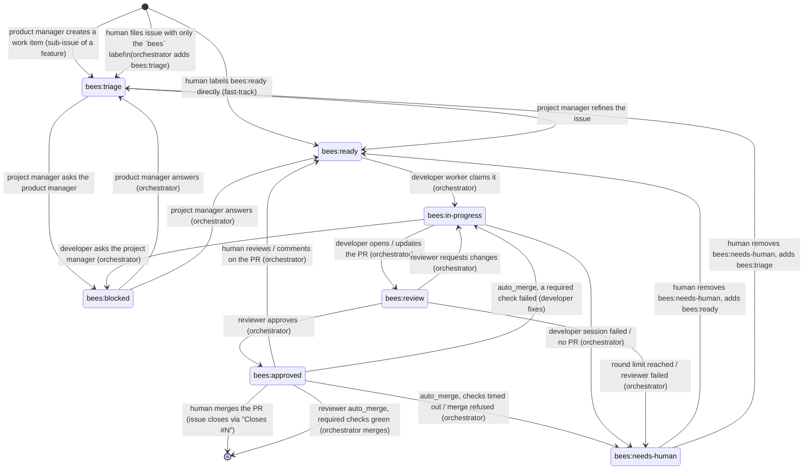

# The workflow

busybees is driven entirely through GitHub. Humans create issues, label them,
comment, and merge pull requests; the factory does everything in between.
This page describes what that looks like from the human side.

## The flow at a glance

1. **A person gives the product manager input.** File an issue with `bees` +
   `bees:feedback` (an idea, product feedback, a bug report), file a feature
   issue directly with `bees` + `bees:feature`, or send mail
   (`bees mail send --from human --to product_manager ...`). A concrete bug you
   already understand can skip the product manager: `bees` + `bees:bug` goes
   straight to triage.
2. **The product manager owns feature issues.** It makes each `bees:feature`
   issue detailed enough, asks *you* on the issue when only a person can decide
   something (label `bees:question`), and breaks the feature into work items —
   one issue per pull-request-sized piece, created with
   `bees issue create --parent <feature>` so each is a native GitHub
   **sub-issue** of the feature. GitHub shows the feature's progress; the
   product manager closes the feature once all its sub-issues are closed.
3. **The project manager triages work items.** It refines each `bees:triage`
   issue (reading the parent feature for context), asks the product manager by
   mail if it needs a product decision, and moves it to `bees:ready`.
4. **Developers and reviewers ship work items.** A developer worker implements
   the issue on a branch and opens a PR; the reviewer reviews; when approved a
   human merges (or the reviewer's `auto_merge` does, once required checks are
   green).
5. **QA tests the default branch** after merges, files bugs (`bees:bug` +
   `bees:triage`) and reports to the product manager, which feeds the next round.

Feature and feedback issues belong to the product manager and sit outside the
label state machine below; work items are the issues that move through it.

## What the factory can see

The factory only looks at issues and pull requests that match the `[filter]`
block in `bees.toml`. All configured criteria must match:

| Criterion | Key | Default | Meaning |
|---|---|---|---|
| Label | `filter.label` | `bees` | Item carries the label (when `require_label = true`) |
| Assignee | `filter.assignee` | unset | Item is assigned to this GitHub login (`@me` = the `gh` user) |
| Milestone | `filter.milestone` | unset | Item belongs to this milestone |

Everything outside the filter is invisible: the factory will never read, label
or comment on it. The label is also the base name for the workflow labels
below, so with `label = "hive"` the states become `hive:triage`, `hive:ready`
and so on. Everything the factory creates itself gets the label (and the
assignee, if one is configured) so it stays visible. The role prompts require
it, and the orchestrator backstops it: after every session it lists the
issues and PRs the account created since the session started and adds the
base label (and assignee) to anything carrying a `bees:*` label that lacks
them.

The typical solo setup is "label only": put `bees` on an issue and the factory
picks it up. In a shared repository where one person wants busybees to handle
their share of the work, set `assignee = "@me"` and optionally
`require_label = false` so everything assigned to you is fair game.

## The label state machine

Each visible issue carries exactly one **state label**. The orchestrator moves
most of them; the project manager moves a few; humans can move any of them.

Feature issues (`bees:feature`) and feedback issues (`bees:feedback`) are
**not** in this diagram: they never carry a state label. They are the product
manager's, and work items are what the product manager produces from them.



| Label | Meaning | Who sets it |
|---|---|---|
| `bees:triage` | Needs the project manager to make it buildable | Product manager (new work items), orchestrator (unlabelled issues), humans |
| `bees:ready` | Detailed enough for a developer | Project manager, orchestrator (after an answer, or human PR feedback on an approved issue), humans |
| `bees:in-progress` | A developer worker owns it and a branch exists | Orchestrator |
| `bees:blocked` | Waiting on an answer to a question | Project manager (asking the PM), orchestrator (developer asking) |
| `bees:review` | A pull request is open and in the review loop | Orchestrator |
| `bees:approved` | Reviewer approved; waiting for a human to merge (or, with `roles.reviewer.auto_merge`, for required checks) | Orchestrator (also put on the PR) |
| `bees:needs-human` | The factory gave up on it | Orchestrator |

Three more labels sit **outside** the state machine; issues carrying them
never get a state label and are never triaged:

| Label | Meaning | Who sets it |
|---|---|---|
| `bees:feature` | A feature issue: owned by the product manager, which makes it detailed enough and breaks it into work items | Product manager, humans |
| `bees:feedback` | The product manager's inbox: an idea, product feedback or a bug report from a person | Humans |
| `bees:question` | The product manager is waiting for a person to answer on a feature or feedback issue | Product manager (removed by the orchestrator when the person replies) |

`bees:bug` is a **kind label** on a work item (a bug filed by the developer,
reviewer, QA or a human) and travels through the state machine like any other
work item. Humans do not need to add a kind label.

See [Talking to the product manager](#talking-to-the-product-manager) for how
feature and feedback issues are handled.

`bees init` (or `bees labels sync`) creates all of these in the repository.

## Talking to the product manager

Not everything you want to say is a buildable issue. The product manager is
the role that turns product intent into work, and it listens on two kinds of
issue.

### Feedback issues

For a high-level feature idea ("we should support SSO"), product feedback
("onboarding feels clunky"), or a bug report you would rather have *weighed*
than fixed verbatim, **create an issue with the `bees` label and the
`bees:feedback` label.** That issue goes to the product manager, not to
triage:

- The orchestrator never adds a state label to it and the project manager
  never sees it. `bees status` counts these issues in its `feedback` queue.
- A *fresh* feedback issue wakes the product manager on the next poll instead
  of waiting for `product_manager_interval`. Fresh means you created it, or
  commented on it, after the product manager's last reply.
- The product manager reads it (with all its comments), decides what to do,
  and does it: creates or adjusts feature issues, files a bug work item, or
  declines. (It never touches milestones — those are yours.)
- It then **replies on your feedback issue** with a comment saying what it did
  and linking any issues it created. Like every comment a bee writes, that
  reply ends with an invisible `<!-- bees:product_manager -->` marker; the
  orchestrator uses it to tell your comments from the product manager's.
- If the feedback is fully actioned, it **closes** the issue. If it has a
  question for you, it asks in a comment and labels the issue `bees:question`
  (below).

### Feature issues

A feature issue (`bees` + `bees:feature`) describes a user-visible outcome:
the problem, who it is for, what "done" looks like, constraints. The product
manager writes most of them (from feedback, QA reports and its own roadmap),
but you can file one directly and it is treated the same way. Feature issues
never enter the state machine; `bees status` counts them in its `features`
queue. For each *fresh* feature issue (created, or commented on by a person,
since the product manager's last marker comment on it) the product manager:

1. makes sure it is detailed enough to be broken down — or asks you (below);
2. breaks it into **work items**: one issue per pull-request-sized piece,
   created with `bees issue create --parent <feature> --title ... --body-file ...`
   (`--bug` for bugs). Each becomes a native GitHub **sub-issue** of the
   feature, labelled `bees` + `bees:triage` (+ `bees:bug`), and inherits the
   feature's milestone. GitHub tracks the feature's progress from its
   sub-issues, and the product manager's prompt shows it as a
   `completed/total` column. Work items are ordered with dependencies noted
   ("after #N"); the project manager adds implementation detail during triage.
   An existing issue can be attached with `bees issue link --parent <feature> --child <item>`;
3. comments the list of work items on the feature issue (with the marker), so
   it is not presented to the product manager again until something changes;
4. later, closes the feature issue once all its sub-issues are closed, or
   when it no longer makes sense (saying why).

You steer a feature by commenting on it: a human comment newer than the
product manager's last reply makes the issue fresh again.

### Questions for you: `bees:question`

When only a person can decide something — on a feature issue or a feedback
issue — the product manager posts the question as a comment (with the marker),
adds the `bees:question` label, and stops working on that issue. The label is
purely for you: it marks issues waiting on a human. Answer in a comment; on
the next poll the orchestrator sees a human comment newer than the product
manager's last marker comment, removes `bees:question`, and the issue comes
back to the product manager as fresh.

Contrast with the other ways of getting something into the factory:

| You want | Do this | Who handles it |
|---|---|---|
| An idea weighed, feedback heard, a bug considered | issue with `bees` + `bees:feedback` | Product manager |
| A feature specified and broken into work items | issue with `bees` + `bees:feature` | Product manager |
| A concrete piece of work built | issue with `bees` (optionally `bees:bug`), or `bees:ready` to fast-track | Project manager (triage), then a developer |
| A private note to a role, off GitHub | `bees mail send --from human --to product_manager --subject "..." --body "..."` | That role, on its next session |

## Filing work

Work items normally come from the product manager breaking a feature issue
down, but you can file one yourself: **create an issue and add the `bees`
label.** That is all. On the next poll the orchestrator sees an issue with no
state label, adds `bees:triage`, and the project manager picks it up: it reads
the codebase and the parent feature issue if there is one (shown in its
prompt), rewrites the body with scope, acceptance criteria and pointers to
relevant code (keeping your intent), splits it if it is too big (with
`bees issue create --ready --parent <feature>`, or `--related <original>` when
there is no parent feature), and moves it to `bees:ready`. It never changes
milestones. If the issue is invalid or a duplicate the project
manager closes it with a comment. The project manager only ever edits work
items; feature and feedback issues are the product manager's.

If the filter does not require the label (`require_label = false`) the
orchestrator also adds the `bees` label at this point, so the issue is fully
tagged either way.

**Fast-track:** if your issue is already detailed enough, label it
`bees:ready` yourself and it skips triage. The next free developer worker takes
the oldest `bees:ready` issue first.

**Steering:** anything a human writes in an issue or PR is treated as
authoritative by every role, so commenting on an issue is the way to change
direction. Labels are also yours to move: relabel to `bees:triage` to send an
issue back for refinement, or remove the `bees` label to take it out of the
factory entirely.

## Development

When a developer worker claims a `bees:ready` issue it:

1. labels it `bees:in-progress`;
2. creates a temporary git worktree on the branch `bees/issue-N` (prefix
   configurable), based on the default branch, reusing the branch if it
   already exists;
3. runs a developer session that implements the issue, pushes, and opens a
   pull request whose body contains `Closes #N`;
4. labels the PR `bees` (and assigns it, if an assignee is configured) and
   moves the issue to `bees:review`.

The developer never touches labels itself and never pushes to the default
branch. Bugs the developer notices outside the issue's scope are filed as new
`bees:bug` issues in triage rather than fixed.

## Questions

Roles never talk to each other on GitHub. They use a local mailbox in the
state directory (`bees mail`), which humans can read with `bees mail list`.
The visible effect on GitHub is the `bees:blocked` label:

- A **developer** that cannot implement an issue without guessing sends one
  question to the project manager and stops. The orchestrator labels the issue
  `bees:blocked` and frees the worker. When the project manager answers, the
  orchestrator sees unread mail for the developer about that issue and relabels
  it `bees:ready`; the next developer session starts with the answer in its
  prompt.
- A **project manager** that needs a product decision during triage asks the
  product manager and labels the issue `bees:blocked` itself. When the product
  manager answers, the orchestrator relabels the issue `bees:triage` and the
  project manager continues.

Answers are delivered with the issue, so it does not matter which developer
worker ends up with it. If you want to answer a question yourself, do it in
the issue (roles treat human comments as authoritative) and move the label back
to `bees:ready` or `bees:triage`, or send mail:

```
bees mail send --from human --to developer --issue 12 --subject "Re: which DB" --body "Use SQLite."
```

## Review

Each developer worker runs a strictly sequential loop for its issue:

```
developer → reviewer → developer → reviewer → … → approved
```

The reviewer checks out the PR branch, reads the diff and the issue, runs the
tests, and either approves or sends one consolidated feedback message to the
developer through the mailbox. It does not submit a GitHub review and does not
push to the branch. On "changes requested" the orchestrator moves the issue
back to `bees:in-progress`, runs the developer again with the feedback in its
prompt, and the developer pushes and reports `pr-updated`.

`scheduler.max_review_rounds` (default 3) caps the number of reviewer passes.
If the last round still requests changes the issue is escalated (below). The
reviewer is told when it is on the final round.

When the reviewer approves, the orchestrator labels both the PR and the issue
`bees:approved`. If the reviewer role is disabled (`[roles.reviewer] enabled =
false`) a PR is treated as approved as soon as the developer opens it.

### Before the review: the required checks

The developer runs the repository's own lint and test commands before it
pushes, and the orchestrator reads the pull request's **required checks before
the first review** (`[roles.reviewer] pre_review_checks`, on by default —
independent of `auto_merge`). Between the developer opening or updating the PR
and the reviewer starting, the worker waits `checks_wait` and polls
`gh pr checks --required` every `checks_poll_interval`, at most
`pre_review_checks_timeout` (default 10 minutes):

- **Green**, or no required checks configured: the review starts, and the
  reviewer's prompt lists the checks so it knows CI is green and can
  concentrate on the change itself.
- **A check failed**: the reviewer gets a checks-mode session first (exactly as
  after approval, below), mails the developer the error, and the developer
  pushes a fix; only then does the normal review happen. These rounds share
  `check_fix_rounds` and `max_check_fix_rounds` with the post-approval stage
  and do **not** count against `max_review_rounds`; exhausting them escalates.
- **Still pending** at `pre_review_checks_timeout`: the review happens anyway
  and the reviewer is told the checks were pending and that it should run the
  test-suite itself.
- **The read itself fails** (`gh` errors, a rate limit, an API outage): the read
  is advisory, so it is logged as a warning and the review happens anyway,
  without a checks section in the reviewer's prompt.

`bees status` shows the worker in the `pre-review checks` stage while it waits.
Set `pre_review_checks = false` to go straight from the developer to the
reviewer.

## Giving the developer feedback

You do not need the mailbox to steer a developer: review the pull request on
GitHub like you would review a colleague's. On every poll the orchestrator
looks at each open factory PR whose `updatedAt` moved since it last checked
and collects, via the GitHub API, the reviews, inline review comments and
conversation comments written since then. It ignores comments containing the
`<!-- bees:` marker (bees and humans share one `gh` account, so every comment
a bee posts ends with `<!-- bees:<role> -->`) and empty approvals. Whatever is
left is sent to the developer as one mail message from `human`, listing each
item with its author, file and line, comment id, link and the exact `gh`
command to reply to it. The timestamp of the last item delivered is recorded
as `human_seen_at` in `<state_dir>/issues/<n>.json`.

What happens next depends on the issue's state:

- **`bees:approved`** (the usual case: the reviewer approved and the PR is
  waiting on you): the orchestrator moves the issue back to `bees:ready` and
  removes `bees:approved` from the PR. A developer worker picks it up, reads
  your feedback, pushes changes, and replies to each of your comments on
  GitHub; the reviewer re-reviews and the issue returns to `bees:approved`.
- **`bees:in-progress` / `bees:review`**: the worker is still running; the
  mail is delivered to the next developer session for that PR.
- **`bees:blocked`**: mail for the developer counts as an answer, so the issue
  becomes `bees:ready` on the same poll.

You can also mail a developer directly, with or without a PR:

```
bees mail send --from human --to developer --issue 12 --body "Keep the CLI flag names as they are."
```

Roles treat what humans write as authoritative; when your request conflicts
with the issue or the reviewer's feedback, the developer follows you and says
so in the PR.

## Merging

**By default nobody in the factory merges.** An approved PR waits for a human;
merging it closes the issue through `Closes #N`.

The reviewer can be given the job instead. Set `auto_merge = true` under
`[roles.reviewer]` (with optional `merge_method`, `checks_wait`,
`checks_timeout`, `max_check_fix_rounds` — see
[configuration.md](configuration.md#rolesreviewer-only-checks-and-auto-merge)). Once the
reviewer approves, the developer worker enters a **checks** stage:

1. It waits `checks_wait` (default 1 minute), because some required checks
   take a moment to report that they have started.
2. It polls the PR's **required** checks (`gh pr checks --required`) every
   `roles.reviewer.checks_poll_interval` (default 2 minutes) until they are no
   longer pending.
3. All green — or no required checks configured — the orchestrator merges with
   `gh pr merge --<merge_method> --delete-branch`. The issue closes through
   `Closes #N` and QA sees the change on its next run.
4. A check failed: the reviewer gets a follow-up session in *checks mode*. It
   works out what failed without assuming any particular CI system — the
   check's details link and description, `gh pr checks`, the repository's own
   documentation and its notes, `gh run view --log-failed` only if the link is
   a GitHub Actions run, and local reproduction on the branch otherwise — then
   mails the developer the main error message, its cause and how to reproduce
   it. The developer pushes a fix (`pr-updated`) and the worker goes straight
   back to polling the checks; there is no second full review. If the reviewer
   decides the failure is unrelated (infrastructure, flakiness) it may re-run
   the check where the CI system allows and report `approved`, which means
   "wait for the checks again".
5. This fix loop runs at most `max_check_fix_rounds` times (default 2). After
   that, or if the checks are still pending at `checks_timeout` (default 30
   minutes), or if GitHub refuses the merge (typically branch protection that
   requires a human review), the issue is escalated to `bees:needs-human`.

If the reviewer role is disabled but `auto_merge` is on, a developer's PR
skips review and goes straight to the checks stage.

## Escalation: `bees:needs-human`

The factory hands an issue to a human when it cannot make progress:

- the developer session failed, timed out, or reported a PR that does not
  exist;
- the developer said it asked a question but sent no mail (or the reviewer said
  it requested changes but sent no feedback);
- the reviewer session failed;
- `max_review_rounds` passed without approval;
- a worktree could not be created;
- with `roles.reviewer.auto_merge`: required checks still failed after
  `max_check_fix_rounds`, were still pending at `checks_timeout`, the reviewer
  could not diagnose them (or said it had mailed the developer but had not), or
  GitHub refused the merge.

The orchestrator sets `bees:needs-human` and posts a comment on the issue
explaining why. **This is the only comment the orchestrator itself writes.** Roles
do comment on GitHub, but only to people — the developer replying to PR feedback,
the product manager replying to feedback and feature issues or asking a
`bees:question` — always tagged `<!-- bees:<role> -->`; everything *between roles*
stays in the mailbox. The reviewer's last
feedback, if any, is in the mailbox (`bees mail list --issue N`), and the full
transcripts are under `<state_dir>/sessions/`.

To hand the issue back, remove `bees:needs-human` and add `bees:ready` (to
retry development, the branch and any PR are reused) or `bees:triage` (to have
the project manager rework it).

## QA

QA is a singleton that runs against a detached checkout of the default
branch, so it only ever sees merged work. It runs when at least
`scheduler.qa_interval` (default 30m) has passed since its last run **and**
something matching the filter has been merged since then (that merged-PR check
itself happens at most once per `qa_interval`); its very first run
happens immediately and looks back seven days. In a session QA works out from
the repository's documentation (and its notes) how to install dependencies,
run the test-suite and launch the app, verifies each merged PR against its
issue, explores around it, and then:

- files a `bees:bug` issue in triage for every defect (with reproduction steps,
  expected vs actual, severity), after searching for duplicates;
- sends the product manager one report by mail: what was tested, what works,
  bugs filed, and product-level observations.

## Bugs

Any of developer, reviewer and QA can file bugs. They always go in as
`bees` + `bees:bug` + `bees:triage`, so they flow through the project manager
like any other issue. Developers and reviewers only file bugs they notice
outside the scope of what they are working on; they do not fix them in
passing.

## Features, sub-issues and milestones

The product manager owns the roadmap of feature issues. It runs at least every
`scheduler.product_manager_interval` (default 1h), or sooner when it has
unread mail (questions from the project manager, reports from QA) or when a
feature or feedback issue is fresh. It writes feature issues
(`bees issue create --feature`) that describe user-visible outcomes rather than
implementation, and breaks them into work items as described above. Because
work items are GitHub sub-issues of their feature, progress is visible on the
feature issue itself, in GitHub's project views, and in the product manager's
prompt.

**Milestones are managed by people, never by bees.** No role creates, edits or
closes a milestone; the product manager sees the open milestones read-only and
treats them as a priority signal. What the bees do is *inherit*: every issue
they create takes the milestone of the issue it relates to — a work item gets
its parent feature's milestone, a bug found while working on an issue gets that
issue's milestone (`--related`), a feature distilled from a feedback issue gets
the feedback issue's milestone — falling back to `filter.milestone` when the
factory is pinned to one. So if you put a feature into a milestone, everything
that grows out of it lands there too.

Humans can shape the roadmap by creating or editing milestones and moving
issues between them, editing the product manager's notes file
(`<state_dir>/notes/product_manager.md`), filing feature or feedback issues, or
answering the product manager's `bees:question`s.

## One issue, end to end

```mermaid
sequenceDiagram
    actor H as Human
    participant GH as GitHub
    participant O as Orchestrator
    participant PM as Product manager
    participant PjM as Project manager
    participant Dev as Developer
    participant Rev as Reviewer
    participant QA as QA

    H->>GH: Create feature issue, label `bees` + `bees:feature`
    O->>PM: Session (fresh feature issue)
    PM->>GH: comment question, add bees:question
    H->>GH: Answer in a comment
    O->>GH: human replied → remove bees:question
    O->>PM: Session (feature fresh again)
    PM->>GH: bees issue create --parent F: sub-issues, bees:triage, inherit milestone
    PM->>GH: Comment list of work items on the feature
    O->>PjM: Session with triage batch (parent feature shown)
    PjM->>GH: Edit body (scope, acceptance criteria)
    PjM-->>PM: mail: "should X support Y?"
    PjM->>GH: label bees:blocked
    O->>PM: Session with unread mail
    PM-->>PjM: mail: "yes, but only Z"
    O->>GH: answer arrived → bees:triage
    O->>PjM: Session
    PjM->>GH: bees:triage → bees:ready
    O->>GH: claim → bees:in-progress
    O->>Dev: Session on branch bees/issue-N
    Dev->>GH: push, gh pr create (Closes #N)
    Dev->>O: bees done pr-opened --pr M
    O->>GH: label PR `bees`; issue → bees:review
    O->>Rev: Session on PR branch
    Rev-->>Dev: mail: review round 1 feedback
    Rev->>O: bees done changes-requested
    O->>GH: issue → bees:in-progress
    O->>Dev: Session with feedback (round 2)
    Dev->>GH: push
    Dev->>O: bees done pr-updated --pr M
    O->>GH: issue → bees:review
    O->>Rev: Session (round 2)
    Rev->>O: bees done approved
    O->>GH: PR + issue → bees:approved
    H->>GH: Merge PR (work item closes)
    Note over O,GH: with roles.reviewer.auto_merge the orchestrator waits<br/>checks_wait, polls required checks and merges instead
    O->>QA: Session on default branch (merged PRs since last run)
    QA->>GH: file bees:bug issues
    QA-->>PM: mail: QA report
    O->>PM: Session (mail)
    PM->>GH: all work items closed → close feature issue
```
